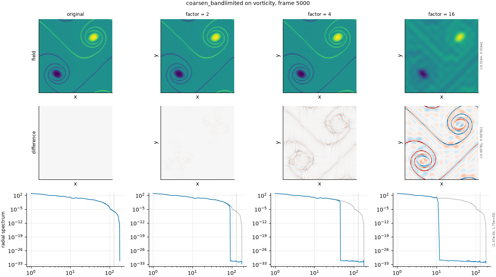

## Definition

The field is block-averaged exactly as [coarsen](../../degradations/coarsen/card.md) does, over
non-overlapping blocks of $m$ cells along each axis, using the same
``fmeval.remap.block_average``. What differs is the reconstruction. Instead of repeating each
block mean, this returns the one field that holds no Fourier mode above the coarse grid's
resolution and whose block means are exactly the coarse values.

Along one axis, write $N$ for the fine length, $M = N/m$ for the coarse length, $G(k)$ for the
fine field's discrete Fourier coefficients and $C(\kappa)$ for those of the block means. With
numpy's transform conventions the two are related by

$$
C(\kappa) = \frac{1}{m} \sum_{k \equiv \kappa \ (\mathrm{mod}\ M)} G(k)\, D(k),
\qquad
D(k) = \frac{1}{m} \sum_{s=0}^{m-1} e^{2\pi i k s / N} \tag{1}
$$

where $D(k)$ is the Fourier response of averaging $m$ neighbouring cells. Restricting $G$ to
the coarse band, $|k| \le M/2$, leaves one fine mode per coarse mode, and Equation (1) inverts
to

$$
G(\kappa) = \frac{m\, C(\kappa)}{D(\kappa)}, \qquad |\kappa| < M/2 \tag{2}
$$

with $G = 0$ everywhere else. When $M$ is even, the coarse Nyquist coefficient $C(-M/2)$
receives both fine modes $+M/2$ and $-M/2$, and it is split equally between them,
$G(\pm M/2) = m\,C(-M/2) / \bigl(2 D(\pm M/2)\bigr)$, which keeps the result real. $D$ has no
zero in the coarse band, and its smallest modulus there tends to $2/\pi$, so Equation (2)
amplifies no mode by more than $\pi/2$.

Block averaging is separable, so the reconstruction is applied one spatial axis at a time,
and the block means over the full $m^d$ blocks are reproduced exactly. The derivation of
Equations (1) and (2) is ours; `test_degradation.py` checks the properties it promises
rather than the algebra.

The purpose is a controlled comparison. This and `coarsen` discard exactly the same
information — their block means agree with each other and with the input's — and differ only
in how each block is filled in. `coarsen` repeats the mean and leaves a jump at every block
edge; this adds nothing the coarse grid could not represent. A metric that responds very
differently to the two is responding to the reconstruction, not to the lost resolution.
`issues/039` records why that matters for metrics that differentiate the field.

### Boundary handling

Periodic on every axis, inherited from the discrete Fourier transform in Equations (1) and
(2), which matches the doubly periodic domain. The blocks tile the domain exactly when the
factor divides the grid size, and a factor that does not divide it is rejected by the block
average rather than handled.

## Intuition

This stands in for a surrogate whose effective resolution is coarser than the grid it writes
on, like `coarsen` does, but without the blockiness. Both keep only the local averages over
patches of the given size. Where `coarsen` paints each patch a flat colour, this draws the
smoothest picture that has those same patch averages, so the result looks blurred rather
than tiled.

A worked example, one row of eight cells, coarsened by two. The pairs average to 0.5, 1, 0.5
and 0.

```
before              0       1       1       1       1       0       0       0
coarsen             0.5     0.5     1       1       0.5     0.5     0       0
coarsen_bandlimited 0.2929  0.7071  1       1       0.7071  0.2929  0       0
```

Both rows keep every pair average: 0.2929 and 0.7071 add to 1, so that pair still averages
0.5. The staircase jumps by 0.5 at two block edges; the band-limited row ramps instead.

What this degradation leaves untouched: the spatial mean and every block mean, exactly, and
every structure the coarse grid is fine enough to represent, which comes through unchanged.

## Severity scale

The severity is the coarsening factor, the number of cells per block along each axis, and it
is **absolute** rather than calibrated, exactly as for `coarsen`. The strengths run at 2, 4, 8
and 16 so that the two operators can be compared factor for factor. The factor must divide the
analysis grid size; factors that do not are dropped before the run.

The same factor does not mean the same damage as under `coarsen`. On a smooth field the
staircase is a large part of what `coarsen` costs even a pointwise metric, and this operator
removes only the content above the coarse band: on a synthetic Gaussian random field with a
correlation length of 128 cells, recorded in `issues/039`, the mean squared error at a factor
of 32 is 0.085 under `coarsen` and 0.000 here. Compare the two operators at a given factor as
two reconstructions of the same coarse data, not as two strengths of one damage.

## Limitations

Like `coarsen`, this degrades a correct fine field rather than simulating at lower
resolution, so the large scales remain exactly right and it is an optimistic imitation of a
low-resolution surrogate.

A sharp front rings instead of stepping. A band-limited field cannot hold a discontinuity, so
the one with a step's block means overshoots on both sides of it: `test_degradation.py`
measures overshoots of 18%, 21% and 23% of the step height at factors 2, 4 and 8, more than
the classic 9% Gibbs overshoot because Equation (2) boosts the modes nearest the cut. On a
shocked flow a derivative-based metric would therefore see this ringing where it saw the
staircase under `coarsen`. The pair separates the two artefacts; it does not supply a
reconstruction free of both.

The band is square rather than round: each axis is cut at its own coarse Nyquist wavenumber,
so modes along the diagonals survive up to $\sqrt 2$ times further out than along the axes.
That is what the coarse grid itself can represent, and it differs from
[lowpass_ideal](../../degradations/lowpass_ideal/card.md), which cuts on a circle of $|k|$.

A derived field is degraded as a field in its own right, as on every other ladder axis:
vorticity coarsened here is the band-limited reconstruction of the vorticity's block means,
not the curl of a coarsened velocity.

## What the degradation looks like

### The picture

<!-- GENERATED exemplars: written by `python -m fmeval.cards exemplars coarsen_bandlimited`, do not edit -->



**coarsen_bandlimited** on vorticity, frame 5000 of `kinet_re5e4`. The same three factors as the coarsen panel, so the two can be read side by side. The difference row shows the error without coarsen's block pattern, and the radial spectrum row shows the clean cut at the coarse grid's resolution with nothing above it, where coarsen's staircase leaves energy at every higher wavenumber.

| strength requested in the config | strength actually applied to this field | RMS size of the change | fraction of the field's power kept |
|---|---|---|---|
| 2 | 2 | 0.0001041 | 1 |
| 4 | 4 | 0.0006996 | 0.9992 |
| 16 | 16 | 0.001537 | 0.9601 |

<!-- END GENERATED exemplars -->

Read this panel beside the one on the [coarsen](../../degradations/coarsen/card.md) page,
which uses the same frame and the same three factors. The field row has no block pattern at any
factor: at a factor of two it is indistinguishable from the original by eye, and at sixteen it
is blurred rather than tiled. What it shows instead, at sixteen, is faint ripples in the smooth
background and along the thin filaments. That is the ringing described under Limitations, the
price of refusing to add edges.

The table makes the contrast with `coarsen` quantitative. At a factor of two the change here
has an RMS of 0.00010 and keeps all of the field's power, where `coarsen` at the same factor
changes it by 0.00049 and keeps 0.993 of it: most of what `coarsen` does to vorticity at a
factor of two is the staircase, not the lost resolution.

The radial spectrum row is where the definition is visible. Each curve follows the original up
to a sharp cut and then falls to the round-off floor, about 1e-32, with nothing in between.
The cut sits where the coarse grid runs out of modes, at the corner of its square band, and
moves inward as the factor grows. `coarsen`'s spectrum instead keeps energy at every higher
wavenumber, which is its block edges.

## References

\bibliography
