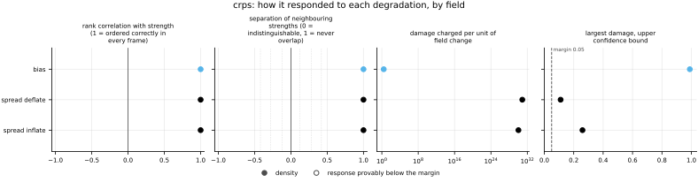
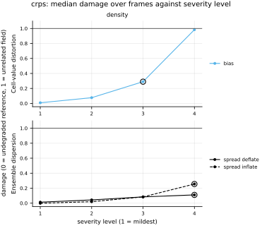

## Definition

For a reference realization $y$ and a predictive distribution with cumulative distribution
function $F$, the continuous ranked probability score is the squared distance between $F$
and the step function at the observation,

$$
\mathrm{CRPS}(F, y) = \int_{-\infty}^{\infty}
\bigl( F(z) - \mathbf{1}\{z \ge y\} \bigr)^2 \, \mathrm{d}z \tag{1}
$$

Equation (1) has an equivalent kernel form that needs no integral, and it is the one used
here [@gneitingraftery2007]:

$$
\mathrm{CRPS}(F, y) = \mathbb{E}\,|X - y|
- \tfrac{1}{2}\,\mathbb{E}\,|X - X'| \tag{2}
$$

for $X, X'$ drawn independently from $F$. The first term rewards members that land near the
observation and the second rewards spread, which is what makes the score *proper*: it is
minimised in expectation only by reporting the distribution one actually believes.

Estimating both expectations from a finite ensemble $x_1 \dots x_M$ requires care. Replacing
them with plain sample means gives an estimator biased low by an amount that depends on $M$,
so the same model evaluated with more members would look worse. Excluding self-pairs from the
second sum removes that bias, giving the **fair** estimator [@ferro2014]:

$$
\widehat{\mathrm{CRPS}} = \frac{1}{M}\sum_{i=1}^{M} |x_i - y|
- \frac{1}{2M(M-1)}\sum_{i=1}^{M}\sum_{j=1}^{M} |x_i - x_j| \tag{3}
$$

The difference is not marginal: on the worked example below the fair estimator gives 0.167
and the plug-in form gives 0.5, three times larger.

At $M = 1$ the second term of Equation (3) is empty and the score is exactly $|x_1 - y|$, so
a one-member ensemble scores identically to mean absolute error on the same pair of fields.

The implementation evaluates the double sum by sorting the members at each cell, since for
sorted $x_{(1)} \le \dots \le x_{(M)}$

$$
\sum_{i}\sum_{j} |x_i - x_j| = 2 \sum_{i=1}^{M} (2i - M - 1)\, x_{(i)} \tag{4}
$$

which turns an $O(M^2)$ sum per cell into $O(M \log M)$. The value is then averaged over
channels and cells, so a vector field's components are pooled rather than reduced
separately.

### Boundary handling

None. The score at a cell uses only the values at that cell, across the ensemble; no
stencil, transform or neighbourhood is involved, so the domain edge is never consulted and
periodicity is irrelevant.

## Performance

<!-- GENERATED performance: written by `python -m fmeval.cards evidence crps --results results/crps_1787800137`, do not edit -->



Four measured statistics for crps, one row per degradation grouped by family and one marker per field. From left: the rank correlation between the metric and the applied strength within a frame, with the line showing the resampling interval; the separation of neighbouring strengths as Cliff's delta, where 0 means the metric cannot tell one strength from the next and the faint ticks at 0.12, 0.28 and 0.42 are Vargha and Delaney's small, medium and large anchors, for scale and not as grades; the damage charged per unit of field change at the harshest strength; and the upper confidence bound on the largest damage, beside the fixed margin of 0.05. A hollow marker is a field and degradation on which that bound lies below the margin, so the response is provably small. A missing marker is a statistic the analysis withheld, as the rank correlation is on an axis the metric is invariant to.



Median damage over frames against severity level for crps, one row per family of degradation and one column per field, on one shared scale. The solid grey line is damage 1, an unrelated field; the dotted black line is the damage assigned to the fake prediction with the right spectrum, where the run included it. The hollow black ring marks the first level at which the metric has moved a tenth of the way to an unrelated field. Hollow grey markers are strengths excluded for repeating a milder one or for doing nothing. Degradations with three or fewer usable levels are drawn as markers only; points above 2 are drawn as triangles at the top.

| test family | field | degradations | rank correlation | weakest gap between neighbouring strengths | first strength detected |
|---|---|---|---|---|---|
| Ensemble dispersion | density | 2 | 1 to 1 | 1 | level 4 |
| Cell-value distortion | density | 1 | 1 to 1 | 1 | level 3 |

One row per family of degradation and physical field. **Rank correlation** asks whether the metric put the strengths of one degradation in the right order: it is the Spearman correlation between the metric and the applied strength, computed inside a single frame, and the column gives the range over the degradations in that family. A value of 1 means every strength was ordered correctly in every frame. **Weakest gap between neighbouring strengths** asks whether the metric can tell one strength from the next: it is the smallest Mann-Whitney overlap between any two neighbouring strengths, where 1 means the two never overlap and 0.5 means the metric cannot separate them at all. **First strength detected** is the mildest strength at which the metric has moved a tenth of the way from the undegraded reference toward a field with no relation to the truth; a dash means the metric never reached that tenth. **Damage** is that same 0-to-1 scale read as a number: 0 is the undegraded reference and 1 is an unrelated field.

This table reports what was measured and grades none of the measurements. What the numbers mean for this metric is written in the subsections below, beside the test that produced each number.

**Profile.**

| field | selectivity | charges most for | charges least for | response provably below 0.05 at 90% on | elasticity to a sub-pixel shift | compute cost (x cheapest in this run) |
|---|---|---|---|---|---|---|
| density | 0.575 | `spread_deflate` | `bias` | — | — | 1 |

One row per physical field. **Selectivity** is how concentrated the metric's response is on a few degradations, measured per unit of field change: 0 means it charges every degradation the same, as mean squared error does by construction, and values toward 1 that one degradation carries most of it. **Charges most and least for** name the two ends of that profile. **Response provably below** lists degradations on which the upper confidence bound of the largest damage lies below the margin -- an equivalence test, so an entry says the response is provably small, not merely not significant; a dash means no degradation met the bound. **Elasticity** is the slope of log damage against log shift over the smallest shifts: 1 means damage grows in proportion to the shift, 2 with its square. **Compute cost** is wall-clock per evaluation over the cheapest metric and field in the same run.

<!-- END GENERATED performance -->

## Intuition

This metric scores a prediction that is a *set of possibilities* rather than a single
answer. It asks two things at once and combines them into one number: were the possibilities
close to what happened, and was the range of possibilities honest? A prediction that hedges
by offering an enormous range is penalised even when the truth falls inside it, and so is
one that commits to a narrow range that misses.

The mechanism is the second term of the definition. The first term alone — the average
distance from each member to the truth — would be minimised by an ensemble that collapses
every member onto its single best guess, which is exactly the overconfident forecast we want
to catch. Subtracting half the average distance between members pays back some of that
penalty in proportion to how spread out they are, and the arithmetic works out so that the
score is lowest when the spread genuinely reflects the uncertainty. Being unable to profit
by misrepresenting your uncertainty is what "proper" means.

The other thing worth knowing is what happens with a single member: the spread term vanishes
and the score becomes the plain absolute error. That makes this directly comparable with the
pointwise controls in the same units, and it means a deterministic prediction can be scored
on the same axis as a probabilistic one without changing metrics.

A worked example on a single cell, with three members against a reference of 0:

```
reference        members              result
0                -1, 0.5, 2           0.1667
```

The average distance from the members to the reference is 7/6. The distances between pairs
of members sum to 12, and dividing by 2M(M-1) = 12 gives a spread credit of exactly 1, so
the score is 7/6 − 1 = 1/6.

What it ignores is position. Like every cell-by-cell metric here it compares each cell with
the same cell, so an ensemble whose members all have the right shape in slightly the wrong
place is penalised twice over, once for the feature that is missing and once for the one
that should not be there.

## Reading the output

The score is in the field's own units and runs from zero upward, with no upper bound; lower
is better. Zero means every member equalled the reference exactly, which in practice means
a degenerate ensemble on a degenerate field.

There is no absolute threshold for a good value, because the scale is set by the field. The
useful reading is comparative, and there are two comparisons worth making. Against
`mae` on the same run: CRPS below the mean absolute error of the ensemble mean says the
spread is buying something. Against the same metric on a degraded ladder: the shape of the
rise is what says whether the metric is sensitive where it matters.

Comparisons across models on one dataset are meaningful. Comparisons across resolutions are
not, without care — the score is resolution dependent, since a finer grid resolves sharper
gradients and larger pointwise differences. Comparisons across ensemble sizes are meaningful
*because* the fair estimator is used; with the plug-in form they would not be, which is why
`n_members` is recorded on every row.

## Limitations

The score is dominated by the bulk of the field, so a prediction that is excellent almost
everywhere and badly wrong in a small region reads as good. On a shocked flow, where the
interesting behaviour lives in a small fraction of the cells, that is exactly backwards.

It is also blind in the way every pointwise metric here is blind: it compares each cell only
with itself. Consider an ensemble whose members are all correct in shape and amplitude but
displaced by one cell. The score is large — as large as if the feature were absent and a
spurious one had appeared elsewhere — while a person looking at the two fields would call
the prediction very nearly right. This is the double-penalty problem that motivates the
position-tolerant metrics in this repository, and CRPS does not escape it: making a metric
probabilistic changes what it knows about uncertainty, not what it knows about position.

Finally, one number cannot separate the two things it combines. An ensemble that is accurate
but overconfident and one that is inaccurate but honestly dispersed can score the same. When
the score moves, `spread_skill` and `rank_histogram` are what say which half moved.

## Results

<!-- GENERATED run: written by `python -m fmeval.cards evidence crps --results results/crps_1787800137`, do not edit -->

Measured on `synthetic_ensemble`, frames 0 to 11 (12 frames of developed flow), on the 64 analysis grid, seed 20260807, at commit `c49b363765d7` (working tree dirty). Run `crps_1787800137`.

Every number in this section comes from that one run. Regenerate with `python -m fmeval.cards evidence <name> --results results/crps_1787800137`.

<!-- END GENERATED run -->

**What these numbers are evidence of, and what they are not.** The run behind them is on
`synthetic_ensemble`, which is generated rather than simulated: the reference is drawn from
the same process as the members, with the same dispersion, so the two are exchangeable and
every quantity below has a value derivable in advance. That is what makes the run worth
citing — an estimator agreeing with arithmetic it could not have fitted to is a real
result, and it is the claim a first implementation has to establish.

It is not evidence about turbulence. The fields have no shocks, no intermittency and no
coherent structure, so nothing here says how this metric behaves on the flows this
repository exists to evaluate. The degradation families a physical run would exercise —
smoothing, spectral filtering, displacement, resolution loss — are absent from these
tables for that reason, and so are the trap tests. When an ensemble of real runs exists
([issue 004](https://github.com/khegazy/pde_metrics/blob/main/issues/004-independent-realizations.md)), this card should be
regenerated against it and this section will say something different.

### Ensemble dispersion

[spread_inflate](../../degradations/spread_inflate/card.md) ·
[spread_deflate](../../degradations/spread_deflate/card.md)

<!-- GENERATED results_ensemble: written by `python -m fmeval.cards evidence crps --results results/crps_1787800137`, do not edit -->

| degradation | field | strengths | rank correlation | fraction of frames in the right order | weakest gap between neighbouring strengths |
|---|---|---|---|---|---|
| `spread_deflate` | density | 4 | 1 | 1 | 1 |
| `spread_inflate` | density | 4 | 1 | 1 | 1 |

<!-- END GENERATED results_ensemble -->

Both directions raise the score, which is propriety visible in a measurement rather than
asserted from the definition: the calibrated ensemble at 0.085 is the minimum, and widening
it (to 0.141 at the harshest inflation) or narrowing it (to 0.109 at the harshest deflation)
both cost. The two sides are not symmetric. Inflation is the steeper of the two here,
costing 0.056 against deflation's 0.024 at comparable severity, because an ensemble stretched
to four times its honest width puts most of its members far from the truth while one
collapsed toward its mean keeps them all near a centre that is itself close to correct.

Read that asymmetry with the generator in mind rather than as a general property: the
ensemble mean of this dataset is a good prediction, so there is little for deflation to
expose. On a model whose centre is wrong, collapsing the spread removes the only thing
covering that error, and the deflation side would be expected to bite harder.

## References

\bibliography
