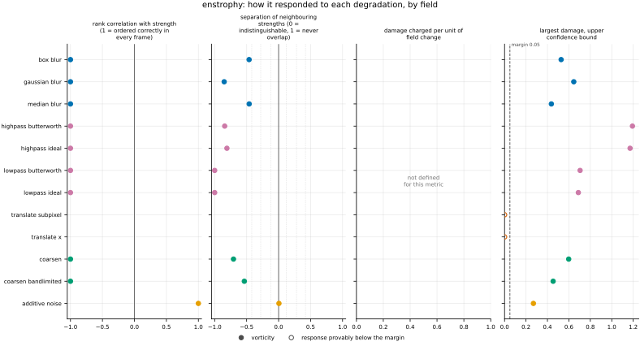
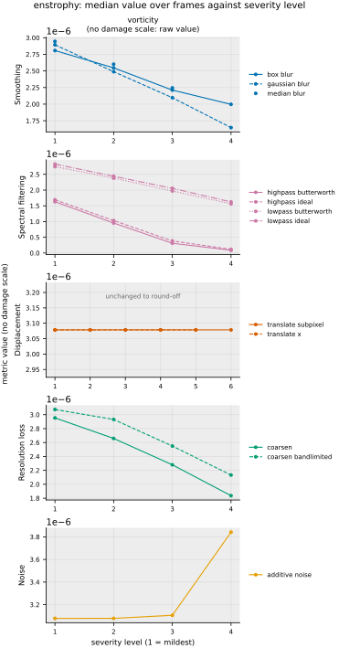

## Definition

For a vorticity field $\omega$ on the analysis grid with $C$ components and $N$ cells,

$$
\mathcal{E}(\omega) = \frac{1}{2N} \sum_{i=1}^{N} \sum_{c=1}^{C}
\omega_{c,i}^{2} \tag{1}
$$

Components are summed before the average over cells, so in 2D the single component is
used and in 3D all three contribute. Equation (1) takes one field and returns one number:
it is a diagnostic, not a comparison, and the pipeline evaluates it on the reference and
on every degraded variant so that the drift between them can be read downstream.

The vorticity itself is recomputed on the analysis grid from the velocity rather than
block-averaged from a finer one, because the average of a curl is not the curl of the
average. Mixing the two produces a field that is not the curl of the velocity beside it.

### Boundary handling

None in this metric: it reads cell values and never a neighbourhood. The vorticity it
consumes does involve a stencil, and the boundary treatment there belongs to the field's
construction — the domain is doubly periodic and the derivative wraps accordingly.

## Performance

<!-- GENERATED performance: written by `python -m fmeval.cards evidence enstrophy --results results/comparison_1790639359`, do not edit -->



Four measured statistics for enstrophy, one row per degradation grouped by family and one marker per field. From left: the rank correlation between the metric and the applied strength within a frame, with the line showing the resampling interval; the separation of neighbouring strengths as Cliff's delta, where 0 means the metric cannot tell one strength from the next and the faint ticks at 0.12, 0.28 and 0.42 are Vargha and Delaney's small, medium and large anchors, for scale and not as grades; the damage charged per unit of field change at the harshest strength; and the upper confidence bound on the largest damage, beside the fixed margin of 0.05. A hollow marker is a field and degradation on which that bound lies below the margin, so the response is provably small. A missing marker is a statistic the analysis withheld, as the rank correlation is on an axis the metric is invariant to.



Median damage over frames against severity level for enstrophy, one row per family of degradation and one column per field, on one shared scale. The solid grey line is damage 1, an unrelated field; the dotted black line is the damage assigned to the fake prediction with the right spectrum, where the run included it. The hollow black ring marks the first level at which the metric has moved a tenth of the way to an unrelated field. Hollow grey markers are strengths excluded for repeating a milder one or for doing nothing. Degradations with three or fewer usable levels are drawn as markers only; points above 2 are drawn as triangles at the top. No damage scale on vorticity: the grey panels show the raw value instead.

| test family | field | degradations | rank correlation | weakest gap between neighbouring strengths | first strength detected |
|---|---|---|---|---|---|
| Displacement | vorticity | 2 | — to — | — | level — |
| Resolution loss | vorticity | 2 | -1 to -1 | 0.147 | level — |
| Smoothing | vorticity | 3 | -1 to -1 | 0.0745 | level — |
| Spectral filtering | vorticity | 4 | -1 to -1 | 0 | level — |
| Noise | vorticity | 1 | 1 to 1 | 0.503 | level — |
| trap test: fake prediction, right spectrum | vorticity | 1 | — | — | damage — |

One row per family of degradation and physical field. **Rank correlation** asks whether the metric put the strengths of one degradation in the right order: it is the Spearman correlation between the metric and the applied strength, computed inside a single frame, and the column gives the range over the degradations in that family. A value of 1 means every strength was ordered correctly in every frame. **Weakest gap between neighbouring strengths** asks whether the metric can tell one strength from the next: it is the smallest Mann-Whitney overlap between any two neighbouring strengths, where 1 means the two never overlap and 0.5 means the metric cannot separate them at all. **First strength detected** is the mildest strength at which the metric has moved a tenth of the way from the undegraded reference toward a field with no relation to the truth; a dash means the metric never reached that tenth. **Damage** is that same 0-to-1 scale read as a number: 0 is the undegraded reference and 1 is an unrelated field.

This table reports what was measured and grades none of the measurements. What the numbers mean for this metric is written in the subsections below, beside the test that produced each number.

**Profile.**

| field | selectivity | charges most for | charges least for | response provably below 0.05 at 90% on | elasticity to a sub-pixel shift, against severity (distance) | compute cost (x cheapest in this run) |
|---|---|---|---|---|---|---|
| vorticity | — | — | — | `translate_subpixel` `translate_x` | — | 1.06 |

One row per physical field. **Selectivity** is how concentrated the metric's response is on a few degradations, measured per unit of field change: 0 means it charges every degradation the same, as mean squared error does by construction, and values toward 1 that one degradation carries most of it. **Charges most and least for** name the two ends of that profile. **Response provably below** lists degradations on which the upper confidence bound of the largest damage lies below the margin -- an equivalence test, so an entry says the response is provably small, not merely not significant; a dash means no degradation met the bound. **Elasticity** is the slope of log damage against log shift over the smallest shifts: 1 means damage grows in proportion to the shift, 2 with its square. **Compute cost** is wall-clock per evaluation over the cheapest metric and field in the same run.

<!-- END GENERATED performance -->

## Intuition

Enstrophy measures how much rotation a flow contains, by squaring the local rotation rate
everywhere and averaging. Squaring means the direction of the swirl does not matter and
that vigorous small eddies count for far more than gentle large ones, which is why
enstrophy is usually read as a measure of small-scale activity.

Because enstrophy needs only one field, the number says nothing about accuracy on its own.
It is evaluated on the true flow and on the prediction, and the useful quantity is the
difference: a prediction that has lost its small eddies to numerical smoothing will report
noticeably less enstrophy than the flow it is imitating.

On a four-by-four grid with four rotating cells, two turning each way:

```
vorticity        enstrophy
0  0  0  0
0  1 -1  0       0.125
0 -1  1  0
0  0  0  0
```

Four cells of unit magnitude out of sixteen, halved, gives 0.125. Moving those same four
cells into a corner gives 0.125 as well, and so does reflecting the field.

That last point is what this quantity ignores, and the omission is not a small one:
enormously many different flows share any given enstrophy. It can tell you that rotation
has been lost, never that a prediction is right.

## Reading the output

The value runs from zero upwards with no upper limit, in the square of the vorticity
units. There is no direction in which it is better: it is a property of a flow, not an
error, and it is read by comparing the prediction's value against the reference's on the
same frame. Equal is good; the sign of a departure tells you which way the prediction
went wrong.

A prediction reporting less enstrophy than the reference has lost small-scale rotation,
which is what excessive numerical dissipation or an over-smooth surrogate looks like. More
enstrophy than the reference usually means noise or a numerical instability adding
spurious small-scale structure.

Comparisons are only meaningful between fields on the same analysis grid, because a
coarser grid cannot represent the small scales where most of the enstrophy sits and will
report less of it regardless of the prediction's quality. Comparing the absolute value
across datasets is not meaningful; comparing the drift from each dataset's own reference
is.

## Limitations

One number summarising a whole field is degenerate on a scale that is easy to
underestimate: a flow with its vorticity redistributed arbitrarily, reflected, rotated or
translated has exactly the same enstrophy. A prediction can match the reference here while
being wrong in every other respect, so a matching value is not evidence of anything. This
is why it belongs in a panel as a rough alarm and never alone.

The resolution dependence is the trap most likely to catch a real user. Enstrophy lives at
the smallest resolved scales, so it falls simply from evaluating on a coarser grid, and a
comparison that mixes grids will read that as a physical loss of rotation. Fix the
analysis grid before drawing any conclusion.

## Results

<!-- GENERATED run: written by `python -m fmeval.cards evidence enstrophy --results results/comparison_1790639359`, do not edit -->

Measured on `kinet_re5e4`, frames 2000 to 10000 (161 frames of developed flow), on the 256 analysis grid, seed 20260807, at commit `ce78cb2d30d8` (working tree dirty). Run `comparison_1790639359`.

Every number in this section comes from that one run. Regenerate with `python -m fmeval.cards evidence <name> --results results/comparison_1790639359`.

<!-- END GENERATED run -->

Each subsection links to the degradations that subsection reports. What those degradations
do, and what their strength numbers mean, is documented on their own pages. A single-field
diagnostic is evaluated on the reference and on every degraded variant alike, so what is
read here is the drift away from the reference value rather than an error.

### Smoothing

[gaussian_blur](../../degradations/gaussian_blur/card.md) ·
[box_blur](../../degradations/box_blur/card.md) ·
[median_blur](../../degradations/median_blur/card.md)

<!-- GENERATED results_smoothing: written by `python -m fmeval.cards evidence enstrophy --results results/comparison_1790639359`, do not edit -->

| degradation | field | strengths | rank correlation | fraction of frames in the right order | weakest gap between neighbouring strengths |
|---|---|---|---|---|---|
| `box_blur` | vorticity | 4 | -1 | 0 | 0.269 |
| `gaussian_blur` | vorticity | 4 | -1 | 0 | 0.0745 |
| `median_blur` | vorticity | 3 | -1 | 0 | 0.27 |

<!-- END GENERATED results_smoothing -->

### Spectral filtering

[lowpass_ideal](../../degradations/lowpass_ideal/card.md) ·
[lowpass_butterworth](../../degradations/lowpass_butterworth/card.md) ·
[highpass_ideal](../../degradations/highpass_ideal/card.md) ·
[highpass_butterworth](../../degradations/highpass_butterworth/card.md)

<!-- GENERATED results_spectral: written by `python -m fmeval.cards evidence enstrophy --results results/comparison_1790639359`, do not edit -->

| degradation | field | strengths | rank correlation | fraction of frames in the right order | weakest gap between neighbouring strengths |
|---|---|---|---|---|---|
| `highpass_butterworth` | vorticity | 4 | -1 | 0 | 0.0784 |
| `highpass_ideal` | vorticity | 4 | -1 | 0 | 0.0958 |
| `lowpass_butterworth` | vorticity | 4 | -1 | 0 | 0 |
| `lowpass_ideal` | vorticity | 4 | -1 | 0 | 0 |

<!-- END GENERATED results_spectral -->

### Displacement

[translate_x](../../degradations/translate/card.md) ·
[translate_subpixel](../../degradations/translate_subpixel/card.md)

<!-- GENERATED results_geometric: written by `python -m fmeval.cards evidence enstrophy --results results/comparison_1790639359`, do not edit -->

| degradation | field | strengths | rank correlation | fraction of frames in the right order | weakest gap between neighbouring strengths |
|---|---|---|---|---|---|
| `translate_subpixel` | vorticity | 6 | — | — | — |
| `translate_x` | vorticity | 5 | — | — | — |

<!-- END GENERATED results_geometric -->

A translation moves the field without changing any of its values, so a quantity built from
those values alone cannot see it at all. This degradation is expected to be flat, and a
measurement showing otherwise would indicate the translation is not conserving what it
should — which is one of the things a reference-free diagnostic is useful for.

### Resolution loss

[coarsen](../../degradations/coarsen/card.md) ·
[coarsen_bandlimited](../../degradations/coarsen_bandlimited/card.md)

<!-- GENERATED results_resolution: written by `python -m fmeval.cards evidence enstrophy --results results/comparison_1790639359`, do not edit -->

| degradation | field | strengths | rank correlation | fraction of frames in the right order | weakest gap between neighbouring strengths |
|---|---|---|---|---|---|
| `coarsen` | vorticity | 4 | -1 | 0 | 0.147 |
| `coarsen_bandlimited` | vorticity | 4 | -1 | 0 | 0.232 |

<!-- END GENERATED results_resolution -->

The rank correlation of −1 under both coarsenings is the correct result for a quantity that
falls as detail is removed. `coarsen` removes more at every factor: 4%, 14%, 26% and 40% of the
enstrophy at factors 2 to 16, against 0.1%, 5%, 17% and 31% under `coarsen_bandlimited`. The
two keep the same block means; the staircase additionally flattens each block, discarding the
variance inside it that the band-limited reconstruction keeps wherever the coarse grid can
represent it.

### Noise

[additive_noise](../../degradations/additive_noise/card.md)

<!-- GENERATED results_stochastic: written by `python -m fmeval.cards evidence enstrophy --results results/comparison_1790639359`, do not edit -->

| degradation | field | strengths | rank correlation | fraction of frames in the right order | weakest gap between neighbouring strengths |
|---|---|---|---|---|---|
| `additive_noise` | vorticity | 4 | 1 | 0.919 | 0.503 |

<!-- END GENERATED results_stochastic -->

### Trap tests

[gaussian_impostor](../../degradations/gaussian_impostor/card.md) ·
[uncorrelated](../../degradations/random_large_translation/card.md)

<!-- GENERATED results_canaries: written by `python -m fmeval.cards evidence enstrophy --results results/comparison_1790639359`, do not edit -->

| field | damage assigned to the fake prediction | closest real degradation | value on an unrelated field |
|---|---|---|---|
| vorticity | — | `` | 3.08e-06 |

The fake prediction here has exactly the reference field's amplitude spectrum and completely scrambled structure. Damage of 1 is what a field with no relation to the truth scores, so the damage column says how close to useless this metric considers that fake prediction: a low number means the metric was fooled. The third column translates the same number into an ordinary degradation whose damage the fake prediction matches, which is easier to picture.

<!-- END GENERATED results_canaries -->

### Compared with the other metrics

<!-- GENERATED results_summary: written by `python -m fmeval.cards evidence enstrophy --results results/comparison_1790639359`, do not edit -->

| compared with | rank correlation over every degradation |
|---|---|
| `kinetic_energy` | 0.86 |
| `palinstrophy` | 0.757 |
| `h1_seminorm` | 0.25 |
| `increment_flatness` | 0.0202 |
| `mae` | -0.103 |
| `rmse` | -0.116 |
| `mse` | -0.116 |
| `nrmse` | -0.154 |
| `h_minus_one` | -0.183 |
| `increment_w1` | -0.495 |
| `spectrum_l2` | -0.828 |

Computed on the median value at each combination of degradation and strength, over every degradation and physical field in the run, with the undegraded reference excluded. Two metrics correlating near 1 put the degradations in the same order, but the two may still weight those degradations very differently. A correlation near 1 therefore means the two metrics are redundant for ranking models, not that the two are interchangeable as training losses.

<!-- END GENERATED results_summary -->

### Damage beside the other metrics

<!-- GENERATED results_damage_by_level: written by `python -m fmeval.cards evidence enstrophy --results results/comparison_1790639359`, do not edit -->

**Displacement, density, `translate_subpixel`** (strength: distance).

| metric | 0.125 | 0.25 | 0.5 | 1 | 2 | 4 |
|---|---|---|---|---|---|---|
| `enstrophy` | — | — | — | — | — | — |
| `mae` | 0.00328 | 0.00655 | 0.0131 | 0.0262 | 0.0521 | 0.103 |
| `mse` | 1.49e-05 | 5.97e-05 | 0.000238 | 0.000952 | 0.00379 | 0.015 |
| `rmse` | 0.00386 | 0.00772 | 0.0154 | 0.0309 | 0.0616 | 0.123 |
| `nrmse` | 0.00362 | 0.00723 | 0.0145 | 0.0289 | 0.0576 | 0.115 |

**Displacement, density, `translate_x`** (strength: distance).

| metric | 1 | 2 | 4 | 8 | 16 |
|---|---|---|---|---|---|
| `enstrophy` | — | — | — | — | — |
| `mae` | 0.0262 | 0.0521 | 0.103 | 0.205 | 0.401 |
| `mse` | 0.000952 | 0.00379 | 0.015 | 0.0584 | 0.211 |
| `rmse` | 0.0309 | 0.0616 | 0.123 | 0.242 | 0.46 |
| `nrmse` | 0.0289 | 0.0576 | 0.115 | 0.226 | 0.43 |

**Displacement, velocity, `translate_subpixel`** (strength: distance).

| metric | 0.125 | 0.25 | 0.5 | 1 | 2 | 4 |
|---|---|---|---|---|---|---|
| `enstrophy` | — | — | — | — | — | — |
| `mae` | 0.00163 | 0.00325 | 0.0065 | 0.013 | 0.0257 | 0.05 |
| `mse` | 4.76e-06 | 1.91e-05 | 7.61e-05 | 0.000303 | 0.00118 | 0.00445 |
| `rmse` | 0.00218 | 0.00437 | 0.00873 | 0.0174 | 0.0344 | 0.0667 |
| `nrmse` | 0.00219 | 0.00437 | 0.00873 | 0.0174 | 0.0343 | 0.0667 |

**Displacement, velocity, `translate_x`** (strength: distance).

| metric | 1 | 2 | 4 | 8 | 16 |
|---|---|---|---|---|---|
| `enstrophy` | — | — | — | — | — |
| `mae` | 0.013 | 0.0257 | 0.05 | 0.0951 | 0.18 |
| `mse` | 0.000303 | 0.00118 | 0.00445 | 0.016 | 0.0541 |
| `rmse` | 0.0174 | 0.0344 | 0.0667 | 0.127 | 0.233 |
| `nrmse` | 0.0174 | 0.0343 | 0.0667 | 0.127 | 0.232 |

**Displacement, vorticity, `translate_subpixel`** (strength: distance).

| metric | 0.125 | 0.25 | 0.5 | 1 | 2 | 4 |
|---|---|---|---|---|---|---|
| `enstrophy` | — | — | — | — | — | — |
| `mae` | 0.0225 | 0.045 | 0.0892 | 0.172 | 0.306 | 0.453 |
| `mse` | 0.000476 | 0.0019 | 0.00747 | 0.028 | 0.0889 | 0.187 |
| `rmse` | 0.0218 | 0.0436 | 0.0865 | 0.167 | 0.298 | 0.432 |
| `nrmse` | 0.0219 | 0.0437 | 0.0868 | 0.169 | 0.304 | 0.447 |

**Displacement, vorticity, `translate_x`** (strength: distance).

| metric | 1 | 2 | 4 | 8 | 16 |
|---|---|---|---|---|---|
| `enstrophy` | — | — | — | — | — |
| `mae` | 0.172 | 0.306 | 0.453 | 0.581 | 0.69 |
| `mse` | 0.028 | 0.0889 | 0.187 | 0.288 | 0.468 |
| `rmse` | 0.167 | 0.298 | 0.432 | 0.537 | 0.684 |
| `nrmse` | 0.169 | 0.304 | 0.447 | 0.555 | 0.702 |

Median damage over frames at every strength, this metric in the first row and the pointwise controls beneath it, all on the same 0-to-1 scale where 0 is the undegraded reference and 1 an unrelated field; a dash means no damage scale on that field. The rank correlations under *Compared with the other metrics* say whether two metrics put the strengths in the same order; this table says how much each one charges for the same strength, which decides whether two metrics are interchangeable as training losses.

<!-- END GENERATED results_damage_by_level -->

## References

\bibliography
