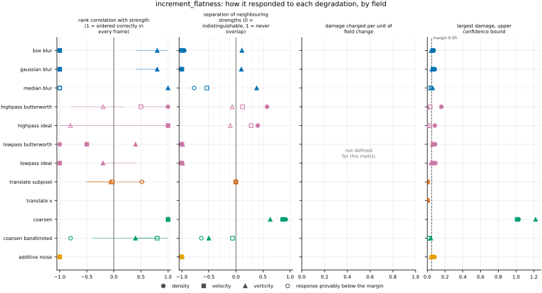
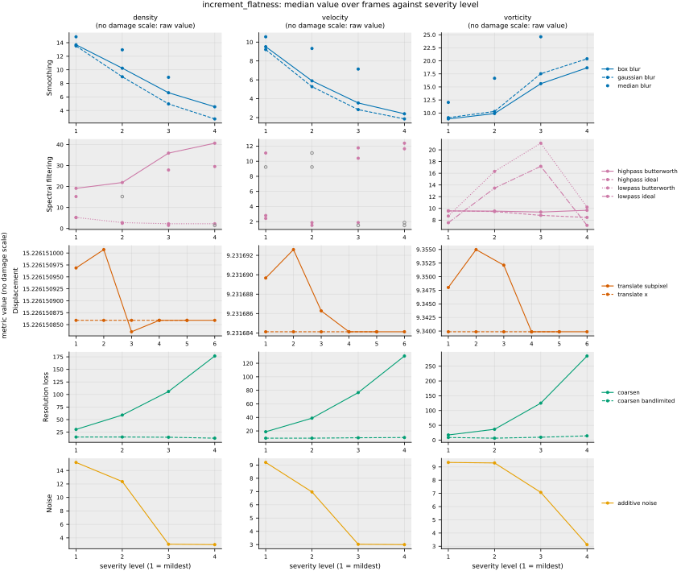

## Definition

Let $f$ be one channel of a field on a periodic grid and let $\mathbf{e}_j$ be the unit
step along spatial axis $j$. The increment at separation $\ell$ is

$$
(\delta_j f)_{\mathbf{n}} = f_{\mathbf{n} + \ell \mathbf{e}_j} - f_{\mathbf{n}} \tag{1}
$$

and this metric fixes $\ell = 1$ cell, the smallest separation the analysis grid resolves.
The flatness of that increment field is its fourth moment normalised by the square of its
second,

$$
F_j^{(c)} = \frac{\bigl\langle (\delta_j f^{(c)})^4 \bigr\rangle}
{\bigl\langle (\delta_j f^{(c)})^2 \bigr\rangle^2} \tag{2}
$$

with $\langle \cdot \rangle$ the average over all cells. The reported value averages
Equation (2) over the set $A$ of channel-and-axis pairs whose increments do not vanish
identically:

$$
F = \frac{1}{|A|} \sum_{(c, j) \in A} F_j^{(c)} \tag{3}
$$

and is NaN when $A$ is empty, that is when the field is constant.

Equation (3) averages *flatnesses*, and that is a choice with consequences rather than a
detail. The alternative — pooling every increment from every axis and channel into one
sample and taking the flatness of that — breaks the property the metric is for. Increments
along different axes of an anisotropic field have different variances, and an equal
mixture of two zero-mean Gaussians whose variances stand in the ratio $r$ has flatness

$$
F_{\text{pooled}} = \frac{6 (1 + r^2)}{(1 + r)^2} \tag{4}
$$

which equals 3 only at $r = 1$. A perfectly Gaussian but anisotropic field would then score
above 3, and the fixed anchor that gives the number its meaning would be gone. Averaging
per-axis flatnesses keeps that anchor exact for any anisotropy.

Two values follow from Equation (2) in closed form and are worth recording because they
bound and calibrate the scale. A Gaussian field gives exactly 3. A single step across an
otherwise flat periodic axis of $N$ cells has increments $+1$ and $-1$ at two places and
zero at the other $N - 2$, so

$$
F = \frac{2/N}{(2/N)^2} = \frac{N}{2} \tag{5}
$$

which is how a rare sharp event registers: the same jump spread over a longer axis is
rarer and scores higher without limit. At the other extreme $F = 1$, the floor implied by
$\langle d^4 \rangle \ge \langle d^2 \rangle^2$, is attained when every increment has the
same magnitude.

The separation in Equation (1) is a constant of the evaluator, not an option. A separation
chosen per model would let a model be scored at whichever scale flattered it, which is the
same failure that fixing detector thresholds once is meant to prevent.

### Boundary handling

Periodic wrap on every axis: the increment of the last cell along an axis is taken against
the first. An axis that is constant contributes no increments and is dropped from the
average in Equation (3) rather than contributing a zero or a three, both of which would be
claims the data does not support.

## Performance

<!-- GENERATED performance: written by `python -m fmeval.cards evidence increment_flatness --results results/comparison_1790639359`, do not edit -->



Four measured statistics for increment_flatness, one row per degradation grouped by family and one marker per field. From left: the rank correlation between the metric and the applied strength within a frame, with the line showing the resampling interval; the separation of neighbouring strengths as Cliff's delta, where 0 means the metric cannot tell one strength from the next and the faint ticks at 0.12, 0.28 and 0.42 are Vargha and Delaney's small, medium and large anchors, for scale and not as grades; the damage charged per unit of field change at the harshest strength; and the upper confidence bound on the largest damage, beside the fixed margin of 0.05. A hollow marker is a field and degradation on which that bound lies below the margin, so the response is provably small. A missing marker is a statistic the analysis withheld, as the rank correlation is on an axis the metric is invariant to.



Median damage over frames against severity level for increment_flatness, one row per family of degradation and one column per field, on one shared scale. The solid grey line is damage 1, an unrelated field; the dotted black line is the damage assigned to the fake prediction with the right spectrum, where the run included it. The hollow black ring marks the first level at which the metric has moved a tenth of the way to an unrelated field. Hollow grey markers are strengths excluded for repeating a milder one or for doing nothing. Degradations with three or fewer usable levels are drawn as markers only; points above 2 are drawn as triangles at the top. No damage scale on density, velocity, vorticity: the grey panels show the raw value instead.

| test family | field | degradations | rank correlation | weakest gap between neighbouring strengths | first strength detected |
|---|---|---|---|---|---|
| Displacement | density | 2 | 0.516 to 0.516 | 0.499 | level — |
| Displacement | velocity | 2 | -0.0304 to -0.0304 | 0.499 | level — |
| Displacement | vorticity | 2 | -0.058 to -0.058 | 0.499 | level — |
| Resolution loss | density | 2 | -0.8 to 1 | 0.182 | level — |
| Resolution loss | velocity | 2 | 0.8 to 1 | 0.469 | level — |
| Resolution loss | vorticity | 2 | 0.4 to 1 | 0.25 | level — |
| Smoothing | density | 3 | -1 to -1 | 0 | level — |
| Smoothing | velocity | 3 | -1 to -1 | 0 | level — |
| Smoothing | vorticity | 3 | 0.8 to 1 | 0.549 | level — |
| Spectral filtering | density | 4 | -1 to 1 | 0 | level — |
| Spectral filtering | velocity | 4 | -1 to 1 | 0 | level — |
| Spectral filtering | vorticity | 4 | -0.8 to 0.4 | 0.00772 | level — |
| Noise | density | 1 | -1 to -1 | 0 | level — |
| Noise | velocity | 1 | -1 to -1 | 0 | level — |
| Noise | vorticity | 1 | -1 to -1 | 0 | level — |
| trap test: fake prediction, right spectrum | density | 1 | — | — | damage — |
| trap test: fake prediction, right spectrum | velocity | 1 | — | — | damage — |
| trap test: fake prediction, right spectrum | vorticity | 1 | — | — | damage — |

One row per family of degradation and physical field. **Rank correlation** asks whether the metric put the strengths of one degradation in the right order: it is the Spearman correlation between the metric and the applied strength, computed inside a single frame, and the column gives the range over the degradations in that family. A value of 1 means every strength was ordered correctly in every frame. **Weakest gap between neighbouring strengths** asks whether the metric can tell one strength from the next: it is the smallest Mann-Whitney overlap between any two neighbouring strengths, where 1 means the two never overlap and 0.5 means the metric cannot separate them at all. **First strength detected** is the mildest strength at which the metric has moved a tenth of the way from the undegraded reference toward a field with no relation to the truth; a dash means the metric never reached that tenth. **Damage** is that same 0-to-1 scale read as a number: 0 is the undegraded reference and 1 is an unrelated field.

This table reports what was measured and grades none of the measurements. What the numbers mean for this metric is written in the subsections below, beside the test that produced each number.

**Profile.**

| field | selectivity | charges most for | charges least for | response provably below 0.05 at 90% on | elasticity to a sub-pixel shift, against severity (distance) | compute cost (x cheapest in this run) |
|---|---|---|---|---|---|---|
| density | — | — | — | `coarsen_bandlimited` `median_blur` `translate_subpixel` `translate_x` | 1.36 | 31.5 |
| velocity | — | — | — | `coarsen_bandlimited` `highpass_butterworth` `highpass_ideal` `median_blur` `translate_subpixel` `translate_x` | 10.2 | 62.9 |
| vorticity | — | — | — | `highpass_butterworth` `highpass_ideal` `translate_subpixel` `translate_x` | 1.15 | 32 |

One row per physical field. **Selectivity** is how concentrated the metric's response is on a few degradations, measured per unit of field change: 0 means it charges every degradation the same, as mean squared error does by construction, and values toward 1 that one degradation carries most of it. **Charges most and least for** name the two ends of that profile. **Response provably below** lists degradations on which the upper confidence bound of the largest damage lies below the margin -- an equivalence test, so an entry says the response is provably small, not merely not significant; a dash means no degradation met the bound. **Elasticity** is the slope of log damage against log shift over the smallest shifts: 1 means damage grows in proportion to the shift, 2 with its square. **Compute cost** is wall-clock per evaluation over the cheapest metric and field in the same run.

<!-- END GENERATED performance -->

## Intuition

This metric asks whether a field's variation is shared out evenly across the domain or
concentrated into a few sharp places. It looks at the difference between each cell and its
neighbour, collects all of those differences, and asks how heavy the tails of that
collection are. A field whose neighbour-to-neighbour differences are all about the same
size scores low. A field that is mostly smooth but has a few abrupt jumps scores high,
because those jumps are enormous compared with the typical difference and a fourth power
weights them enormously more.

The anchor that makes the number readable is that a field of pure random noise with the
familiar bell-shaped distribution scores exactly three, whatever its amplitude. Above three
means the field has heavier tails than that: rare events larger than random chance would
produce. Real turbulence is well above three and climbs as you look at finer separations,
which is the standard quantitative statement that turbulence is intermittent — its
steepest gradients live in a small fraction of the volume. The failure this reveals is the
one an averaging-based prediction makes first: smoothing removes the rare sharp events
before it removes anything else, so this number falls toward three, and then below it,
while a cell-by-cell error norm may still look acceptable.

A worked example, four cells by four cells. On the left, a single step: the top row is
zero and the rest is one. Reading down a column, the differences between neighbours are
one at the step, one more where the grid wraps around, and zero at the two other places.
On the right, the value alternates every row, so every difference has the same size.

```
one step          alternating
0 0 0 0           0 0 0 0
1 1 1 1           1 1 1 1
1 1 1 1           0 0 0 0
1 1 1 1           1 1 1 1

flatness 2        flatness 1
```

Neither is above three, because four cells is far too short an axis for anything to be
rare in. That is the point of the comparison rather than an awkwardness: rarity is what
this measures, and on a four-cell axis a single jump happens a quarter of the time. Stretch
the same single step across sixteen cells and it scores eight; across a hundred, fifty. The
rows running across in these examples are constant, so they contribute nothing and the
value comes from reading down the columns alone.

What it ignores: where the sharp events are, and whether there is one of them or many
arranged differently. It counts how rare and how large they are, and nothing about their
positions, so two fields with identical increment distributions arranged into completely
different structures are indistinguishable here.

## Reading the output

Dimensionless, bounded below by 1 and unbounded above, with 3 the value of a Gaussian
field. There is no direction in which the number is better: what is read is the drift away
from the reference field's own value, in either direction. A prediction that scores below
the reference has lost intermittency, which for this data means it has smoothed away the
rare steep gradients; one that scores above has manufactured sharper or rarer events than
the flow contains.

Because the ratio in Equation (2) cancels any overall scaling of the field, values are
comparable across fields of completely different magnitude — density fluctuating by parts
in ten thousand and vorticity of order one can be read on the same axis, which is not true
of any other single-field quantity here. What is *not* comparable is across analysis-grid
resolutions: the separation in Equation (1) is one cell, so a finer grid measures the
flatness at a physically smaller separation, and intermittency means precisely that the
answer depends on that separation. Two runs at different `analysis_grid.resolution` are
measuring different quantities that happen to share a name.

## Limitations

The most misleading case is a prediction whose flatness matches the reference for the wrong
reason. This is one number summarising an entire distribution, and a field that has lost
its genuine sharp structures while acquiring spurious small-scale noise can land back on
the reference value with both errors present. Nothing in the output distinguishes that from
a faithful prediction, which is why this belongs beside a metric that resolves scales
rather than in place of one.

A second case is quieter. The value is a fourth moment, so it is dominated by the largest
few increments in the field and is correspondingly noisy from frame to frame. A drift that
looks like a trend across a handful of frames may be sampling variation; the spread across
frames has to be read alongside the drift, not separately from it.

Finally, the fixed one-cell separation ties the number to the grid. On a coarse analysis
grid the separation may sit outside the range of scales where intermittency is developed,
and the metric then reports something real but not the quantity the literature discusses.

The limitation that matters most for how this metric may be used is that its response to
smoothing is **not monotone**, and this has been measured rather than feared. On the real
trajectory, increasing blur moves the value up before it moves down on density, wanders on
velocity, and on vorticity falls by roughly 40 per cent and then more than doubles at the
heaviest blur tested. So ranking two predictions by how close their flatness is to the
reference's can put a more heavily smoothed field ahead of a less smoothed one. The numbers
behind this, and what should be done about it, are in
`issues/036-increment-flatness-is-not-monotone-under-smoothing.md`. Read this metric as a
tripwire that says intermittency has changed, never as an ordering of how much.

## Results

<!-- GENERATED run: written by `python -m fmeval.cards evidence increment_flatness --results results/comparison_1790639359`, do not edit -->

Measured on `kinet_re5e4`, frames 2000 to 10000 (161 frames of developed flow), on the 256 analysis grid, seed 20260807, at commit `ce78cb2d30d8` (working tree dirty). Run `comparison_1790639359`.

Every number in this section comes from that one run. Regenerate with `python -m fmeval.cards evidence <name> --results results/comparison_1790639359`.

<!-- END GENERATED run -->

### Smoothing

[gaussian_blur](../../degradations/gaussian_blur/card.md) ·
[box_blur](../../degradations/box_blur/card.md)

<!-- GENERATED results_smoothing: written by `python -m fmeval.cards evidence increment_flatness --results results/comparison_1790639359`, do not edit -->

| degradation | field | strengths | rank correlation | fraction of frames in the right order | weakest gap between neighbouring strengths |
|---|---|---|---|---|---|
| `box_blur` | density | 4 | -1 | 0 | 0.0226 |
| `box_blur` | velocity | 4 | -1 | 0 | 0 |
| `box_blur` | vorticity | 4 | 0.8 | 0.435 | 0.556 |
| `gaussian_blur` | density | 4 | -1 | 0 | 0 |
| `gaussian_blur` | velocity | 4 | -1 | 0 | 0 |
| `gaussian_blur` | vorticity | 4 | 0.8 | 0.304 | 0.549 |
| `median_blur` | density | 3 | -1 | 0 | 0.113 |
| `median_blur` | velocity | 3 | -1 | 0.0373 | 0.232 |
| `median_blur` | vorticity | 3 | 1 | 0.969 | 0.691 |

<!-- END GENERATED results_smoothing -->

The response is monotone on every field, and its **sign differs between fields**: -1 on
density and velocity, where smoothing drives the flatness down, and +0.8 to +1 on vorticity,
where it drives it up. A single metric changing direction from one field to another is
disqualifying for ranking, because there is no single declaration of which way is worse that
can be right for both.

This is the same phenomenon recorded in
`issues/036-increment-flatness-is-not-monotone-under-smoothing.md`, seen through the ladder
rather than through a blur sweep on one frame. The separability of 0 on density and velocity
means the strengths are perfectly separated in the falling direction; it is not a failure to
separate them.

### Spectral filtering

[lowpass_ideal](../../degradations/lowpass_ideal/card.md) ·
[highpass_ideal](../../degradations/highpass_ideal/card.md)

<!-- GENERATED results_spectral: written by `python -m fmeval.cards evidence increment_flatness --results results/comparison_1790639359`, do not edit -->

| degradation | field | strengths | rank correlation | fraction of frames in the right order | weakest gap between neighbouring strengths |
|---|---|---|---|---|---|
| `highpass_butterworth` | density | 4 | 1 | 1 | 0.787 |
| `highpass_butterworth` | velocity | 3 | 0.5 | 0.466 | 0.561 |
| `highpass_butterworth` | vorticity | 4 | -0.2 | 0.0559 | 0.465 |
| `highpass_ideal` | density | 3 | 1 | 0.95 | 0.702 |
| `highpass_ideal` | velocity | 2 | 1 | 0.646 | 0.641 |
| `highpass_ideal` | vorticity | 4 | -0.8 | 0 | 0.448 |
| `lowpass_butterworth` | density | 4 | -1 | 0 | 0 |
| `lowpass_butterworth` | velocity | 3 | -0.5 | 0 | 0 |
| `lowpass_butterworth` | vorticity | 4 | 0.4 | 0 | 0.00829 |
| `lowpass_ideal` | density | 3 | -1 | 0 | 0 |
| `lowpass_ideal` | velocity | 2 | -1 | 0 | 0 |
| `lowpass_ideal` | vorticity | 4 | -0.2 | 0 | 0.00772 |

<!-- END GENERATED results_spectral -->

The weakest family for this metric, and the only one where it fails to order anything
consistently. The correlation ranges from -1 to +1 across the four filters on density and
velocity and from -0.8 to +0.4 on vorticity, so different filters move the flatness in
opposite directions on the same field. Separability is at or near zero throughout, reaching
0.008 on vorticity.

The mechanism is not mysterious: a low-pass and a high-pass filter reshape the increment
distribution in opposite ways, and flatness is a shape statistic with no reason to respond to
both alike. Nothing here should be read as this metric ranking spectral damage.

### Displacement

[translate_x](../../degradations/translate/card.md) ·
[translate_subpixel](../../degradations/translate_subpixel/card.md)

<!-- GENERATED results_geometric: written by `python -m fmeval.cards evidence increment_flatness --results results/comparison_1790639359`, do not edit -->

| degradation | field | strengths | rank correlation | fraction of frames in the right order | weakest gap between neighbouring strengths |
|---|---|---|---|---|---|
| `translate_subpixel` | density | 6 | 0.516 | 0 | 0.499 |
| `translate_subpixel` | velocity | 6 | -0.0304 | 0 | 0.499 |
| `translate_subpixel` | vorticity | 6 | -0.058 | 0 | 0.499 |
| `translate_x` | density | 5 | — | — | — |
| `translate_x` | velocity | 5 | — | — | — |
| `translate_x` | vorticity | 5 | — | — | — |

<!-- END GENERATED results_geometric -->

Invariant, as it must be. An integer translation permutes the increments without changing
the multiset, so `translate_x` gives an identical value at every strength and its correlation
is withheld as round-off. `translate_subpixel` interpolates and so perturbs the field
slightly, producing correlations between -0.06 and +0.52 and a separability of 0.499, which
is the chance floor.

For this metric the invariance is incidental rather than the point — it is a consequence of
reading only the distribution of increments — but it has the same protocol consequence
described in `issues/037-position-blind-metrics-have-no-damage-anchor.md`.

### Resolution loss

[coarsen](../../degradations/coarsen/card.md) ·
[coarsen_bandlimited](../../degradations/coarsen_bandlimited/card.md)

<!-- GENERATED results_resolution: written by `python -m fmeval.cards evidence increment_flatness --results results/comparison_1790639359`, do not edit -->

| degradation | field | strengths | rank correlation | fraction of frames in the right order | weakest gap between neighbouring strengths |
|---|---|---|---|---|---|
| `coarsen` | density | 4 | 1 | 1 | 0.96 |
| `coarsen` | velocity | 4 | 1 | 1 | 0.931 |
| `coarsen` | vorticity | 4 | 1 | 0.994 | 0.817 |
| `coarsen_bandlimited` | density | 4 | -0.8 | 0 | 0.182 |
| `coarsen_bandlimited` | velocity | 4 | 0.8 | 0.46 | 0.469 |
| `coarsen_bandlimited` | vorticity | 4 | 0.4 | 0.087 | 0.25 |

<!-- END GENERATED results_resolution -->

Under `coarsen` the flatness rises steeply and monotonically with the factor, from 15.2 to 177
on density, 9.2 to 131 on velocity and 9.3 to 284 on vorticity at a factor of 16. That rise is
the staircase, not the lost resolution. Inside each block every one-cell increment is exactly
zero and at its edge there is a jump, so the increment distribution becomes a spike at zero
with rare large values, which is precisely what flatness measures.

`coarsen_bandlimited` keeps the same block means without adding edges, and under it the
flatness barely moves on density and velocity (15.3, 15.3, 14.9, 13.0 and 9.2, 9.3, 9.8, 10.2
at factors 2 to 16) and on vorticity falls and then rises (8.8, 6.5, 9.7, 14.3), with rank
correlations of −0.8, 0.8 and 0.4. An earlier version of this card read the `coarsen` row as
the one family this metric handles cleanly. It was a response to the operator's block edges;
`issues/039` records the mechanism.

### Noise

[additive_noise](../../degradations/additive_noise/card.md)

<!-- GENERATED results_stochastic: written by `python -m fmeval.cards evidence increment_flatness --results results/comparison_1790639359`, do not edit -->

| degradation | field | strengths | rank correlation | fraction of frames in the right order | weakest gap between neighbouring strengths |
|---|---|---|---|---|---|
| `additive_noise` | density | 4 | -1 | 0 | 0 |
| `additive_noise` | velocity | 4 | -1 | 0 | 0 |
| `additive_noise` | vorticity | 4 | -1 | 0 | 0 |

<!-- END GENERATED results_stochastic -->

Correlation -1 on all three fields with complete separation between neighbouring
strengths. Additive Gaussian noise pushes the increment distribution toward a Gaussian one,
so the flatness falls toward 3 from the much larger values the undegraded fields carry. This
is the clearest confirmation in the run that the metric measures what it claims to: the one
degradation that manipulates Gaussianity directly is the one it responds to most cleanly, and
in the direction the definition predicts.

### Trap tests

[gaussian_impostor](../../degradations/gaussian_impostor/card.md) ·
[uncorrelated](../../degradations/random_large_translation/card.md)

<!-- GENERATED results_canaries: written by `python -m fmeval.cards evidence increment_flatness --results results/comparison_1790639359`, do not edit -->

| field | damage assigned to the fake prediction | closest real degradation | value on an unrelated field |
|---|---|---|---|
| density | — | `` | 15.2 |
| velocity | — | `` | 9.23 |
| vorticity | — | `` | 9.34 |

The fake prediction here has exactly the reference field's amplitude spectrum and completely scrambled structure. Damage of 1 is what a field with no relation to the truth scores, so the damage column says how close to useless this metric considers that fake prediction: a low number means the metric was fooled. The third column translates the same number into an ordinary degradation whose damage the fake prediction matches, which is easier to picture.

<!-- END GENERATED results_canaries -->

Neither trap can be scored, and the reason is the one `AGENTS.md` already gives for
single-field quantities: the damage scale is anchored between the reference and a
positionally unrelated but statistically identical field, and a quantity that does not depend
on position takes the same value at both anchors. The span is zero, so the damage column is
absent rather than zero. That is the honest outcome, not a gap to be filled.

The raw values on an unrelated field are recorded in the table — 15.2, 9.23 and 9.34 on
density, velocity and vorticity — and are of the same order as the reference values, which is
what "statistically identical twin" means and is the direct confirmation that the anchor is
doing its job.

### Compared with the other metrics

<!-- GENERATED results_summary: written by `python -m fmeval.cards evidence increment_flatness --results results/comparison_1790639359`, do not edit -->

| compared with | rank correlation over every degradation |
|---|---|
| `palinstrophy` | 0.468 |
| `kinetic_energy` | 0.161 |
| `enstrophy` | 0.0202 |
| `h_minus_one` | -0.0907 |
| `mae` | -0.101 |
| `nrmse` | -0.121 |
| `rmse` | -0.135 |
| `mse` | -0.135 |
| `h1_seminorm` | -0.139 |
| `spectrum_l2` | -0.234 |
| `increment_w1` | -0.489 |

Computed on the median value at each combination of degradation and strength, over every degradation and physical field in the run, with the undegraded reference excluded. Two metrics correlating near 1 put the degradations in the same order, but the two may still weight those degradations very differently. A correlation near 1 therefore means the two metrics are redundant for ranking models, not that the two are interchangeable as training losses.

<!-- END GENERATED results_summary -->

Read as a ranker, this metric works on exactly one family of the five. It orders noise
cleanly, changes sign between fields under smoothing, orders spectral filtering
inconsistently and is invariant to displacement. Its clean ordering under `coarsen` turned
out to be a response to that operator's block edges rather than to lost resolution: under
`coarsen_bandlimited`, which discards the same information without adding edges, it is not
ordered (see Resolution loss). `CLAUDE.md`'s acceptance rule is that a
metric joins the panel only if it is monotone with high rank correlation, and on that rule
this does not qualify; `issues/036` sets out what should be done about it.

Read as a tripwire, the picture is different and more favourable. It correlates -0.10 to
-0.14 with the four pointwise baselines and -0.09 with `h_minus_one`, so it is close to
independent of everything else in the panel and is carrying information none of them carry.
Its correlation with `increment_w1` is -0.49, which is the only substantial relationship it
has with another metric here and is expected, since both read the same increment
distribution. The case for keeping it is that a drift in this number means something specific
that no other metric reports; the case against using it to choose between models is the sign
change above.

### Damage beside the other metrics

<!-- GENERATED results_damage_by_level: written by `python -m fmeval.cards evidence increment_flatness --results results/comparison_1790639359`, do not edit -->

No damage beside the pointwise controls figure: increment_flatness has no damage scale on any field for these degradations.

**Displacement, density, `translate_subpixel`** (strength: distance).

| metric | 0.125 | 0.25 | 0.5 | 1 | 2 | 4 |
|---|---|---|---|---|---|---|
| `increment_flatness` | — | — | — | — | — | — |
| `mae` | 0.00328 | 0.00655 | 0.0131 | 0.0262 | 0.0521 | 0.103 |
| `mse` | 1.49e-05 | 5.97e-05 | 0.000238 | 0.000952 | 0.00379 | 0.015 |
| `rmse` | 0.00386 | 0.00772 | 0.0154 | 0.0309 | 0.0616 | 0.123 |
| `nrmse` | 0.00362 | 0.00723 | 0.0145 | 0.0289 | 0.0576 | 0.115 |

**Displacement, density, `translate_x`** (strength: distance).

| metric | 1 | 2 | 4 | 8 | 16 |
|---|---|---|---|---|---|
| `increment_flatness` | — | — | — | — | — |
| `mae` | 0.0262 | 0.0521 | 0.103 | 0.205 | 0.401 |
| `mse` | 0.000952 | 0.00379 | 0.015 | 0.0584 | 0.211 |
| `rmse` | 0.0309 | 0.0616 | 0.123 | 0.242 | 0.46 |
| `nrmse` | 0.0289 | 0.0576 | 0.115 | 0.226 | 0.43 |

**Displacement, velocity, `translate_subpixel`** (strength: distance).

| metric | 0.125 | 0.25 | 0.5 | 1 | 2 | 4 |
|---|---|---|---|---|---|---|
| `increment_flatness` | — | — | — | — | — | — |
| `mae` | 0.00163 | 0.00325 | 0.0065 | 0.013 | 0.0257 | 0.05 |
| `mse` | 4.76e-06 | 1.91e-05 | 7.61e-05 | 0.000303 | 0.00118 | 0.00445 |
| `rmse` | 0.00218 | 0.00437 | 0.00873 | 0.0174 | 0.0344 | 0.0667 |
| `nrmse` | 0.00219 | 0.00437 | 0.00873 | 0.0174 | 0.0343 | 0.0667 |

**Displacement, velocity, `translate_x`** (strength: distance).

| metric | 1 | 2 | 4 | 8 | 16 |
|---|---|---|---|---|---|
| `increment_flatness` | — | — | — | — | — |
| `mae` | 0.013 | 0.0257 | 0.05 | 0.0951 | 0.18 |
| `mse` | 0.000303 | 0.00118 | 0.00445 | 0.016 | 0.0541 |
| `rmse` | 0.0174 | 0.0344 | 0.0667 | 0.127 | 0.233 |
| `nrmse` | 0.0174 | 0.0343 | 0.0667 | 0.127 | 0.232 |

**Displacement, vorticity, `translate_subpixel`** (strength: distance).

| metric | 0.125 | 0.25 | 0.5 | 1 | 2 | 4 |
|---|---|---|---|---|---|---|
| `increment_flatness` | — | — | — | — | — | — |
| `mae` | 0.0225 | 0.045 | 0.0892 | 0.172 | 0.306 | 0.453 |
| `mse` | 0.000476 | 0.0019 | 0.00747 | 0.028 | 0.0889 | 0.187 |
| `rmse` | 0.0218 | 0.0436 | 0.0865 | 0.167 | 0.298 | 0.432 |
| `nrmse` | 0.0219 | 0.0437 | 0.0868 | 0.169 | 0.304 | 0.447 |

**Displacement, vorticity, `translate_x`** (strength: distance).

| metric | 1 | 2 | 4 | 8 | 16 |
|---|---|---|---|---|---|
| `increment_flatness` | — | — | — | — | — |
| `mae` | 0.172 | 0.306 | 0.453 | 0.581 | 0.69 |
| `mse` | 0.028 | 0.0889 | 0.187 | 0.288 | 0.468 |
| `rmse` | 0.167 | 0.298 | 0.432 | 0.537 | 0.684 |
| `nrmse` | 0.169 | 0.304 | 0.447 | 0.555 | 0.702 |

Median damage over frames at every strength, this metric in the first row and the pointwise controls beneath it, all on the same 0-to-1 scale where 0 is the undegraded reference and 1 an unrelated field; a dash means no damage scale on that field. The rank correlations under *Compared with the other metrics* say whether two metrics put the strengths in the same order; this table says how much each one charges for the same strength, which decides whether two metrics are interchangeable as training losses.

<!-- END GENERATED results_damage_by_level -->

## References

\bibliography
