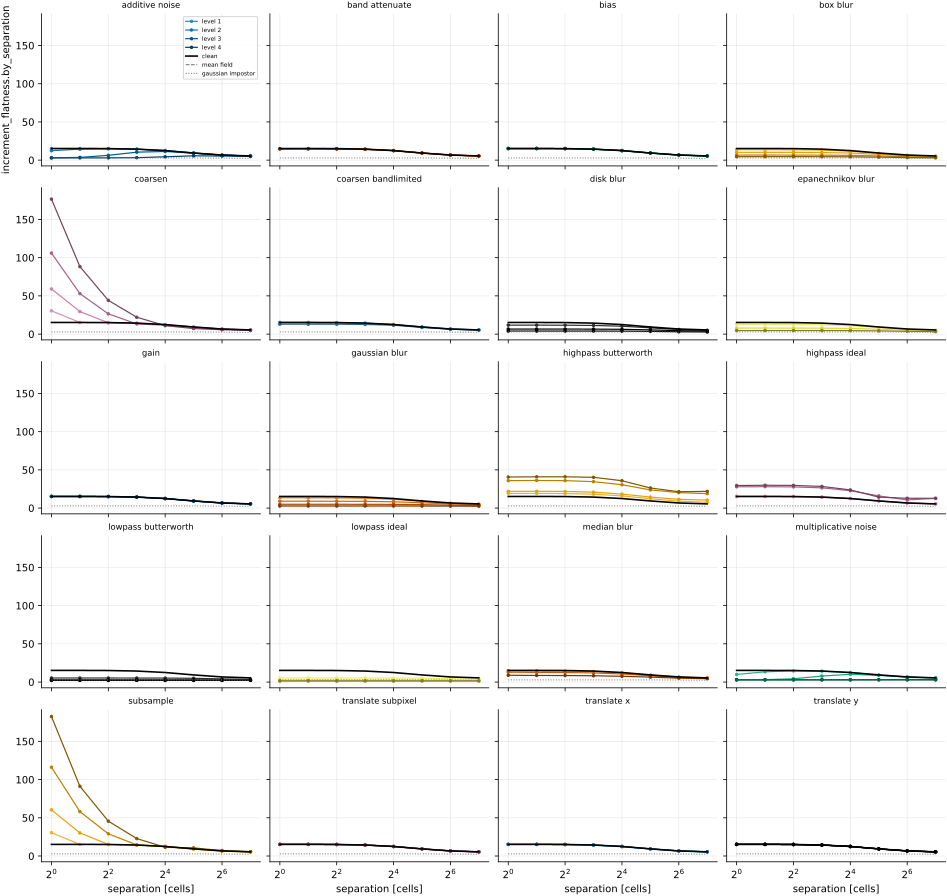
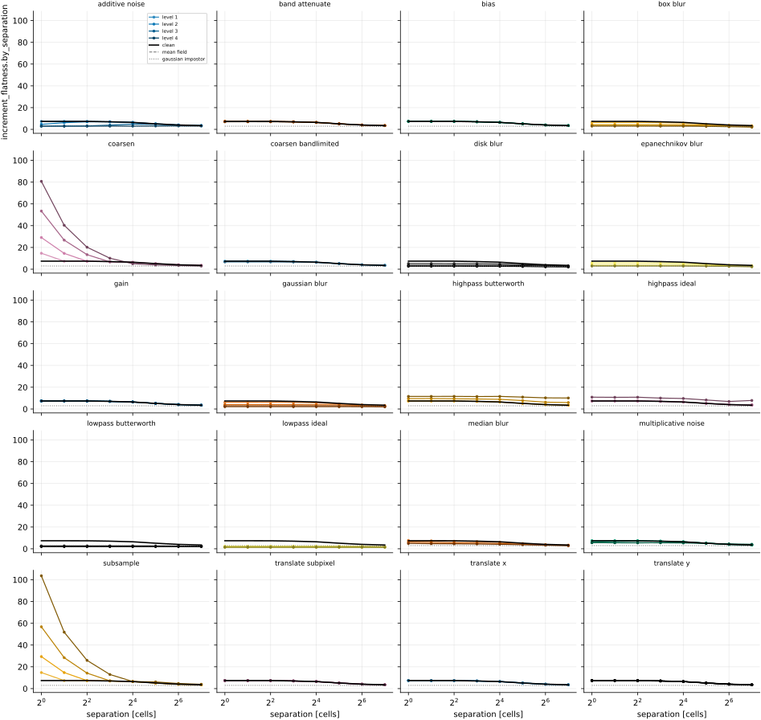
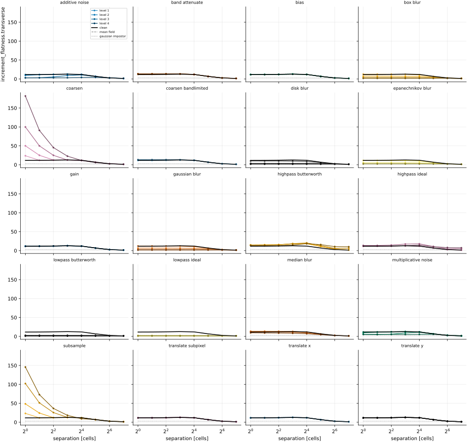
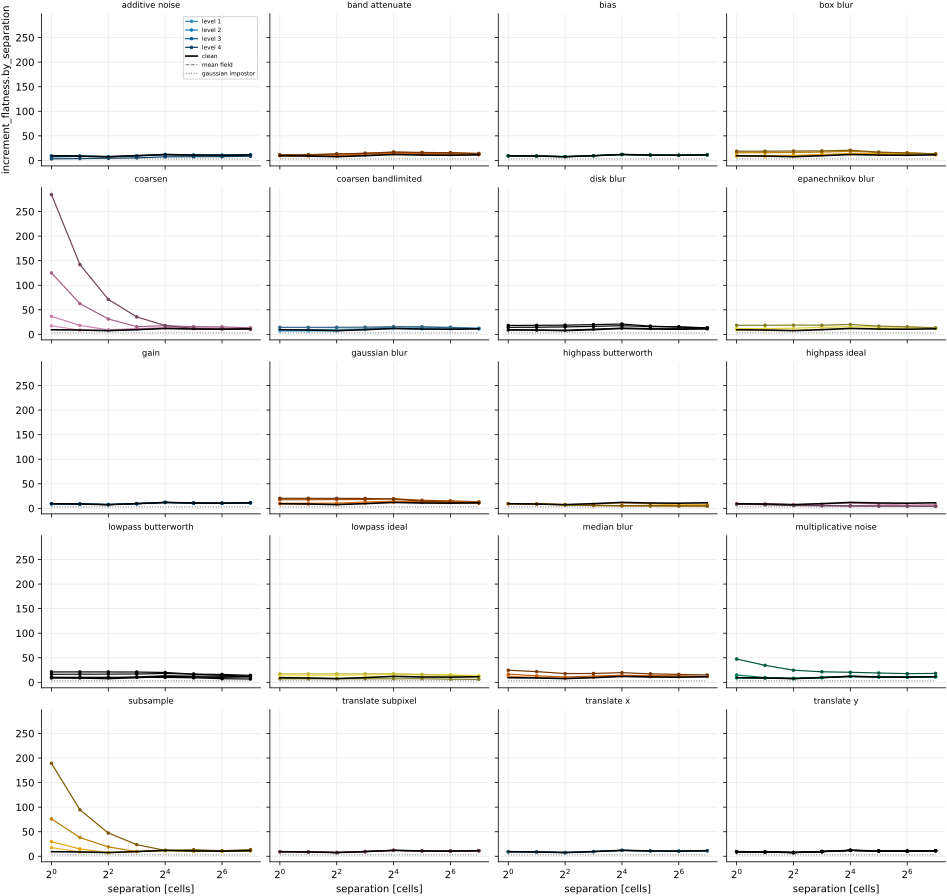
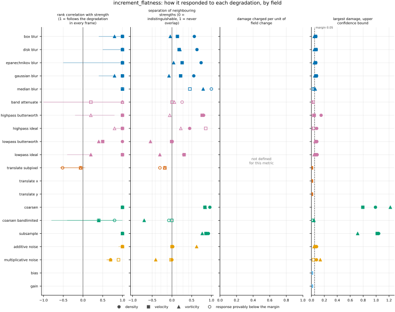
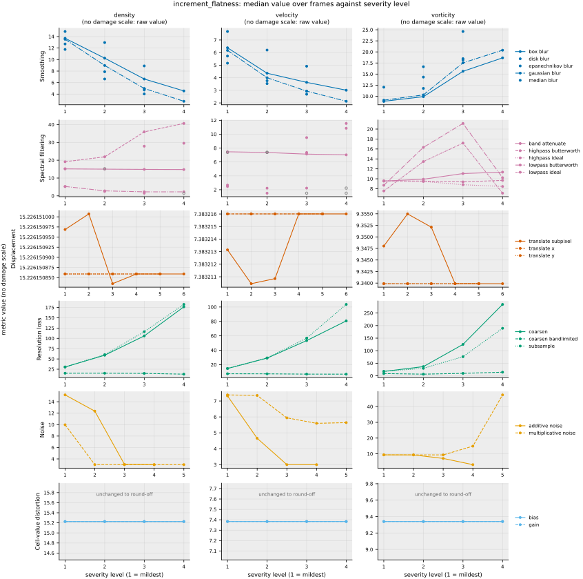
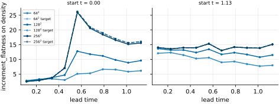
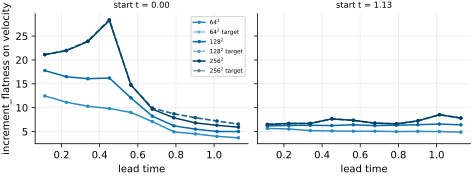
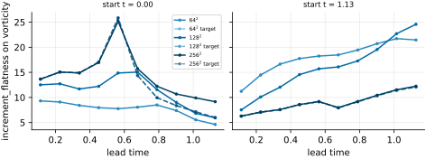

## Definition

Let $f$ be one channel of a field on a periodic grid and let $\mathbf{e}_j$ be the unit
step along spatial axis $j$. The increment at separation $\ell$ is

$$
(\delta_{\ell, j} f)_{\mathbf{n}} = f_{\mathbf{n} + \ell \mathbf{e}_j} - f_{\mathbf{n}} \tag{1}
$$

and the registered number fixes $\ell = 1$ cell, the smallest separation the analysis grid
resolves. The flatness of that increment field is its fourth moment normalised by the square
of its second [@granero2024] (Eq. (5)),

$$
F_j^{(c)}(\ell) = \frac{\bigl\langle (\delta_{\ell, j} f^{(c)})^4 \bigr\rangle}
{\bigl\langle (\delta_{\ell, j} f^{(c)})^2 \bigr\rangle^2} \tag{2}
$$

with $\langle \cdot \rangle$ the average over all cells. Which channel-and-axis pairs
$(c, j)$ are read depends on the field. Velocity is a vector whose channel $c$ is its
component along axis $c$, and for it only the **longitudinal** pairs $j = c$ are read: the
component parallel to the separation, the standard object of structure-function theory
([@boffetta2012], Eq. (4); [@granero2024], Eq. (1)). The **transverse** pairs $j \ne c$, the
component perpendicular to it, are a companion of their own (below). A scalar field such as
density or vorticity in two dimensions has no orientation, and every channel is read along
every axis. With $A$ the set of pairs read whose increments do not vanish identically, the
reported value is

$$
F = \frac{1}{|A|} \sum_{(c, j) \in A} F_j^{(c)}(1) \tag{3}
$$

and is NaN when $A$ is empty, that is when the field is constant along every axis read.

Equation (3) averages *flatnesses*, and that is a choice with consequences rather than a
detail. The alternative — pooling every increment from every axis and channel into one
sample and taking the flatness of that — breaks the property the metric is for. Increments
along different axes of an anisotropic field have different variances, and an equal
mixture of two zero-mean Gaussians whose variances stand in the ratio $r$ has flatness

$$
F_{\text{pooled}} = \frac{6 (1 + r^2)}{(1 + r)^2} \tag{4}
$$

which equals 3 only at $r = 1$. A perfectly Gaussian but anisotropic field would then score
above 3, and the fixed anchor that gives the number its meaning would be gone. Averaging
per-axis flatnesses keeps that anchor exact for any anisotropy.

Two values follow from Equation (2) in closed form and are worth recording because they
bound and calibrate the scale. A Gaussian field gives exactly 3. A single step across an
otherwise flat periodic axis of $N$ cells has increments $+1$ and $-1$ at two places and
zero at the other $N - 2$, so

$$
F = \frac{2/N}{(2/N)^2} = \frac{N}{2} \tag{5}
$$

which is how a rare sharp event registers: the same jump spread over a longer axis is
rarer and scores higher without limit. At the other extreme $F = 1$, the floor implied by
$\langle d^4 \rangle \ge \langle d^2 \rangle^2$, is attained when every increment has the
same magnitude.

The separation of the registered number is a constant of the evaluator, not an option. A
separation chosen per model would let a model be scored at whichever scale flattered it,
which is the same failure that fixing detector thresholds once is meant to prevent.

**The curves behind the number.** The flatness at every octave separation,
$\ell = 1, 2, 4, \dots$ cells up to half the shortest side of the grid (1 to 128 on a
$256^2$ grid), averaged over the same pairs as Equation (3),
$F(\ell) = |A_\ell|^{-1} \sum_{(c, j) \in A_\ell} F_j^{(c)}(\ell)$, is the companion
`increment_flatness.by_separation`; its first point is the registered number. For velocity
the same curve over the transverse pairs is the companion `increment_flatness.transverse`;
for a scalar field it is empty. Both are stored for every result row, untransformed, and
are drawn the way the field draws them, on logarithmic axes in both the separation and the
flatness. The registered number is computed on its own, so its cost is that of one
separation.

### Boundary handling

Periodic wrap on every axis: the increment of a cell within $\ell$ of the end of an axis is
taken against the cells at its start. An axis that is constant contributes no increments and
is dropped from the average in Equation (3) rather than contributing a zero or a three, both
of which would be claims the data does not support.

It therefore declares `requires_periodic`, and the harness does not run it on a dataset with a
non-periodic axis, such as the Sod shock tube; it reports why in the run log.

### How its field reports it

The metric comes from the statistical theory of turbulence, where the flatness of velocity
increments is the standard measure of intermittency.

- **Fully developed three-dimensional turbulence.** The object is the increment of the
  longitudinal velocity, $\delta_\ell v(x) = v(x + \ell) - v(x)$ ([@granero2024], Sect. 2.1,
  Eq. (1), "following Kolmogorov 1941"), its structure functions
  $S_p(\ell) = \langle (\delta_\ell v)^p \rangle$ (Eqs. (2)-(3)) and its flatness
  $F(\ell) = S_4 / S_2^2$ (Eq. (5)). The flatness is 3 at the integral scale, where the
  increments are close to Gaussian, and rises as $\ell$ decreases, which is intermittency
  (Sect. 2.1). The figure is $\log(F(\ell)/3)$ against $\log(\ell / L)$, with the
  Kolmogorov scale $\eta$ and the integral scale $L$ marked and error bars from the spread
  over realisations (Fig. 6c), beside the structure functions of orders 2 to 4 on log-log
  axes (Fig. 7), the probability densities of the standardised increments at several
  separations on a logarithmic density axis (Fig. 8), and the scaling exponents $\zeta_p$
  fitted to the structure functions over an inertial range (Fig. 9, fitted over
  $17 \le \ell / l_s \le 274$ sampling lengths). The experiment is a long velocity record of
  fully developed, homogeneous, isotropic turbulence: their data are single-point
  measurements of the longitudinal velocity in grid turbulence in the ONERA Modane wind
  tunnel, at a Taylor-scale Reynolds number of 2500,
  read as a spatial signal through Taylor's frozen-turbulence hypothesis (Sect. 2.2). The
  textbook treatment of structure functions and of intermittency is [@frisch1995],
  chapters 6 and 8; that book was not read for this card, so nothing here rests on it beyond
  the chapter titles.
- **Two-dimensional turbulence** ([@boffetta2012]). The structure function is split into
  longitudinal and transverse parts, from the velocity component parallel and perpendicular
  to the separation (Eq. (4), p. 430), and the exact third-order laws are stated for the
  longitudinal part (Eqs. (15)-(16), p. 432). In the inverse energy cascade the probability
  densities of the longitudinal increments are close to Gaussian, with no intermittency
  (p. 438, Fig. 6). In the direct enstrophy cascade the velocity structure functions are
  dominated by the largest scales and say little about small ones, so the vorticity
  structure functions are read instead (p. 432), and they become intermittent when the flow
  has friction (p. 444). A strong departure from Gaussianity of the longitudinal increments
  has been attributed to large coherent vortices (p. 442), which is the situation of the
  data here.

**What this bundle reports, and what it does not.** The number is the flatness at one cell,
longitudinal for velocity; the curve $F(\ell)$ and, for velocity, the transverse curve are
the field's figure. Scaling exponents are not computed and no scaling range is claimed:
`kinet_re5e4` is two opposite shear layers rolling up into a vortex pair, decaying and
anisotropic (`docs/datasets/reynolds_ladder_2d.md`), and no inertial range has been
established on it. Extended self-similarity, a way of reading scaling exponents that is
reported to hold at low Reynolds numbers too ([@benzi1993], abstract), is not used for the
same reason. The separations are in cells, not in units of $\eta$ or $L$, so the curve
cannot be laid over the field's published curves. Vorticity, which the two-dimensional field
reads in the direct cascade, is evaluated as a scalar, every axis.

**The experiments here.** The field's experiment, stationary isotropic turbulence with an
inertial range, does not exist here:
[EXP-increment_flatness-isotropic-3d-turbulence-cutouts](https://github.com/khegazy/pde_metrics/blob/main/proposals/EXP-increment_flatness-isotropic-3d-turbulence-cutouts.md)
writes it up, and
[EXP-energy_distance-tail-only-degradation](https://github.com/khegazy/pde_metrics/blob/main/proposals/EXP-energy_distance-tail-only-degradation.md)
a degradation that changes the tails of the increment distribution and nothing else, which is
what flatness measures. The metric runs on the degradation ladder on `kinet_re5e4`, on the
forecasts of `forecast_re5e4` (the flatness of each prediction beside its target's) and on
the Reynolds ladder. It is not run on the member mean of `synthetic_ensemble` (reason under
Results) or on `sod_shock_tube`, whose walls rule out a periodic increment.

## Performance

<!-- GENERATED performance: written by `python -m fmeval.cards evidence increment_flatness --results results/comparison_1793829127 --results results/comparison_1793811840 --results results/comparison_1793829231`, do not edit -->



*As this metric's own field draws it.* The curve behind increment_flatness.by_separation on density: the median over frames at every strength of every degradation, the clean curve in black, the anchor dashed and the impostor dotted. Values are the literature's own, untransformed.



*As this metric's own field draws it.* The curve behind increment_flatness.by_separation on velocity: the median over frames at every strength of every degradation, the clean curve in black, the anchor dashed and the impostor dotted. Values are the literature's own, untransformed.



*As this metric's own field draws it.* The curve behind increment_flatness.transverse on velocity: the median over frames at every strength of every degradation, the clean curve in black, the anchor dashed and the impostor dotted. Values are the literature's own, untransformed.



*As this metric's own field draws it.* The curve behind increment_flatness.by_separation on vorticity: the median over frames at every strength of every degradation, the clean curve in black, the anchor dashed and the impostor dotted. Values are the literature's own, untransformed.



Four measured statistics for increment_flatness, one row per degradation grouped by family and one marker per field. From left: the rank correlation between the metric and the applied strength within a frame, with the line showing the resampling interval; the separation of neighbouring strengths as Cliff's delta, where 0 means the metric cannot tell one strength from the next and the faint ticks at 0.12, 0.28 and 0.42 are Vargha and Delaney's small, medium and large anchors, for scale and not as grades; the damage charged per unit of field change at the harshest strength; and the upper confidence bound on the largest damage, beside the fixed margin of 0.05. A hollow marker is a field and degradation on which that bound lies below the margin, so the response is provably small. A missing marker is a statistic the analysis withheld, as the rank correlation is on an axis the metric is invariant to.



Median damage over frames against severity level for increment_flatness, one row per family of degradation and one column per field, on one shared scale. The solid grey line is damage 1, the anchor (by default the field's own mean); the dotted black line is the damage assigned to the fake prediction with the right spectrum, where the run included it. The hollow black ring marks the first level at which the metric has moved a tenth of the way to the anchor. Hollow grey markers are strengths excluded for repeating a milder one or for doing nothing. Degradations with three or fewer usable levels are drawn as markers only; points beyond 2 either side are drawn as triangles at the edge. Damage is negative where a degradation moves the metric away from the anchor, as noise raises a single-field quantity the field's mean sets to zero. No damage scale on density, velocity, vorticity: the grey panels show the raw value instead.

**Trend: does the response follow the degradation?**

| test family | field | degradations | rank correlation | fraction of frames in order | weakest gap between neighbouring strengths |
|---|---|---|---|---|---|
| Displacement | density | 3 | -0.516 | 0 | 0.348 |
| Displacement | velocity | 3 | -0.058 | 0 | 0.41 |
| Displacement | vorticity | 3 | -0.058 | 0 | 0.41 |
| Cell-value distortion | density | 2 | — | — | — |
| Cell-value distortion | velocity | 2 | — | — | — |
| Cell-value distortion | vorticity | 2 | — | — | — |
| Resolution loss | density | 3 | 0.8 to 1 | 0.317 to 1 | 0.461 to 0.98 |
| Resolution loss | velocity | 3 | 0.4 to 1 | 0.379 to 1 | 0.499 to 0.931 |
| Resolution loss | vorticity | 3 | 0.4 to 1 | 0.087 to 1 | 0.148 to 0.921 |
| Smoothing | density | 5 | 1 | 1 | 0.777 to 0.999 |
| Smoothing | velocity | 5 | 1 | 0.783 to 1 | 0.569 to 0.727 |
| Smoothing | vorticity | 5 | 0.8 to 1 | 0.304 to 0.969 | 0.462 to 0.896 |
| Spectral filtering | density | 5 | 1 | 0.95 to 1 | 0.503 to 0.902 |
| Spectral filtering | velocity | 5 | 0.2 to 1 | 0.211 to 1 | 0.496 to 0.928 |
| Spectral filtering | vorticity | 5 | 0.2 to 1 | 0 to 0.602 | 0.228 to 0.612 |
| Noise | density | 2 | 0.7 to 1 | 0.0683 to 0.981 | 0.499 to 0.51 |
| Noise | velocity | 2 | 0.9 to 1 | 0.186 to 0.565 | 0.488 to 0.501 |
| Noise | vorticity | 2 | 0.7 to 1 | 0.149 to 1 | 0.294 to 0.812 |

**Reactivity: how far does it move?**

| test family | field | change from clean at the harshest strength | elasticity | first strength detected |
|---|---|---|---|---|
| Displacement | density | -1.23e-15 to 0 | 1.36 | level — |
| Displacement | velocity | 0 | 5.16 | level — |
| Displacement | vorticity | 0 | 1.15 | level — |
| Cell-value distortion | density | -1.25e-16 to 0 | — | level — |
| Cell-value distortion | velocity | 0 | — | level — |
| Cell-value distortion | vorticity | 0 | — | level — |
| Resolution loss | density | -0.156 to 11 | 1.29 to 1.36 | level — |
| Resolution loss | velocity | -0.043 to 12.5 | 1.31 to 1.36 | level — |
| Resolution loss | vorticity | 0.573 to 30.1 | 1.47 to 1.88 | level — |
| Smoothing | density | -0.819 to -0.409 | 0.826 to 2.09 | level — |
| Smoothing | velocity | -0.719 to -0.257 | 0.583 to 1.19 | level — |
| Smoothing | vorticity | 0.606 to 1.1 | 1.18 | level — |
| Spectral filtering | density | -0.901 to 1.6 | 0.151 to 14.4 | level — |
| Spectral filtering | velocity | -0.797 to 0.465 | -0.0654 to 8.07 | level — |
| Spectral filtering | vorticity | -0.249 to 0.104 | 2.04 | level — |
| Noise | density | -0.803 | 0.185 to 1.27 | level — |
| Noise | velocity | -0.593 to -0.262 | 0.98 to 1.83 | level — |
| Noise | vorticity | -0.665 to 3.32 | 1.83 | level — |
| trap test: fake prediction, right spectrum | density | — | — | damage — |
| trap test: fake prediction, right spectrum | velocity | — | — | damage — |
| trap test: fake prediction, right spectrum | vorticity | — | — | damage — |

**Consistency: how much does it vary from snapshot to snapshot?**

| test family | field | consistency, in the strength's units | snapshots per independent block |
|---|---|---|---|
| Displacement | density | 4.31 | 1 to 6 |
| Displacement | velocity | 2.73 | 1 to 7 |
| Displacement | vorticity | 10 | 1 to 8 |
| Cell-value distortion | density | — | 1 |
| Cell-value distortion | velocity | — | 1 |
| Cell-value distortion | vorticity | — | 1 to 4 |
| Resolution loss | density | 0.159 to 2.38 | 18 to 19 |
| Resolution loss | velocity | 0.664 to 8.84 | 13 to 22 |
| Resolution loss | vorticity | 1.58 to 9.03 | 18 to 21 |
| Smoothing | density | 0.00287 to 0.00994 | 11 to 20 |
| Smoothing | velocity | 0.0192 to 0.098 | 21 |
| Smoothing | vorticity | 0.0479 to 5.98 | 19 to 22 |
| Spectral filtering | density | 0.0181 to 0.157 | 17 to 20 |
| Spectral filtering | velocity | 0.033 to 0.687 | 19 to 22 |
| Spectral filtering | vorticity | 0.18 to 1 | 13 to 22 |
| Noise | density | 0.00875 to 1.13 | 18 |
| Noise | velocity | 0.0462 to 0.065 | 21 |
| Noise | vorticity | 0.064 to 0.126 | 4 to 20 |

One row per family of degradation and physical field; a cell gives the range over the degradations in that family. **Trend.** The rank correlation is the Spearman correlation between the strength and how far the metric has moved from its value on the undegraded field of the same frame, in the one direction it moves under that degradation, computed inside a single frame. A value of 1 means every strength moved it further than the last in every frame, whichever way it moves; a response that scatters to both sides scores near 0. The fraction of frames in order counts the frames with no exception. The weakest gap is the smallest Mann-Whitney overlap between two neighbouring strengths across frames: 1 means they never overlap, 0.5 that they cannot be told apart. **Reactivity.** The change from clean is the median, at the harshest strength, of the departure from the undegraded value of the same frame over the size of that value: 0.3 means 30%. The elasticity is the percentage change of that departure per percentage change in strength over the mildest strengths. First strength detected is the mildest at which the metric has moved a tenth of the way to the anchor; **damage** reads that 0-to-1 scale as a number. A dash means the measurement is not defined there. A metric's reactivity scales with the power it is expressed in: mean squared error's elasticity is twice root-mean-square error's, though the two carry the same information, so compare magnitudes across metrics with that in mind. **Consistency** is how much the response varies from snapshot to snapshot relative to its size, in the strength's units; the snapshots of one trajectory are correlated, and the last column is how many consecutive snapshots one independent block spans.

These tables report what was measured and grade none of the measurements. What the numbers mean for this metric is written in the subsections below, beside the test that produced each number.

**Profile.**

| field | selectivity | charges most for | charges least for | response provably below 0.05 at 90% on | elasticity to a sub-pixel shift, against severity (distance) | compute cost (x cheapest in this run) |
|---|---|---|---|---|---|---|
| density | — | — | — | `band_attenuate` `bias` `coarsen_bandlimited` `gain` `median_blur` `translate_subpixel` `translate_x` `translate_y` | 1.36 | 24.6 |
| velocity | — | — | — | `band_attenuate` `bias` `coarsen_bandlimited` `gain` `highpass_ideal` `median_blur` `multiplicative_noise` `translate_subpixel` `translate_x` `translate_y` | 5.16 | 24.6 |
| vorticity | — | — | — | `band_attenuate` `bias` `gain` `highpass_butterworth` `highpass_ideal` `translate_subpixel` `translate_x` `translate_y` | 1.15 | 25.2 |

One row per physical field. **Selectivity** is how concentrated the metric's response is on a few degradations, measured per unit of field change: 0 means it charges every degradation the same, as mean squared error does by construction, and values toward 1 that one degradation carries most of it. **Charges most and least for** name the two ends of that profile. **Response provably below** lists degradations on which the upper confidence bound of the largest damage lies below the margin -- an equivalence test, so an entry says the response is provably small, not merely not significant; a dash means no degradation met the bound. **Elasticity** is the slope of log damage against log shift over the smallest shifts: 1 means damage grows in proportion to the shift, 2 with its square. **Compute cost** is wall-clock per evaluation over the cheapest metric and field in the same run.

<!-- END GENERATED performance -->

## Intuition

This metric asks whether a field's variation is shared out evenly across the domain or
concentrated into a few sharp places. It looks at the difference between each cell and its
neighbour, collects all of those differences, and asks how heavy the tails of that
collection are. A field whose neighbour-to-neighbour differences are all about the same
size scores low. A field that is mostly smooth but has a few abrupt jumps scores high,
because those jumps are enormous compared with the typical difference and a fourth power
weights them enormously more.

The anchor that makes the number readable is that a field of pure random noise with the
familiar bell-shaped distribution scores exactly three, whatever its amplitude. Above three
means the field has heavier tails than that: rare events larger than random chance would
produce. Real turbulence is well above three and climbs as you look at finer separations,
which is the standard quantitative statement that turbulence is intermittent — its
steepest gradients live in a small fraction of the volume. The failure this reveals is the
one an averaging-based prediction makes first: smoothing removes the rare sharp events
before it removes anything else, so this number falls toward three, and then below it,
while a cell-by-cell error norm may still look acceptable.

A worked example, four cells by four cells. On the left, a single step: the top row is
zero and the rest is one. Reading down a column, the differences between neighbours are
one at the step, one more where the grid wraps around, and zero at the two other places.
On the right, the value alternates every row, so every difference has the same size.

```
one step          alternating
0 0 0 0           0 0 0 0
1 1 1 1           1 1 1 1
1 1 1 1           0 0 0 0
1 1 1 1           1 1 1 1

flatness 2        flatness 1
```

Neither is above three, because four cells is far too short an axis for anything to be
rare in. That is the point of the comparison rather than an awkwardness: rarity is what
this measures, and on a four-cell axis a single jump happens a quarter of the time. Stretch
the same single step across sixteen cells and it scores eight; across a hundred, fifty. The
rows running across in these examples are constant, so they contribute nothing and the
value comes from reading down the columns alone.

For a velocity field the differences are taken the way turbulence takes them: along each
direction, only the part of the velocity pointing in that direction. The sideways part, the
velocity across the direction of travel, is kept as a second curve beside the number. The
same question asked at two, four, eight cells apart and further gives the curve that the
field actually draws, and the number is its first point.

What it ignores: where the sharp events are, and whether there is one of them or many
arranged differently. It counts how rare and how large they are, and nothing about their
positions, so two fields with identical increment distributions arranged into completely
different structures are indistinguishable here.

## Reading the output

Dimensionless, bounded below by 1 and unbounded above, with 3 the value of a Gaussian
field. There is no direction in which the number is better: what is read is the drift away
from the reference field's own value, in either direction. A prediction that scores below
the reference has lost intermittency, which for this data means it has smoothed away the
rare steep gradients; one that scores above has manufactured sharper or rarer events than
the flow contains.

Because the ratio in Equation (2) cancels any overall scaling of the field, values are
comparable across fields of completely different magnitude — density fluctuating by parts
in ten thousand and vorticity of order one can be read on the same axis, which is not true
of any other single-field quantity here. What is *not* comparable is across analysis-grid
resolutions: the separation in Equation (1) is one cell, so a finer grid measures the
flatness at a physically smaller separation, and intermittency means precisely that the
answer depends on that separation. Two runs at different `analysis_grid.resolution` are
measuring different quantities that happen to share a name.

For velocity the number is the flatness of the longitudinal increments only. A velocity value
from a run recorded before the bundle read the orientation averaged the longitudinal and
transverse pairs together, and is a different quantity; density and vorticity read every
axis, and their values did not change.

The companions are the curves in the run's `companions.csv`: rows labelled
`increment_flatness.by_separation` hold $F(\ell)$, rows labelled
`increment_flatness.transverse` the transverse curve of velocity, each with the separation in
cells as `coordinate`. Read a curve against the reference's curve on the same field, on
logarithmic axes. A curve that rises toward the small separations is the intermittency
signature; a prediction whose curve drops toward 3 at the small separations while agreeing
at the large ones has lost the small-scale extremes and kept the large-scale structure. A
longitudinal and a transverse curve that differ say the flow is not isotropic at those
separations, or that the two components are intermittent differently; neither is a defect of
a prediction unless the reference's curves differ in another way.

## Limitations

The most misleading case is a prediction whose flatness matches the reference for the wrong
reason. This is one number summarising an entire distribution, and a field that has lost
its genuine sharp structures while acquiring spurious small-scale noise can land back on
the reference value with both errors present. Nothing in the output distinguishes that from
a faithful prediction at one separation; the curve over separations, which the two errors
move at different scales, is where they separate.

A second case is quieter. The value is a fourth moment, so it is dominated by the largest
few increments in the field and is correspondingly noisy from frame to frame. A drift that
looks like a trend across a handful of frames may be sampling variation; the spread across
frames has to be read alongside the drift, not separately from it.

Finally, the fixed one-cell separation ties the number to the grid. On a coarse analysis
grid the separation may sit outside the range of scales where intermittency is developed,
and the metric then reports something real but not the quantity the literature discusses.
At the other end of the curve, the largest separations have few independent samples on one
frame: at half the domain every increment pairs a cell with the one opposite it, and the two
halves of the domain repeat each other's pairs with the sign reversed.

The limitation that matters most for how this metric may be used is that its response to
smoothing is **not monotone**, and this has been measured rather than feared. On the real
trajectory, increasing blur moves the value up before it moves down on density, wanders on
velocity (measured on the earlier value that pooled both orientations), and on vorticity falls by roughly 40 per cent and then more than doubles at the
heaviest blur tested. So ranking two predictions by how close their flatness is to the
reference's can put a more heavily smoothed field ahead of a less smoothed one. The numbers
behind this, and what should be done about it, are in
`issues/036-increment-flatness-is-not-monotone-under-smoothing.md`. Read this metric as a
tripwire that says intermittency has changed, never as an ordering of how much.

## Results

<!-- GENERATED run: written by `python -m fmeval.cards evidence increment_flatness --results results/comparison_1793829127 --results results/comparison_1793811840 --results results/comparison_1793829231`, do not edit -->

Measured on `kinet_re5e4`, frames 2000 to 10000 (161 frames of developed flow), on the 256 analysis grid, seed 20260807, at commit `adbdc88e4950`. Run `comparison_1793829127`.

Every number in this section comes from that run, except in the subsections headed with another experiment and in a figure whose caption names another run, each of which names its own run. Regenerate with `python -m fmeval.cards evidence <name> --results results/comparison_1793829127 --results results/comparison_1793811840 --results results/comparison_1793829231`.

<!-- END GENERATED run -->

<!-- GENERATED experiments: written by `python -m fmeval.cards catalog`, do not edit -->

**Across the experiments.**

| experiment | what a run on it is evidence of | on this card |
|---|---|---|
| `kinet_re5e4` | developed flow | measured, run `comparison_1793829127`: the main results |
| `kinet_re1e6` | developed flow at Re = 1e6, twenty times the Reynolds number of kinet_re5e4, from the same initial condition | measured, run `comparison_1793829231`: under *On `kinet_re1e6`* |
| `synthetic_ensemble` | a calibrated null: evidence that the estimator computes what it claims to compute, and nothing about turbulence | not applicable: every axis there leaves the member mean's increments unchanged (dispersion scales members about their mean; a bias cancels in an increment) |
| `sod_shock_tube` | an analytic check: evidence that the metric locates and scores a known shock correctly, and nothing about turbulence | not applicable: needs a periodic domain, and this dataset is not periodic |
| `forecast_re5e4` | real predictions scored against their targets at each prediction step; who produced the predictions, a trained model or a coarser solver, is not recorded | measured, run `comparison_1793811840`: under *On `forecast_re5e4`* |

One row per dataset a card may cite (`configs/cards/default.yaml`). *Measured* names the run the card cites: the main results are `## Performance` and the subsections below, and every other run has its own subsection headed with its dataset. *Not applicable* gives the reason: one that follows from what the metric declares and what the dataset offers, or one a person wrote on the card (`not_run` in `card.yaml`) because the result would carry no information. *Not yet run* means the metric can run there and the card cites no run on it yet.

<!-- END GENERATED experiments -->

### Smoothing

[gaussian_blur](../../degradations/gaussian_blur/card.md) ·
[box_blur](../../degradations/box_blur/card.md)

<!-- GENERATED results_smoothing: written by `python -m fmeval.cards evidence increment_flatness --results results/comparison_1793829127 --results results/comparison_1793811840 --results results/comparison_1793829231`, do not edit -->

| degradation | field | strengths | rank correlation | fraction of frames in the right order | weakest gap between neighbouring strengths |
|---|---|---|---|---|---|
| `box_blur` | density | 4 | 1 | 1 | 0.783 |
| `box_blur` | velocity | 4 | 1 | 1 | 0.569 |
| `box_blur` | vorticity | 4 | 0.8 | 0.435 | 0.479 |
| `disk_blur` | density | 3 | 1 | 1 | 0.817 |
| `disk_blur` | velocity | 3 | 1 | 1 | 0.591 |
| `disk_blur` | vorticity | 3 | 1 | 0.615 | 0.601 |
| `epanechnikov_blur` | density | 3 | 1 | 1 | 0.87 |
| `epanechnikov_blur` | velocity | 3 | 1 | 1 | 0.629 |
| `epanechnikov_blur` | vorticity | 3 | 1 | 0.503 | 0.521 |
| `gaussian_blur` | density | 4 | 1 | 1 | 0.777 |
| `gaussian_blur` | velocity | 4 | 1 | 1 | 0.61 |
| `gaussian_blur` | vorticity | 4 | 0.8 | 0.304 | 0.462 |
| `median_blur` | density | 3 | 1 | 1 | 0.999 |
| `median_blur` | velocity | 3 | 1 | 0.783 | 0.727 |
| `median_blur` | vorticity | 3 | 1 | 0.969 | 0.896 |

<!-- END GENERATED results_smoothing -->

The **direction differs between fields**: smoothing drives the flatness down on density and
velocity, where every blur is followed in every frame, and up on vorticity, where the trend is
weaker: a rank correlation of 0.8 under the box and Gaussian blurs, with 43% and 30% of frames
in order. Under the box blur, vorticity's flatness falls at every strength in 49 of 161 frames
and rises at every strength in 34; the median moves up, which sets the direction. A metric whose
direction depends on the field gives no single answer to which way is worse.

This is the same phenomenon recorded in
`issues/036-increment-flatness-is-not-monotone-under-smoothing.md`, seen through the ladder
rather than through a blur sweep on one frame.

### Spectral filtering

[lowpass_ideal](../../degradations/lowpass_ideal/card.md) ·
[highpass_ideal](../../degradations/highpass_ideal/card.md)

<!-- GENERATED results_spectral: written by `python -m fmeval.cards evidence increment_flatness --results results/comparison_1793829127 --results results/comparison_1793811840 --results results/comparison_1793829231`, do not edit -->

| degradation | field | strengths | rank correlation | fraction of frames in the right order | weakest gap between neighbouring strengths |
|---|---|---|---|---|---|
| `band_attenuate` | density | 4 | 1 | 0.988 | 0.629 |
| `band_attenuate` | velocity | 4 | 0.2 | 0.416 | 0.501 |
| `band_attenuate` | vorticity | 4 | 1 | 0.602 | 0.53 |
| `highpass_butterworth` | density | 4 | 1 | 1 | 0.902 |
| `highpass_butterworth` | velocity | 3 | 1 | 0.882 | 0.882 |
| `highpass_butterworth` | vorticity | 4 | 0.2 | 0.155 | 0.472 |
| `highpass_ideal` | density | 3 | 1 | 0.95 | 0.724 |
| `highpass_ideal` | velocity | 2 | 1 | 0.938 | 0.928 |
| `highpass_ideal` | vorticity | 4 | 0.8 | 0.497 | 0.612 |
| `lowpass_butterworth` | density | 4 | 1 | 1 | 0.503 |
| `lowpass_butterworth` | velocity | 3 | 0.5 | 0.211 | 0.496 |
| `lowpass_butterworth` | vorticity | 4 | 0.4 | 0 | 0.228 |
| `lowpass_ideal` | density | 3 | 1 | 1 | 0.65 |
| `lowpass_ideal` | velocity | 2 | 1 | 1 | 0.654 |
| `lowpass_ideal` | vorticity | 4 | 0.2 | 0.118 | 0.347 |

<!-- END GENERATED results_spectral -->

The weakest family for this metric. On density every filter is followed, but the low-passes
drive the flatness down and the high-passes up. On velocity the rank correlation is 0.5 to 1 and
on vorticity 0.2 to 0.8, with as few as none of the frames in order under the Butterworth
low-pass. Different filters move the flatness in opposite directions on the same field, and
the weakest gap between neighbouring strengths falls to 0.23 on vorticity.

The mechanism is not mysterious: a low-pass and a high-pass filter reshape the increment
distribution in opposite ways, and flatness is a shape statistic with no reason to respond to
both alike. Nothing here should be read as this metric ranking spectral damage.

### Displacement

[translate_x](../../degradations/translate/card.md) ·
[translate_subpixel](../../degradations/translate_subpixel/card.md)

<!-- GENERATED results_geometric: written by `python -m fmeval.cards evidence increment_flatness --results results/comparison_1793829127 --results results/comparison_1793811840 --results results/comparison_1793829231`, do not edit -->

| degradation | field | strengths | rank correlation | fraction of frames in the right order | weakest gap between neighbouring strengths |
|---|---|---|---|---|---|
| `translate_subpixel` | density | 6 | -0.516 | 0 | 0.348 |
| `translate_subpixel` | velocity | 6 | -0.058 | 0 | 0.41 |
| `translate_subpixel` | vorticity | 6 | -0.058 | 0 | 0.41 |
| `translate_x` | density | 5 | — | — | — |
| `translate_x` | velocity | 5 | — | — | — |
| `translate_x` | vorticity | 5 | — | — | — |
| `translate_y` | density | 5 | — | — | — |
| `translate_y` | velocity | 5 | — | — | — |
| `translate_y` | vorticity | 5 | — | — | — |

<!-- END GENERATED results_geometric -->

Invariant, as it must be. An integer translation permutes the increments without changing
the multiset, so `translate_x` gives an identical value at every strength and its correlation
is withheld as round-off. `translate_subpixel` interpolates and so perturbs the field
slightly at fractional distances and not at all at the whole-cell strengths, so the value moves
off clean and comes back: correlations between -0.52 and -0.03, no frame in order, and weakest
gaps of 0.35 to 0.41, below the chance value of 0.5.

For this metric the invariance is incidental rather than the point — it is a consequence of
reading only the distribution of increments.

### Resolution loss

[coarsen](../../degradations/coarsen/card.md) ·
[coarsen_bandlimited](../../degradations/coarsen_bandlimited/card.md)

<!-- GENERATED results_resolution: written by `python -m fmeval.cards evidence increment_flatness --results results/comparison_1793829127 --results results/comparison_1793811840 --results results/comparison_1793829231`, do not edit -->

| degradation | field | strengths | rank correlation | fraction of frames in the right order | weakest gap between neighbouring strengths |
|---|---|---|---|---|---|
| `coarsen` | density | 4 | 1 | 1 | 0.98 |
| `coarsen` | velocity | 4 | 1 | 1 | 0.917 |
| `coarsen` | vorticity | 4 | 1 | 0.994 | 0.921 |
| `coarsen_bandlimited` | density | 4 | 0.8 | 0.317 | 0.461 |
| `coarsen_bandlimited` | velocity | 4 | 0.4 | 0.379 | 0.499 |
| `coarsen_bandlimited` | vorticity | 4 | 0.4 | 0.087 | 0.148 |
| `subsample` | density | 4 | 1 | 1 | 0.962 |
| `subsample` | velocity | 4 | 1 | 0.994 | 0.931 |
| `subsample` | vorticity | 4 | 1 | 1 | 0.884 |

<!-- END GENERATED results_resolution -->

Under `coarsen` the flatness rises steeply and monotonically with the factor, from 15.2 to 177
on density, 9.2 to 131 on velocity and 9.3 to 284 on vorticity at a factor of 16. That rise is
the staircase, not the lost resolution. Inside each block every one-cell increment is exactly
zero and at its edge there is a jump, so the increment distribution becomes a spike at zero
with rare large values, which is precisely what flatness measures.

`coarsen_bandlimited` keeps the same block means without adding edges, and under it the
flatness barely moves on density and velocity (15.3, 15.3, 14.9, 13.0 and 9.2, 9.3, 9.8, 10.2
at factors 2 to 16) and on vorticity falls and then rises (8.8, 6.5, 9.7, 14.3), with rank
correlations of 0.8, 0.8 and 0.4 and at most 46% of frames in order. An earlier version of this card read the `coarsen` row as
the one family this metric handles cleanly. It was a response to the operator's block edges;
`issues/039` records the mechanism.

### Noise

[additive_noise](../../degradations/additive_noise/card.md)

<!-- GENERATED results_stochastic: written by `python -m fmeval.cards evidence increment_flatness --results results/comparison_1793829127 --results results/comparison_1793811840 --results results/comparison_1793829231`, do not edit -->

| degradation | field | strengths | rank correlation | fraction of frames in the right order | weakest gap between neighbouring strengths |
|---|---|---|---|---|---|
| `additive_noise` | density | 4 | 1 | 0.981 | 0.51 |
| `additive_noise` | velocity | 4 | 1 | 0.565 | 0.501 |
| `additive_noise` | vorticity | 4 | 1 | 1 | 0.812 |
| `multiplicative_noise` | density | 5 | 0.7 | 0.0683 | 0.499 |
| `multiplicative_noise` | velocity | 5 | 0.9 | 0.186 | 0.488 |
| `multiplicative_noise` | vorticity | 5 | 0.7 | 0.149 | 0.294 |

<!-- END GENERATED results_stochastic -->

A rank correlation of 1 on all three fields, with the flatness falling in 91% to 100% of
frames at every strength. Additive Gaussian noise pushes the increment distribution toward a
Gaussian one, so the flatness falls toward 3 from the much larger values the undegraded fields
carry. Read against the clean value of the same frame, neighbouring strengths overlap across
frames on density and velocity (weakest gaps 0.51) and less on vorticity (0.81): the size of the
fall differs from frame to frame more than it differs between neighbouring strengths. This
is the clearest confirmation in the run that the metric measures what it claims to: the one
degradation that manipulates Gaussianity directly is the one it responds to most cleanly, and
in the direction the definition predicts.

### Trap tests

[gaussian_impostor](../../degradations/gaussian_impostor/card.md) ·
[uncorrelated](../../degradations/random_large_translation/card.md)

<!-- GENERATED results_canaries: written by `python -m fmeval.cards evidence increment_flatness --results results/comparison_1793829127 --results results/comparison_1793811840 --results results/comparison_1793829231`, do not edit -->

| field | damage assigned to the fake prediction | closest real degradation | damage of the reference moved far away | value on the anchor |
|---|---|---|---|---|
| density | — | — | — | — |
| velocity | — | — | — | — |
| vorticity | — | — | — | — |

The fake prediction here has exactly the reference field's amplitude spectrum and completely scrambled structure. Damage 1 is what the anchor scores, by default the reference's own spatial mean, a prediction that knows the mean and nothing else. The damage column therefore says how close to useless this metric considers that fake prediction: a low number means the metric was fooled. The third column translates the same number into an ordinary degradation whose damage the fake prediction matches, which is easier to picture. The fourth is the reference moved by a large random offset, the right statistics in the wrong place; where a field's energy sits in its largest scales that copy stays partly correlated with the reference, so it is not the score of an unrelated field.

<!-- END GENERATED results_canaries -->

Neither trap can be scored on the damage scale, because this metric has none. The anchor is
the field's spatial mean, a constant field whose increments are all zero, so its flatness is
zero over zero and the span is undefined
(`issues/037-increment-flatness-has-no-damage-scale.md`). The damage columns are therefore
absent rather than zero.

The reference moved far away scores 15.2, 9.23 and 9.34 on density, velocity and vorticity,
exactly the reference's own values: a translation permutes the increments without changing
them, and this metric reads only their distribution. The fake prediction scores 2.86, 2.89
and 3.00, close to the Gaussian value of 3, because it has the reference's spectrum and
Gaussian statistics.

### Compared with the other metrics

<!-- GENERATED results_summary: written by `python -m fmeval.cards evidence increment_flatness --results results/comparison_1793829127 --results results/comparison_1793811840 --results results/comparison_1793829231`, do not edit -->

| compared with | density | velocity | vorticity |
|---|---|---|---|
| `tail_index` | 0.583 | 0.517 | 0.17 |
| `kinetic_energy` | — | 0.279 | — |
| `h_minus_one` | -0.113 | -0.0258 | 0.105 |
| `persistence_distance` | -0.498 | — | 0.411 |
| `mae` | -0.145 | -0.0717 | 0.0516 |
| `h1_seminorm` | -0.127 | -0.0729 | 0.231 |
| `mse` | -0.209 | -0.0934 | 0.114 |
| `rmse` | -0.208 | -0.0934 | 0.114 |
| `rmse_channel_mean` | -0.208 | -0.103 | 0.114 |
| `nrmse` | -0.208 | -0.104 | 0.109 |
| `vrmse` | -0.208 | -0.104 | 0.106 |
| `wasserstein` | -0.111 | — | — |
| `h1_relative` | -0.21 | -0.142 | 0.159 |
| `max_error` | -0.295 | -0.154 | 0.178 |
| `max_error_channel_mean` | -0.295 | -0.167 | 0.178 |
| `energy_distance` | -0.233 | -0.44 | 0.5 |
| `increment_w1` | -0.247 | -0.413 | 0.505 |
| `palinstrophy` | — | — | -0.259 |
| `spectrum_l2` | -0.327 | -0.326 | 0.435 |
| `increment_w1_by_separation` | -0.331 | -0.524 | 0.392 |
| `enstrophy` | — | — | -0.399 |
| `spectral_energy_flux` | — | -0.429 | — |
| `tail_exceedance` | -0.507 | -0.6 | 0.347 |

Rank correlation over every degradation, computed separately for each physical field on the median value at each combination of degradation and strength, with the undegraded reference excluded. A dash marks a metric that does not run on that field. A metric with a target value enters by its distance from the target. Two metrics correlating near 1 put the degradations in the same order, but the two may still weight those degradations very differently. A correlation near 1 therefore means the two metrics are redundant for ranking models, not that the two are interchangeable as training losses.

<!-- END GENERATED results_summary -->

Read as a ranker, this metric works on exactly one family of the five. It orders noise
cleanly, moves in opposite directions on different fields under smoothing, orders spectral filtering
inconsistently and is invariant to displacement. Its clean ordering under `coarsen` turned
out to be a response to that operator's block edges rather than to lost resolution: under
`coarsen_bandlimited`, which discards the same information without adding edges, it is not
ordered (see Resolution loss). `CLAUDE.md`'s acceptance rule is that a
metric joins the panel only if it is monotone with high rank correlation, and on that rule
this does not qualify; `issues/036` sets out what should be done about it.

Read as a tripwire, the picture is different and more favourable. It correlates -0.225 to
-0.035 with the four pointwise baselines and -0.18 to 0.019 with `h_minus_one` across the three
fields, so it is close to independent of all five and is carrying information none of them carry.
Its correlations with `increment_w1` and `increment_w1_by_separation` are -0.23 to -0.30 on
density and velocity and +0.31 to +0.39 on vorticity, as expected of three metrics that read
increment distributions. The only other substantial
relationships are 0.65 and 0.678 with `tail_index` on density and velocity and -0.445 with
`palinstrophy` on vorticity. The case for keeping it is that a drift in this
number means something specific that no other metric reports; the case against using it to choose between models is the sign
change above.

### Damage beside the other metrics

<!-- GENERATED results_damage_by_level: written by `python -m fmeval.cards evidence increment_flatness --results results/comparison_1793829127 --results results/comparison_1793811840 --results results/comparison_1793829231`, do not edit -->

No damage beside the pointwise controls figure: increment_flatness has no damage scale on any field for these degradations.

**Displacement, density, `translate_subpixel`** (strength: distance).

| metric | 0.125 | 0.25 | 0.5 | 1 | 2 | 4 |
|---|---|---|---|---|---|---|
| `increment_flatness` | — | — | — | — | — | — |
| `mae` | 0.00383 | 0.00767 | 0.0153 | 0.0306 | 0.061 | 0.121 |
| `mse` | 2.17e-05 | 8.68e-05 | 0.000347 | 0.00138 | 0.00551 | 0.0219 |
| `rmse` | 0.00466 | 0.00931 | 0.0186 | 0.0372 | 0.0743 | 0.148 |
| `vrmse` | 0.00463 | 0.00926 | 0.0185 | 0.037 | 0.0738 | 0.147 |

**Displacement, density, `translate_x`** (strength: distance).

| metric | 1 | 2 | 4 | 8 | 16 |
|---|---|---|---|---|---|
| `increment_flatness` | — | — | — | — | — |
| `mae` | 0.0306 | 0.061 | 0.121 | 0.24 | 0.469 |
| `mse` | 0.00138 | 0.00551 | 0.0219 | 0.0849 | 0.307 |
| `rmse` | 0.0372 | 0.0743 | 0.148 | 0.291 | 0.555 |
| `vrmse` | 0.037 | 0.0738 | 0.147 | 0.29 | 0.55 |

**Displacement, density, `translate_y`** (strength: distance).

| metric | 1 | 2 | 4 | 8 | 16 |
|---|---|---|---|---|---|
| `increment_flatness` | — | — | — | — | — |
| `mae` | 0.031 | 0.0616 | 0.122 | 0.244 | 0.476 |
| `mse` | 0.00142 | 0.00565 | 0.0224 | 0.0869 | 0.316 |
| `rmse` | 0.0377 | 0.0752 | 0.15 | 0.295 | 0.562 |
| `vrmse` | 0.0376 | 0.075 | 0.149 | 0.294 | 0.56 |

**Displacement, velocity, `translate_subpixel`** (strength: distance).

| metric | 0.125 | 0.25 | 0.5 | 1 | 2 | 4 |
|---|---|---|---|---|---|---|
| `increment_flatness` | — | — | — | — | — | — |
| `mae` | 0.00279 | 0.00559 | 0.0112 | 0.0223 | 0.0441 | 0.0859 |
| `mse` | 1.45e-05 | 5.81e-05 | 0.000232 | 0.000924 | 0.0036 | 0.0136 |
| `rmse` | 0.00381 | 0.00762 | 0.0152 | 0.0304 | 0.06 | 0.117 |
| `vrmse` | 0.00365 | 0.00729 | 0.0146 | 0.029 | 0.0574 | 0.111 |

**Displacement, velocity, `translate_x`** (strength: distance).

| metric | 1 | 2 | 4 | 8 | 16 |
|---|---|---|---|---|---|
| `increment_flatness` | — | — | — | — | — |
| `mae` | 0.0223 | 0.0441 | 0.0859 | 0.163 | 0.31 |
| `mse` | 0.000924 | 0.0036 | 0.0136 | 0.0489 | 0.165 |
| `rmse` | 0.0304 | 0.06 | 0.117 | 0.221 | 0.406 |
| `vrmse` | 0.029 | 0.0574 | 0.111 | 0.209 | 0.383 |

**Displacement, velocity, `translate_y`** (strength: distance).

| metric | 1 | 2 | 4 | 8 | 16 |
|---|---|---|---|---|---|
| `increment_flatness` | — | — | — | — | — |
| `mae` | 0.0223 | 0.0442 | 0.0856 | 0.16 | 0.295 |
| `mse` | 0.000935 | 0.00366 | 0.0138 | 0.0473 | 0.158 |
| `rmse` | 0.0306 | 0.0605 | 0.117 | 0.218 | 0.397 |
| `vrmse` | 0.0303 | 0.0599 | 0.115 | 0.212 | 0.384 |

**Displacement, vorticity, `translate_subpixel`** (strength: distance).

| metric | 0.125 | 0.25 | 0.5 | 1 | 2 | 4 |
|---|---|---|---|---|---|---|
| `increment_flatness` | — | — | — | — | — | — |
| `mae` | 0.0428 | 0.0854 | 0.169 | 0.328 | 0.582 | 0.86 |
| `mse` | 0.00112 | 0.00448 | 0.0176 | 0.066 | 0.21 | 0.44 |
| `rmse` | 0.0335 | 0.0669 | 0.133 | 0.257 | 0.458 | 0.663 |
| `vrmse` | 0.0329 | 0.0656 | 0.13 | 0.253 | 0.455 | 0.671 |

**Displacement, vorticity, `translate_x`** (strength: distance).

| metric | 1 | 2 | 4 | 8 | 16 |
|---|---|---|---|---|---|
| `increment_flatness` | — | — | — | — | — |
| `mae` | 0.328 | 0.582 | 0.86 | 1.1 | 1.31 |
| `mse` | 0.066 | 0.21 | 0.44 | 0.679 | 1.1 |
| `rmse` | 0.257 | 0.458 | 0.663 | 0.824 | 1.05 |
| `vrmse` | 0.253 | 0.455 | 0.671 | 0.832 | 1.05 |

**Displacement, vorticity, `translate_y`** (strength: distance).

| metric | 1 | 2 | 4 | 8 | 16 |
|---|---|---|---|---|---|
| `increment_flatness` | — | — | — | — | — |
| `mae` | 0.333 | 0.603 | 0.93 | 1.25 | 1.43 |
| `mse` | 0.0858 | 0.283 | 0.628 | 0.849 | 1.17 |
| `rmse` | 0.293 | 0.532 | 0.793 | 0.922 | 1.08 |
| `vrmse` | 0.268 | 0.495 | 0.793 | 0.927 | 1.08 |

Median damage over frames at every strength, this metric in the first row and the pointwise controls beneath it, all on the same 0-to-1 scale where 0 is the undegraded reference and 1 the anchor (by default the field's own mean); a dash means no damage scale on that field. The rank correlations under *Compared with the other metrics* say whether two metrics put the strengths in the same order; this table says how much each one charges for the same strength, which decides whether two metrics are interchangeable as training losses.

<!-- END GENERATED results_damage_by_level -->

### On `forecast_re5e4`

<!-- GENERATED results_on_forecast_re5e4: written by `python -m fmeval.cards evidence increment_flatness --results results/comparison_1793829127 --results results/comparison_1793811840 --results results/comparison_1793829231`, do not edit -->

**Real predictions scored against their targets at each prediction step; who produced the predictions, a trained model or a coarser solver, is not recorded.**

Measured on `forecast_re5e4`, frames 0 to 59 (60 frames of real predictions scored against their targets at each prediction step; who produced the predictions, a trained model or a coarser solver, is not recorded), on the 64 analysis grid, seed 20260807, at commit `adbdc88e4950`. Run `comparison_1793811840`.

[mean_field](../../degradations/mean_field/card.md)



increment_flatness on density against lead time, the physical time since the forecast started, one panel per start and one line per run, darker the finer the run's grid. Dashed lighter lines are the target's own value. Each point is one prediction step of one forecast.



increment_flatness on velocity against lead time, the physical time since the forecast started, one panel per start and one line per run, darker the finer the run's grid. Dashed lighter lines are the target's own value. Each point is one prediction step of one forecast.



increment_flatness on vorticity against lead time, the physical time since the forecast started, one panel per start and one line per run, darker the finer the run's grid. Dashed lighter lines are the target's own value. Each point is one prediction step of one forecast.

**density, increment_flatness on the prediction, at each lead time.**

| lead time | 64², start 0 | 128², start 0 | 256², start 0 | 64², start 1.13 | 128², start 1.13 | 256², start 1.13 |
|---|---|---|---|---|---|---|
| 0.1128 | 2.82 | 2.54 | 2.52 | 12.1 | 13.7 | 14.1 |
| 0.2255 | 3.3 | 3.17 | 2.88 | 12.3 | 13.2 | 13.6 |
| 0.3383 | 3.4 | 3.81 | 3.73 | 11.5 | 13.2 | 14 |
| 0.4511 | 3.01 | 4.69 | 7.05 | 10.3 | 12.3 | 14 |
| 0.5638 | 5.11 | 12.8 | 26 | 10.6 | 13.5 | 15.3 |
| 0.6766 | 5.28 | 11.8 | 20.6 | 9 | 11.7 | 13 |
| 0.7893 | 6.64 | 11.2 | 18.4 | 9.29 | 12.3 | 14.2 |
| 0.9021 | 6.55 | 9.84 | 16.6 | 8.43 | 11.7 | 13.9 |
| 1.015 | 5.84 | 8.89 | 15.2 | 7.71 | 10.8 | 13.8 |
| 1.128 | 6.15 | 9.61 | 15.6 | 8 | 11.5 | 15.1 |

**density, increment_flatness on the target, at each lead time.**

| lead time | 64², start 0 | 128², start 0 | 256², start 0 | 64², start 1.13 | 128², start 1.13 | 256², start 1.13 |
|---|---|---|---|---|---|---|
| 0.1128 | 2.53 | 2.52 | 2.52 | 14 | 14.1 | 14.1 |
| 0.2255 | 2.88 | 2.88 | 2.88 | 13.6 | 13.6 | 13.6 |
| 0.3383 | 3.7 | 3.72 | 3.74 | 14 | 14 | 14 |
| 0.4511 | 7.1 | 7.1 | 7.09 | 14 | 14 | 14 |
| 0.5638 | 26.2 | 26.2 | 26.2 | 15.3 | 15.3 | 15.3 |
| 0.6766 | 21 | 20.9 | 20.9 | 13 | 13 | 13 |
| 0.7893 | 19 | 19 | 19 | 14.2 | 14.2 | 14.2 |
| 0.9021 | 17 | 17 | 17 | 13.9 | 13.9 | 13.9 |
| 1.015 | 15.6 | 15.6 | 15.6 | 13.9 | 13.9 | 13.9 |
| 1.128 | 16 | 16 | 16 | 15.1 | 15.1 | 15.1 |

**density, increment_flatness damage, at each lead time.**

| lead time | 64², start 0 | 128², start 0 | 256², start 0 | 64², start 1.13 | 128², start 1.13 | 256², start 1.13 |
|---|---|---|---|---|---|---|
| 0.1128 | — | — | — | — | — | — |
| 0.2255 | — | — | — | — | — | — |
| 0.3383 | — | — | — | — | — | — |
| 0.4511 | — | — | — | — | — | — |
| 0.5638 | — | — | — | — | — | — |
| 0.6766 | — | — | — | — | — | — |
| 0.7893 | — | — | — | — | — | — |
| 0.9021 | — | — | — | — | — | — |
| 1.015 | — | — | — | — | — | — |
| 1.128 | — | — | — | — | — | — |

**velocity, increment_flatness on the prediction, at each lead time.**

| lead time | 64², start 0 | 128², start 0 | 256², start 0 | 64², start 1.13 | 128², start 1.13 | 256², start 1.13 |
|---|---|---|---|---|---|---|
| 0.1128 | 12.5 | 17.8 | 21.1 | 5.66 | 6.19 | 6.48 |
| 0.2255 | 11.1 | 16.5 | 21.9 | 5.54 | 6.27 | 6.69 |
| 0.3383 | 10.3 | 16.1 | 23.9 | 5.19 | 6.31 | 6.69 |
| 0.4511 | 9.82 | 16.2 | 28.3 | 5.13 | 6.25 | 7.65 |
| 0.5638 | 9.01 | 12 | 14.8 | 5.07 | 6.42 | 7.35 |
| 0.6766 | 7.07 | 8.21 | 9.69 | 5.07 | 6.24 | 6.75 |
| 0.7893 | 4.93 | 6.19 | 7.88 | 4.99 | 6.33 | 6.62 |
| 0.9021 | 4.51 | 5.5 | 6.81 | 5.03 | 6.43 | 7.23 |
| 1.015 | 3.99 | 5.01 | 6.31 | 4.99 | 6.57 | 8.52 |
| 1.128 | 3.69 | 5 | 5.91 | 4.89 | 6.4 | 7.81 |

**velocity, increment_flatness on the target, at each lead time.**

| lead time | 64², start 0 | 128², start 0 | 256², start 0 | 64², start 1.13 | 128², start 1.13 | 256², start 1.13 |
|---|---|---|---|---|---|---|
| 0.1128 | 21.1 | 21.1 | 21.1 | 6.47 | 6.48 | 6.49 |
| 0.2255 | 22 | 22 | 22 | 6.68 | 6.69 | 6.69 |
| 0.3383 | 23.9 | 23.9 | 23.9 | 6.7 | 6.69 | 6.69 |
| 0.4511 | 28.4 | 28.4 | 28.4 | 7.65 | 7.65 | 7.66 |
| 0.5638 | 14.8 | 14.7 | 14.7 | 7.34 | 7.34 | 7.35 |
| 0.6766 | 9.9 | 9.9 | 9.9 | 6.75 | 6.76 | 6.76 |
| 0.7893 | 8.72 | 8.72 | 8.72 | 6.6 | 6.61 | 6.62 |
| 0.9021 | 7.9 | 7.9 | 7.89 | 7.23 | 7.23 | 7.23 |
| 1.015 | 7.21 | 7.21 | 7.21 | 8.53 | 8.53 | 8.54 |
| 1.128 | 6.55 | 6.55 | 6.55 | 7.83 | 7.83 | 7.83 |

**velocity, increment_flatness damage, at each lead time.**

| lead time | 64², start 0 | 128², start 0 | 256², start 0 | 64², start 1.13 | 128², start 1.13 | 256², start 1.13 |
|---|---|---|---|---|---|---|
| 0.1128 | — | — | — | — | — | — |
| 0.2255 | — | — | — | — | — | — |
| 0.3383 | — | — | — | — | — | — |
| 0.4511 | — | — | — | — | — | — |
| 0.5638 | — | — | — | — | — | — |
| 0.6766 | — | — | — | — | — | — |
| 0.7893 | — | — | — | — | — | — |
| 0.9021 | — | — | — | — | — | — |
| 1.015 | — | — | — | — | — | — |
| 1.128 | — | — | — | — | — | — |

**vorticity, increment_flatness on the prediction, at each lead time.**

| lead time | 64², start 0 | 128², start 0 | 256², start 0 | 64², start 1.13 | 128², start 1.13 | 256², start 1.13 |
|---|---|---|---|---|---|---|
| 0.1128 | 9.31 | 12.5 | 13.7 | 11.2 | 7.53 | 6.28 |
| 0.2255 | 9.09 | 12.7 | 15.1 | 14.5 | 10.1 | 7.08 |
| 0.3383 | 8.42 | 11.7 | 14.9 | 16.6 | 12.1 | 7.58 |
| 0.4511 | 7.96 | 12.2 | 17 | 17.8 | 14.6 | 8.59 |
| 0.5638 | 7.76 | 14.9 | 25.2 | 18.2 | 15.7 | 9.18 |
| 0.6766 | 8.06 | 15.1 | 15.7 | 18.5 | 16.1 | 7.98 |
| 0.7893 | 8.51 | 11.6 | 12.2 | 19.5 | 17.3 | 9.21 |
| 0.9021 | 7.39 | 9.01 | 10.7 | 20.7 | 19.5 | 10.4 |
| 1.015 | 5.55 | 6.83 | 9.91 | 21.7 | 22.7 | 11.5 |
| 1.128 | 4.61 | 5.94 | 9.15 | 21.5 | 24.6 | 12.2 |

**vorticity, increment_flatness on the target, at each lead time.**

| lead time | 64², start 0 | 128², start 0 | 256², start 0 | 64², start 1.13 | 128², start 1.13 | 256², start 1.13 |
|---|---|---|---|---|---|---|
| 0.1128 | 13.7 | 13.7 | 13.7 | 6.28 | 6.28 | 6.28 |
| 0.2255 | 15.1 | 15.1 | 15.1 | 7.06 | 7.07 | 7.07 |
| 0.3383 | 14.9 | 14.9 | 14.9 | 7.56 | 7.57 | 7.57 |
| 0.4511 | 17 | 17.1 | 17.1 | 8.56 | 8.56 | 8.56 |
| 0.5638 | 25.9 | 25.9 | 25.8 | 9.15 | 9.14 | 9.14 |
| 0.6766 | 14.4 | 14.4 | 14.4 | 7.92 | 7.93 | 7.93 |
| 0.7893 | 9.96 | 9.96 | 9.96 | 9.15 | 9.14 | 9.14 |
| 0.9021 | 8.38 | 8.37 | 8.37 | 10.4 | 10.4 | 10.4 |
| 1.015 | 7.13 | 7.13 | 7.13 | 11.4 | 11.4 | 11.4 |
| 1.128 | 6 | 6 | 6 | 12.1 | 12.1 | 12.1 |

**vorticity, increment_flatness damage, at each lead time.**

| lead time | 64², start 0 | 128², start 0 | 256², start 0 | 64², start 1.13 | 128², start 1.13 | 256², start 1.13 |
|---|---|---|---|---|---|---|
| 0.1128 | — | — | — | — | — | — |
| 0.2255 | — | — | — | — | — | — |
| 0.3383 | — | — | — | — | — | — |
| 0.4511 | — | — | — | — | — | — |
| 0.5638 | — | — | — | — | — | — |
| 0.6766 | — | — | — | — | — | — |
| 0.7893 | — | — | — | — | — | — |
| 0.9021 | — | — | — | — | — | — |
| 1.015 | — | — | — | — | — | — |
| 1.128 | — | — | — | — | — | — |

Every prediction of every forecast, nothing pooled: a cell is one prediction step of one forecast, a row the lead time (the physical time since the forecast started) and a column the forecast, named by its run's native grid and its starting time (`64², start 0` is `F-906861_64_Re_50k_from_256_to_64/forecast_t0-0`; `128², start 0` is `F-906861_64_Re_50k_from_256_to128/forecast_t0-0`; `256², start 0` is `F-906861_64/forecast_t0-0`; `64², start 1.13` is `F-906861_64_Re_50k_from_256_to_64/forecast_t0-1250`; `128², start 1.13` is `F-906861_64_Re_50k_from_256_to128/forecast_t0-2500`; `256², start 1.13` is `F-906861_64/forecast_t0-5000`). **Damage** is the prediction's departure from the target as a fraction of the anchor's in the same frame, by default the target's own spatial mean, so each step is scaled by its own target. A dash means no value there.

<!-- END GENERATED results_on_forecast_re5e4 -->

### On `kinet_re1e6`

<!-- GENERATED results_on_kinet_re1e6: written by `python -m fmeval.cards evidence increment_flatness --results results/comparison_1793829127 --results results/comparison_1793811840 --results results/comparison_1793829231`, do not edit -->

**Developed flow at Re = 1e6, twenty times the Reynolds number of kinet_re5e4, from the same initial condition.**

Measured on `kinet_re1e6`, frames 2000 to 10000 (161 frames of developed flow at Re = 1e6, twenty times the Reynolds number of kinet_re5e4, from the same initial condition), on the 128 analysis grid, seed 20260807, at commit `adbdc88e4950`. Run `comparison_1793829231`.

[additive_noise](../../degradations/additive_noise/card.md) ·
[band_attenuate](../../degradations/band_attenuate/card.md) ·
[bias](../../degradations/bias/card.md) ·
[box_blur](../../degradations/box_blur/card.md) ·
[coarsen](../../degradations/coarsen/card.md) ·
[coarsen_bandlimited](../../degradations/coarsen_bandlimited/card.md) ·
[disk_blur](../../degradations/disk_blur/card.md) ·
[epanechnikov_blur](../../degradations/epanechnikov_blur/card.md) ·
[gain](../../degradations/gain/card.md) ·
[gaussian_blur](../../degradations/gaussian_blur/card.md) ·
[gaussian_impostor](../../degradations/gaussian_impostor/card.md) ·
[highpass_butterworth](../../degradations/highpass_butterworth/card.md) ·
[highpass_ideal](../../degradations/highpass_ideal/card.md) ·
[lowpass_butterworth](../../degradations/lowpass_butterworth/card.md) ·
[lowpass_ideal](../../degradations/lowpass_ideal/card.md) ·
[mean_field](../../degradations/mean_field/card.md) ·
[median_blur](../../degradations/median_blur/card.md) ·
[multiplicative_noise](../../degradations/multiplicative_noise/card.md) ·
[subsample](../../degradations/subsample/card.md) ·
[translate_subpixel](../../degradations/translate_subpixel/card.md) ·
[translate_x](../../degradations/translate/card.md) ·
[translate_y](../../degradations/translate/card.md) ·
[uncorrelated](../../degradations/random_large_translation/card.md)

**Smoothing.**

| degradation | field | strengths | rank correlation | fraction of frames in the right order | weakest gap between neighbouring strengths |
|---|---|---|---|---|---|
| `box_blur` | density | 4 | 1 | 1 | 0.777 |
| `box_blur` | velocity | 4 | 1 | 0.969 | 0.573 |
| `box_blur` | vorticity | 2 | 1 | 0.863 | 0.726 |
| `disk_blur` | density | 3 | 1 | 1 | 0.804 |
| `disk_blur` | velocity | 3 | 1 | 1 | 0.601 |
| `disk_blur` | vorticity | 2 | 1 | 0.851 | 0.686 |
| `epanechnikov_blur` | density | 3 | 1 | 1 | 0.867 |
| `epanechnikov_blur` | velocity | 3 | 1 | 1 | 0.634 |
| `epanechnikov_blur` | vorticity | 2 | 1 | 0.752 | 0.661 |
| `gaussian_blur` | density | 4 | 1 | 1 | 0.76 |
| `gaussian_blur` | velocity | 4 | 1 | 1 | 0.615 |
| `gaussian_blur` | vorticity | 4 | 1 | 0.553 | 0.559 |
| `median_blur` | density | 3 | 1 | 0.994 | 0.994 |
| `median_blur` | velocity | 3 | 1 | 0.807 | 0.771 |
| `median_blur` | vorticity | 1 | — | — | — |

**Spectral filtering.**

| degradation | field | strengths | rank correlation | fraction of frames in the right order | weakest gap between neighbouring strengths |
|---|---|---|---|---|---|
| `band_attenuate` | density | 4 | 1 | 0.981 | 0.573 |
| `band_attenuate` | velocity | 4 | 1 | 0.516 | 0.512 |
| `band_attenuate` | vorticity | 4 | 0.8 | 0.366 | 0.465 |
| `highpass_butterworth` | density | 4 | 1 | 1 | 0.92 |
| `highpass_butterworth` | velocity | 3 | 1 | 0.894 | 0.895 |
| `highpass_butterworth` | vorticity | 4 | 0.8 | 0.422 | 0.48 |
| `highpass_ideal` | density | 3 | 1 | 0.963 | 0.781 |
| `highpass_ideal` | velocity | 2 | 1 | 0.944 | 0.932 |
| `highpass_ideal` | vorticity | 4 | 1 | 0.553 | 0.531 |
| `lowpass_butterworth` | density | 4 | 1 | 1 | 0.503 |
| `lowpass_butterworth` | velocity | 3 | 0.5 | 0.379 | 0.508 |
| `lowpass_butterworth` | vorticity | 4 | 0.8 | 0 | 0.251 |
| `lowpass_ideal` | density | 3 | 1 | 1 | 0.618 |
| `lowpass_ideal` | velocity | 3 | 1 | 0.727 | 0.543 |
| `lowpass_ideal` | vorticity | 4 | 0.8 | 0 | 0.19 |

**Displacement.**

| degradation | field | strengths | rank correlation | fraction of frames in the right order | weakest gap between neighbouring strengths |
|---|---|---|---|---|---|
| `translate_subpixel` | density | 6 | -0.698 | 0 | 0.137 |
| `translate_subpixel` | velocity | 6 | -0.58 | 0 | 0.398 |
| `translate_subpixel` | vorticity | 6 | -0.698 | 0 | 0.0435 |
| `translate_x` | density | 5 | — | — | — |
| `translate_x` | velocity | 5 | — | — | — |
| `translate_x` | vorticity | 5 | — | — | — |
| `translate_y` | density | 5 | — | — | — |
| `translate_y` | velocity | 5 | — | — | — |
| `translate_y` | vorticity | 5 | — | — | — |

**Resolution loss.**

| degradation | field | strengths | rank correlation | fraction of frames in the right order | weakest gap between neighbouring strengths |
|---|---|---|---|---|---|
| `coarsen` | density | 4 | 0.8 | 0.0186 | 0.0448 |
| `coarsen` | velocity | 4 | 1 | 0.901 | 0.896 |
| `coarsen` | vorticity | 4 | 0.8 | 0 | 0.165 |
| `coarsen_bandlimited` | density | 4 | 1 | 0.957 | 0.942 |
| `coarsen_bandlimited` | velocity | 4 | 0.8 | 0.286 | 0.508 |
| `coarsen_bandlimited` | vorticity | 4 | 0.2 | 0.186 | 0.348 |
| `subsample` | density | 4 | 1 | 1 | 0.987 |
| `subsample` | velocity | 4 | 0.8 | 0.342 | 0.426 |
| `subsample` | vorticity | 4 | 1 | 0.919 | 0.829 |

**Noise.**

| degradation | field | strengths | rank correlation | fraction of frames in the right order | weakest gap between neighbouring strengths |
|---|---|---|---|---|---|
| `additive_noise` | density | 4 | 1 | 1 | 0.597 |
| `additive_noise` | velocity | 4 | 1 | 0.807 | 0.509 |
| `additive_noise` | vorticity | 4 | 1 | 0.969 | 0.893 |
| `multiplicative_noise` | density | 5 | 0.7 | 0.112 | 0.499 |
| `multiplicative_noise` | velocity | 5 | 0.9 | 0.255 | 0.467 |
| `multiplicative_noise` | vorticity | 5 | 0.7 | 0.211 | 0.484 |

**Cell-value distortion.**

| degradation | field | strengths | rank correlation | fraction of frames in the right order | weakest gap between neighbouring strengths |
|---|---|---|---|---|---|
| `bias` | density | 4 | — | — | — |
| `bias` | velocity | 4 | — | — | — |
| `bias` | vorticity | 4 | — | — | — |
| `gain` | density | 4 | — | — | — |
| `gain` | velocity | 4 | — | — | — |
| `gain` | vorticity | 4 | — | — | — |

**Trap tests.**

| field | damage assigned to the fake prediction | closest real degradation | damage of the reference moved far away | value on the anchor |
|---|---|---|---|---|
| density | — | — | — | — |
| velocity | — | — | — | — |
| vorticity | — | — | — | — |

The fake prediction here has exactly the reference field's amplitude spectrum and completely scrambled structure. Damage 1 is what the anchor scores, by default the reference's own spatial mean, a prediction that knows the mean and nothing else. The damage column therefore says how close to useless this metric considers that fake prediction: a low number means the metric was fooled. The third column translates the same number into an ordinary degradation whose damage the fake prediction matches, which is easier to picture. The fourth is the reference moved by a large random offset, the right statistics in the wrong place; where a field's energy sits in its largest scales that copy stays partly correlated with the reference, so it is not the score of an unrelated field.

<!-- END GENERATED results_on_kinet_re1e6 -->

## References

\bibliography
