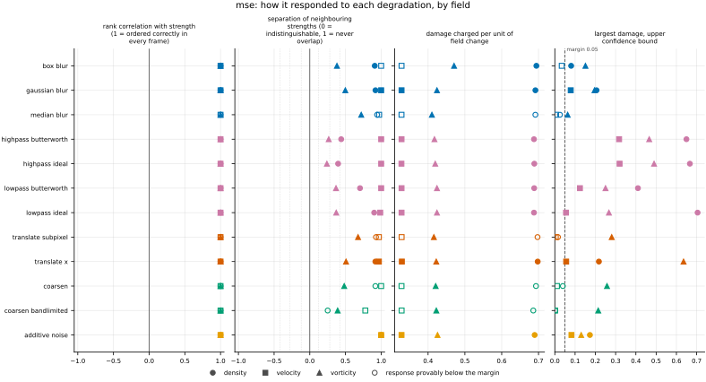
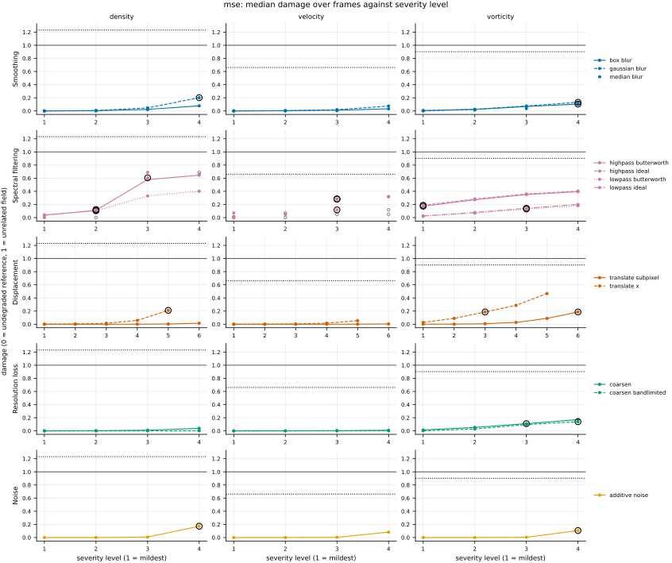

## Definition

For fields $f$ (reference) and $g$ (candidate) sampled on the same analysis grid, with $C$
channels and $N$ cells per channel,

$$
\mathrm{MSE}(f, g) = \frac{1}{CN} \sum_{c=1}^{C} \sum_{i=1}^{N}
\bigl( f_{c,i} - g_{c,i} \bigr)^2 \tag{1}
$$

For a vector field the channels are pooled rather than reduced separately. The analysis
grid is uniform, so cells carry equal weight; on a non-uniform grid Equation (1) would
need cell volumes and would no longer be a plain mean.

The per-cell map that this repository stores alongside the single number is the summand,

$$
m_i = \sum_{c=1}^{C} \bigl( f_{c,i} - g_{c,i} \bigr)^2 ,
\qquad
\mathrm{MSE} = \frac{1}{C} \, \langle m \rangle \tag{2}
$$

The declared reduction is the mean divided by the channel count, and a contract test
checks that reducing the map reproduces the scalar.

For a displacement $\delta$ small compared with the scale of variation, expanding
$f(x + \delta) - f(x) \simeq \delta\, \partial_x f$ in Equation (1) gives the
scaling that governs everything this metric does with shifted features:

$$
\mathrm{MSE} \simeq \delta^{2} \bigl\langle (\partial_x f)^2 \bigr\rangle ,
\qquad
\mathrm{MAE} \simeq \delta \bigl\langle |\partial_x f| \bigr\rangle \tag{3}
$$

### Boundary handling

None. The operation is local to each cell, so no neighbourhood is ever consulted and no
boundary condition can enter.

## Performance

<!-- GENERATED performance: written by `python -m fmeval.cards evidence mse --results results/comparison_1790639359`, do not edit -->



Four measured statistics for mse, one row per degradation grouped by family and one marker per field. From left: the rank correlation between the metric and the applied strength within a frame, with the line showing the resampling interval; the separation of neighbouring strengths as Cliff's delta, where 0 means the metric cannot tell one strength from the next and the faint ticks at 0.12, 0.28 and 0.42 are Vargha and Delaney's small, medium and large anchors, for scale and not as grades; the damage charged per unit of field change at the harshest strength; and the upper confidence bound on the largest damage, beside the fixed margin of 0.05. A hollow marker is a field and degradation on which that bound lies below the margin, so the response is provably small. A missing marker is a statistic the analysis withheld, as the rank correlation is on an axis the metric is invariant to.



Median damage over frames against severity level for mse, one row per family of degradation and one column per field, on one shared scale. The solid grey line is damage 1, an unrelated field; the dotted black line is the damage assigned to the fake prediction with the right spectrum, where the run included it. The hollow black ring marks the first level at which the metric has moved a tenth of the way to an unrelated field. Hollow grey markers are strengths excluded for repeating a milder one or for doing nothing. Degradations with three or fewer usable levels are drawn as markers only; points above 2 are drawn as triangles at the top.

| test family | field | degradations | rank correlation | weakest gap between neighbouring strengths | first strength detected |
|---|---|---|---|---|---|
| Displacement | density | 2 | 1 to 1 | 0.959 | level 5 |
| Displacement | velocity | 2 | 1 to 1 | 0.984 | level — |
| Displacement | vorticity | 2 | 1 to 1 | 0.754 | level 3 |
| Resolution loss | density | 2 | 1 to 1 | 0.625 | level — |
| Resolution loss | velocity | 2 | 1 to 1 | 0.889 | level — |
| Resolution loss | vorticity | 2 | 1 to 1 | 0.695 | level 3 |
| Smoothing | density | 3 | 1 to 1 | 0.955 | level 4 |
| Smoothing | velocity | 3 | 1 to 1 | 0.986 | level — |
| Smoothing | vorticity | 3 | 1 to 1 | 0.69 | level 4 |
| Spectral filtering | density | 4 | 1 to 1 | 0.698 | level 2 |
| Spectral filtering | velocity | 4 | 1 to 1 | 0.993 | level 3 |
| Spectral filtering | vorticity | 4 | 1 to 1 | 0.62 | level 1 |
| Noise | density | 1 | 1 to 1 | 1 | level 4 |
| Noise | velocity | 1 | 1 to 1 | 1 | level — |
| Noise | vorticity | 1 | 1 to 1 | 1 | level 4 |
| trap test: fake prediction, right spectrum | density | 1 | — | — | damage 1.23 |
| trap test: fake prediction, right spectrum | velocity | 1 | — | — | damage 0.661 |
| trap test: fake prediction, right spectrum | vorticity | 1 | — | — | damage 0.902 |

One row per family of degradation and physical field. **Rank correlation** asks whether the metric put the strengths of one degradation in the right order: it is the Spearman correlation between the metric and the applied strength, computed inside a single frame, and the column gives the range over the degradations in that family. A value of 1 means every strength was ordered correctly in every frame. **Weakest gap between neighbouring strengths** asks whether the metric can tell one strength from the next: it is the smallest Mann-Whitney overlap between any two neighbouring strengths, where 1 means the two never overlap and 0.5 means the metric cannot separate them at all. **First strength detected** is the mildest strength at which the metric has moved a tenth of the way from the undegraded reference toward a field with no relation to the truth; a dash means the metric never reached that tenth. **Damage** is that same 0-to-1 scale read as a number: 0 is the undegraded reference and 1 is an unrelated field.

This table reports what was measured and grades none of the measurements. What the numbers mean for this metric is written in the subsections below, beside the test that produced each number.

**Profile.**

| field | selectivity | charges most for | charges least for | response provably below 0.05 at 90% on | elasticity to a sub-pixel shift, against severity (distance) | compute cost (x cheapest in this run) |
|---|---|---|---|---|---|---|
| density | 2.9e-05 | `translate_x` | `coarsen_bandlimited` | `coarsen` `coarsen_bandlimited` `median_blur` `translate_subpixel` | 2 | 1.01 |
| velocity | 6.36e-07 | `translate_x` | `highpass_ideal` | `box_blur` `coarsen` `coarsen_bandlimited` `median_blur` `translate_subpixel` | 2 | 1.91 |
| vorticity | 0.00116 | `box_blur` | `median_blur` | — | 1.99 | 1 |

One row per physical field. **Selectivity** is how concentrated the metric's response is on a few degradations, measured per unit of field change: 0 means it charges every degradation the same, as mean squared error does by construction, and values toward 1 that one degradation carries most of it. **Charges most and least for** name the two ends of that profile. **Response provably below** lists degradations on which the upper confidence bound of the largest damage lies below the margin -- an equivalence test, so an entry says the response is provably small, not merely not significant; a dash means no degradation met the bound. **Elasticity** is the slope of log damage against log shift over the smallest shifts: 1 means damage grows in proportion to the shift, 2 with its square. **Compute cost** is wall-clock per evaluation over the cheapest metric and field in the same run.

<!-- END GENERATED performance -->

## Intuition

Mean squared error compares two fields one cell at a time: subtract, square, average.
Squaring keeps errors of opposite sign from cancelling and makes the largest local errors
dominate the total. Nothing in the calculation ever looks at more than one cell, so the
metric carries no notion of shape or position — it sees a bag of per-cell differences,
not a picture.

That locality produces its characteristic failure. A feature with the right shape and
strength but slightly displaced is wrong twice — once in the cells it left, once in the
cells it entered — while a feature in the right place with reduced amplitude is wrong
only once, and only by the amount reduced. On a four-by-four grid, with a candidate that
moved the square one cell and another that halved its brightness:

```
reference        moved one cell    half brightness
0 0 0 0          0 0 0 0           0    0    0    0
0 1 1 0          0 0 1 1           0   0.5  0.5   0
0 1 1 0          0 0 1 1           0   0.5  0.5   0
0 0 0 0          0 0 0 0           0    0    0    0

                 mse = 0.25        mse = 0.0625
```

The candidate that preserved the feature and only moved it scores four times worse. This
is the double penalty, and it is why a metric comparing fields cell by cell misjudges
sharp features that are nearly in the right place.

What this metric ignores is the arrangement of the errors: one error concentrated at a
sharp front and the same total error scattered as noise across the domain are the same
number.

## Reading the output

The value runs from zero upwards with no upper limit, in the square of the field's units,
so a density field and a vorticity field produce numbers that cannot be compared with each
other. Lower is better, and zero means the two fields are identical cell for cell.

There is no value that counts as good in the abstract. What counts as good depends
entirely on the variance of the field being predicted: an error of 0.01 is excellent for a
field whose fluctuations are of order one and catastrophic for one whose fluctuations are
of order 0.001. That is why the suite reports damage, which rescales the value so that
zero is the reference and one is what two statistically similar but positionally unrelated
fields score, and why NRMSE exists as a normalised sibling.

Comparisons across models on the same field, the same dataset and the same analysis grid
are meaningful and are the intended use. Comparisons across fields are meaningless without
normalising, because of the units. Comparisons across resolutions are invalid as they
stand: the value is a mean over cells, so refining the grid changes the weight given to
small scales even when nothing about the prediction has changed. Compare on a common
analysis grid, which is what this suite remaps onto before measuring.

## Limitations

The concrete situation to recognise is a model that reproduces the structure of a flow
well but places it slightly wrong. Two candidates, one that predicts a shock of the right
strength one cell from its true position and one that smears the same shock over four
cells while keeping it centred, can receive similar mean squared errors even though a
person looking at the two fields would not hesitate to prefer the first. Ranking such
models by MSE therefore selects for smoothness. This is the mechanism behind the blurry
outputs that regression losses are known to produce, and it is visible in the results
here: the metric saturates slowly on displacement degradations while responding
immediately to blurring.

Two further cautions. The value is not comparable across grid resolutions, because it is
a mean over cells, so a run whose analysis grid differs is not comparable at all. And
because the differences are squared, a single badly wrong cell can dominate the whole
field; this is an advantage when outliers are what matters and a liability when they are
an artefact of the reader or the remap.

## Results

<!-- GENERATED run: written by `python -m fmeval.cards evidence mse --results results/comparison_1790639359`, do not edit -->

Measured on `kinet_re5e4`, frames 2000 to 10000 (161 frames of developed flow), on the 256 analysis grid, seed 20260807, at commit `ce78cb2d30d8` (working tree dirty). Run `comparison_1790639359`.

Every number in this section comes from that one run. Regenerate with `python -m fmeval.cards evidence <name> --results results/comparison_1790639359`.

<!-- END GENERATED run -->

Each subsection links to the degradations that subsection reports. What those degradations
do, and what their strength numbers mean, is documented on their own pages.

### Smoothing

[gaussian_blur](../../degradations/gaussian_blur/card.md) ·
[box_blur](../../degradations/box_blur/card.md) ·
[median_blur](../../degradations/median_blur/card.md)

<!-- GENERATED results_smoothing: written by `python -m fmeval.cards evidence mse --results results/comparison_1790639359`, do not edit -->

| degradation | field | strengths | rank correlation | fraction of frames in the right order | weakest gap between neighbouring strengths |
|---|---|---|---|---|---|
| `box_blur` | density | 4 | 1 | 1 | 0.955 |
| `box_blur` | velocity | 4 | 1 | 1 | 1 |
| `box_blur` | vorticity | 4 | 1 | 1 | 0.69 |
| `gaussian_blur` | density | 4 | 1 | 1 | 0.96 |
| `gaussian_blur` | velocity | 4 | 1 | 1 | 1 |
| `gaussian_blur` | vorticity | 4 | 1 | 1 | 0.749 |
| `median_blur` | density | 3 | 1 | 1 | 0.972 |
| `median_blur` | velocity | 3 | 1 | 1 | 0.986 |
| `median_blur` | vorticity | 3 | 1 | 1 | 0.86 |

<!-- END GENERATED results_smoothing -->

### Spectral filtering

[lowpass_ideal](../../degradations/lowpass_ideal/card.md) ·
[lowpass_butterworth](../../degradations/lowpass_butterworth/card.md) ·
[highpass_ideal](../../degradations/highpass_ideal/card.md) ·
[highpass_butterworth](../../degradations/highpass_butterworth/card.md)

<!-- GENERATED results_spectral: written by `python -m fmeval.cards evidence mse --results results/comparison_1790639359`, do not edit -->

| degradation | field | strengths | rank correlation | fraction of frames in the right order | weakest gap between neighbouring strengths |
|---|---|---|---|---|---|
| `highpass_butterworth` | density | 4 | 1 | 1 | 0.72 |
| `highpass_butterworth` | velocity | 3 | 1 | 1 | 1 |
| `highpass_butterworth` | vorticity | 4 | 1 | 1 | 0.633 |
| `highpass_ideal` | density | 3 | 1 | 1 | 0.698 |
| `highpass_ideal` | velocity | 2 | 1 | 1 | 1 |
| `highpass_ideal` | vorticity | 4 | 1 | 1 | 0.62 |
| `lowpass_butterworth` | density | 4 | 1 | 1 | 0.852 |
| `lowpass_butterworth` | velocity | 3 | 1 | 1 | 1 |
| `lowpass_butterworth` | vorticity | 4 | 1 | 1 | 0.684 |
| `lowpass_ideal` | density | 3 | 1 | 1 | 0.951 |
| `lowpass_ideal` | velocity | 2 | 1 | 1 | 0.993 |
| `lowpass_ideal` | vorticity | 4 | 1 | 1 | 0.685 |

<!-- END GENERATED results_spectral -->

### Displacement

[translate_x](../../degradations/translate/card.md) ·
[translate_subpixel](../../degradations/translate_subpixel/card.md)

<!-- GENERATED results_geometric: written by `python -m fmeval.cards evidence mse --results results/comparison_1790639359`, do not edit -->

| degradation | field | strengths | rank correlation | fraction of frames in the right order | weakest gap between neighbouring strengths |
|---|---|---|---|---|---|
| `translate_subpixel` | density | 6 | 1 | 1 | 0.964 |
| `translate_subpixel` | velocity | 6 | 1 | 1 | 0.984 |
| `translate_subpixel` | vorticity | 6 | 1 | 1 | 0.838 |
| `translate_x` | density | 5 | 1 | 1 | 0.959 |
| `translate_x` | velocity | 5 | 1 | 1 | 0.984 |
| `translate_x` | vorticity | 5 | 1 | 1 | 0.754 |

<!-- END GENERATED results_geometric -->

The response is quadratic in the displacement, as Equation (3) gives: on vorticity the
damage ratios per doubling below one cell are 3.98, 3.94 and 3.75 against the 4 implied by
that scaling, falling to 3.18 and 2.10 above a cell as the expansion stops holding. MAE is
linear over the same shifts, so it assigns 47 times the damage at an eighth of a cell and
6.2 times at one cell. MSE therefore reads as tolerant of small displacements and severe
about moderate ones, and the double penalty has no single onset.

### Resolution loss

[coarsen](../../degradations/coarsen/card.md) ·
[coarsen_bandlimited](../../degradations/coarsen_bandlimited/card.md)

<!-- GENERATED results_resolution: written by `python -m fmeval.cards evidence mse --results results/comparison_1790639359`, do not edit -->

| degradation | field | strengths | rank correlation | fraction of frames in the right order | weakest gap between neighbouring strengths |
|---|---|---|---|---|---|
| `coarsen` | density | 4 | 1 | 1 | 0.96 |
| `coarsen` | velocity | 4 | 1 | 1 | 1 |
| `coarsen` | vorticity | 4 | 1 | 1 | 0.741 |
| `coarsen_bandlimited` | density | 4 | 1 | 0.714 | 0.625 |
| `coarsen_bandlimited` | velocity | 4 | 1 | 1 | 0.889 |
| `coarsen_bandlimited` | vorticity | 4 | 1 | 1 | 0.695 |

<!-- END GENERATED results_resolution -->

Both coarsenings are ordered correctly on every field, with a rank correlation of 1. They differ in size. At a factor of 16, `coarsen` costs 0.04, 0.01 and 0.17 of the unrelated-field value on density, velocity and vorticity, and `coarsen_bandlimited` 0.001, 0.001 and 0.14. The two operators keep the same block means, so on the smooth fields most of what `coarsen` charges is its staircase; on vorticity, whose structure the coarse grid genuinely cannot hold, they nearly agree. Under the band-limited operator density is in the right order in only 71% of frames: its damage at factors 2 and 4 is below 0.001 at both, and which of the two is larger changes from frame to frame. The other pointwise metrics, `spectrum_l2` and `h1_seminorm` show this on density too, and its
cause is not established; `issues/039` records what was ruled out.

### Noise

[additive_noise](../../degradations/additive_noise/card.md)

<!-- GENERATED results_stochastic: written by `python -m fmeval.cards evidence mse --results results/comparison_1790639359`, do not edit -->

| degradation | field | strengths | rank correlation | fraction of frames in the right order | weakest gap between neighbouring strengths |
|---|---|---|---|---|---|
| `additive_noise` | density | 4 | 1 | 1 | 1 |
| `additive_noise` | velocity | 4 | 1 | 1 | 1 |
| `additive_noise` | vorticity | 4 | 1 | 1 | 1 |

<!-- END GENERATED results_stochastic -->

### Trap tests

[gaussian_impostor](../../degradations/gaussian_impostor/card.md) ·
[uncorrelated](../../degradations/random_large_translation/card.md)

<!-- GENERATED results_canaries: written by `python -m fmeval.cards evidence mse --results results/comparison_1790639359`, do not edit -->

| field | damage assigned to the fake prediction | closest real degradation | value on an unrelated field |
|---|---|---|---|
| density | 1.23 | `lowpass_ideal=1.4029` | 6.56e-05 |
| velocity | 0.661 | `highpass_ideal=4.02293` | 0.00477 |
| vorticity | 0.902 | `translate_x=16` | 1.45e-05 |

The fake prediction here has exactly the reference field's amplitude spectrum and completely scrambled structure. Damage of 1 is what a field with no relation to the truth scores, so the damage column says how close to useless this metric considers that fake prediction: a low number means the metric was fooled. The third column translates the same number into an ordinary degradation whose damage the fake prediction matches, which is easier to picture.

<!-- END GENERATED results_canaries -->

MSE rejects the phase-scrambled fake prediction firmly: 0.90 damage on vorticity, 0.66 on
velocity, and 1.23 on density, where a damage above 1 means the fake prediction is scored
worse than a field with no relation to the reference at all. The trap test is aimed at
metrics depending only on the amplitude spectrum, so it does not catch this family, and a
panel in which every metric rejects it is not evidence of a well-guarded panel.

### Compared with the other metrics

<!-- GENERATED results_summary: written by `python -m fmeval.cards evidence mse --results results/comparison_1790639359`, do not edit -->

| compared with | rank correlation over every degradation |
|---|---|
| `rmse` | 1 |
| `mae` | 0.986 |
| `nrmse` | 0.974 |
| `h_minus_one` | 0.937 |
| `h1_seminorm` | 0.708 |
| `spectrum_l2` | 0.147 |
| `increment_w1` | 0.0844 |
| `enstrophy` | -0.116 |
| `increment_flatness` | -0.135 |
| `palinstrophy` | -0.158 |
| `kinetic_energy` | -0.23 |

Computed on the median value at each combination of degradation and strength, over every degradation and physical field in the run, with the undegraded reference excluded. Two metrics correlating near 1 put the degradations in the same order, but the two may still weight those degradations very differently. A correlation near 1 therefore means the two metrics are redundant for ranking models, not that the two are interchangeable as training losses.

<!-- END GENERATED results_summary -->

MSE and RMSE correlate at exactly 1: the square root is monotone, so no ranking can ever
separate them. Against the other baselines MSE sits at 0.986 with MAE and 0.974 with
NRMSE, above the 0.95 redundancy threshold, yet MAE assigns 47 times the damage at an
eighth of a cell. They order damage alike without weighting it alike, so for ranking
models they are duplicates and as training losses they are not. Reach for MSE when the
errors that matter are errors of amplitude, not of position.

### Damage beside the other metrics

<!-- GENERATED results_damage_by_level: written by `python -m fmeval.cards evidence mse --results results/comparison_1790639359`, do not edit -->

**Displacement, density, `translate_subpixel`** (strength: distance).

| metric | 0.125 | 0.25 | 0.5 | 1 | 2 | 4 |
|---|---|---|---|---|---|---|
| `mse` | 1.49e-05 | 5.97e-05 | 0.000238 | 0.000952 | 0.00379 | 0.015 |
| `mae` | 0.00328 | 0.00655 | 0.0131 | 0.0262 | 0.0521 | 0.103 |
| `rmse` | 0.00386 | 0.00772 | 0.0154 | 0.0309 | 0.0616 | 0.123 |
| `nrmse` | 0.00362 | 0.00723 | 0.0145 | 0.0289 | 0.0576 | 0.115 |

**Displacement, density, `translate_x`** (strength: distance).

| metric | 1 | 2 | 4 | 8 | 16 |
|---|---|---|---|---|---|
| `mse` | 0.000952 | 0.00379 | 0.015 | 0.0584 | 0.211 |
| `mae` | 0.0262 | 0.0521 | 0.103 | 0.205 | 0.401 |
| `rmse` | 0.0309 | 0.0616 | 0.123 | 0.242 | 0.46 |
| `nrmse` | 0.0289 | 0.0576 | 0.115 | 0.226 | 0.43 |

**Displacement, velocity, `translate_subpixel`** (strength: distance).

| metric | 0.125 | 0.25 | 0.5 | 1 | 2 | 4 |
|---|---|---|---|---|---|---|
| `mse` | 4.76e-06 | 1.91e-05 | 7.61e-05 | 0.000303 | 0.00118 | 0.00445 |
| `mae` | 0.00163 | 0.00325 | 0.0065 | 0.013 | 0.0257 | 0.05 |
| `rmse` | 0.00218 | 0.00437 | 0.00873 | 0.0174 | 0.0344 | 0.0667 |
| `nrmse` | 0.00219 | 0.00437 | 0.00873 | 0.0174 | 0.0343 | 0.0667 |

**Displacement, velocity, `translate_x`** (strength: distance).

| metric | 1 | 2 | 4 | 8 | 16 |
|---|---|---|---|---|---|
| `mse` | 0.000303 | 0.00118 | 0.00445 | 0.016 | 0.0541 |
| `mae` | 0.013 | 0.0257 | 0.05 | 0.0951 | 0.18 |
| `rmse` | 0.0174 | 0.0344 | 0.0667 | 0.127 | 0.233 |
| `nrmse` | 0.0174 | 0.0343 | 0.0667 | 0.127 | 0.232 |

**Displacement, vorticity, `translate_subpixel`** (strength: distance).

| metric | 0.125 | 0.25 | 0.5 | 1 | 2 | 4 |
|---|---|---|---|---|---|---|
| `mse` | 0.000476 | 0.0019 | 0.00747 | 0.028 | 0.0889 | 0.187 |
| `mae` | 0.0225 | 0.045 | 0.0892 | 0.172 | 0.306 | 0.453 |
| `rmse` | 0.0218 | 0.0436 | 0.0865 | 0.167 | 0.298 | 0.432 |
| `nrmse` | 0.0219 | 0.0437 | 0.0868 | 0.169 | 0.304 | 0.447 |

**Displacement, vorticity, `translate_x`** (strength: distance).

| metric | 1 | 2 | 4 | 8 | 16 |
|---|---|---|---|---|---|
| `mse` | 0.028 | 0.0889 | 0.187 | 0.288 | 0.468 |
| `mae` | 0.172 | 0.306 | 0.453 | 0.581 | 0.69 |
| `rmse` | 0.167 | 0.298 | 0.432 | 0.537 | 0.684 |
| `nrmse` | 0.169 | 0.304 | 0.447 | 0.555 | 0.702 |

Median damage over frames at every strength, this metric in the first row and the pointwise controls beneath it, all on the same 0-to-1 scale where 0 is the undegraded reference and 1 an unrelated field; a dash means no damage scale on that field. The rank correlations under *Compared with the other metrics* say whether two metrics put the strengths in the same order; this table says how much each one charges for the same strength, which decides whether two metrics are interchangeable as training losses.

<!-- END GENERATED results_damage_by_level -->

## References

\bibliography
