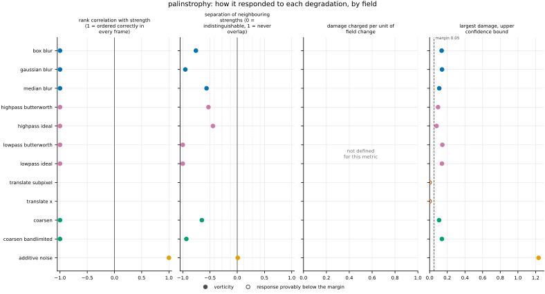
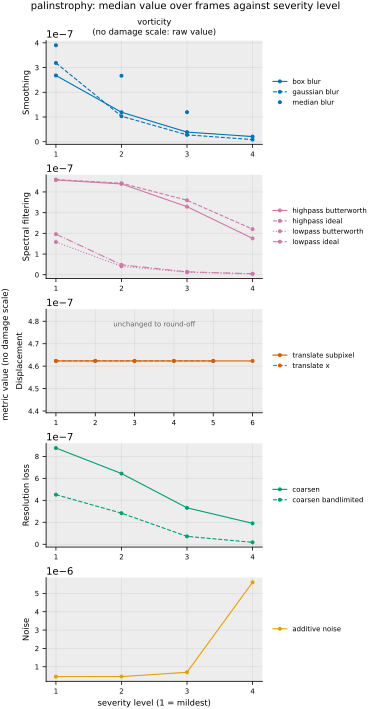

## Definition

For a vorticity field $\boldsymbol{\omega}$ with components $\omega^{(c)}$ on a periodic
grid, palinstrophy is half the mean squared gradient,

$$
P = \frac{1}{2} \Bigl\langle |\nabla \boldsymbol{\omega}|^2 \Bigr\rangle
  = \frac{1}{2} \sum_{c} \sum_{j} \Bigl\langle
    \bigl( \partial_j \omega^{(c)} \bigr)^2 \Bigr\rangle \tag{1}
$$

where $j$ runs over the spatial directions, $c$ over the components — one in 2D, three in
3D — and $\langle \cdot \rangle$ averages over cells. The factor of one half is the one
Boffetta and Ecke fix on p. 429 of their review [@boffetta2012]: they define enstrophy as
$\Omega = \tfrac12 \langle \omega^2 \rangle = \int k^2 E(k)\,dk$ and palinstrophy, with their
Equation (6) $d\Omega/dt = -2\nu P$, as $P = \int k^4 E(k)\,dk$, which together give
Equation (1). It is also the convention [enstrophy](../../metrics/enstrophy/card.md) uses, so the two
are directly comparable. Their setting is two-dimensional; in 3D Equation (1) sums all three
components, which is the direct generalisation rather than a definition taken from them.

Derivatives are spectral, $\partial_j \to i k_j$ with
$k_j = 2\pi \, \mathrm{fftfreq}(N_j, h_j)$, the convention the repository already uses
throughout [@pope2000]. This is not only a consistency preference. `fmeval/derived.py` records that the
solver's lattice-stencil vorticity and a spectral one differ by 8.1% rms, so a second
differentiation convention introduced here would stack a second discrepancy of that kind on
top of the first.

The pairing with enstrophy is what makes this worth computing. In terms of the vorticity
spectrum $E_\omega(\kappa)$, the two quantities are successive moments,

$$
\text{enstrophy} \propto \int E_\omega(\kappa) \, d\kappa,
\qquad
P \propto \int \kappa^2 \, E_\omega(\kappa) \, d\kappa \tag{2}
$$

so enstrophy asks how much rotational activity there is and palinstrophy asks how sharp it
is [@boffetta2012]. Equation (2) also orders the two under smoothing. For a filter whose
squared gain $G^2$ is a non-increasing function of $\kappa$ alone — a Gaussian, a Butterworth
or an ideal low-pass, though not a box or a median filter — Chebyshev's integral inequality,
applied under the measure $E_\omega(\kappa)\,d\kappa$ to the non-increasing $G^2$ and the
increasing $\kappa^2$, gives

$$
\frac{\int \kappa^2 G^2 E_\omega \, d\kappa}{\int \kappa^2 E_\omega \, d\kappa}
\;\le\;
\frac{\int G^2 E_\omega \, d\kappa}{\int E_\omega \, d\kappa} \tag{3}
$$

so such a filter always removes at least as large a fraction of palinstrophy as of enstrophy.
Equation (3) bounds the ordering only; how wide the gap is on real data is measured under
Results.

### Boundary handling

Periodic on every axis, inherited from the spectral derivative. The spacing is read from the
analysis grid rather than assumed, and here that matters more than it does for a first-order
quantity: the value carries an inverse length *squared*, so on a grid coarsened by a factor,
using the native spacing would inflate the result by the square of that factor.

## Performance

<!-- GENERATED performance: written by `python -m fmeval.cards evidence palinstrophy --results results/comparison_1790639359`, do not edit -->



Four measured statistics for palinstrophy, one row per degradation grouped by family and one marker per field. From left: the rank correlation between the metric and the applied strength within a frame, with the line showing the resampling interval; the separation of neighbouring strengths as Cliff's delta, where 0 means the metric cannot tell one strength from the next and the faint ticks at 0.12, 0.28 and 0.42 are Vargha and Delaney's small, medium and large anchors, for scale and not as grades; the damage charged per unit of field change at the harshest strength; and the upper confidence bound on the largest damage, beside the fixed margin of 0.05. A hollow marker is a field and degradation on which that bound lies below the margin, so the response is provably small. A missing marker is a statistic the analysis withheld, as the rank correlation is on an axis the metric is invariant to.



Median damage over frames against severity level for palinstrophy, one row per family of degradation and one column per field, on one shared scale. The solid grey line is damage 1, an unrelated field; the dotted black line is the damage assigned to the fake prediction with the right spectrum, where the run included it. The hollow black ring marks the first level at which the metric has moved a tenth of the way to an unrelated field. Hollow grey markers are strengths excluded for repeating a milder one or for doing nothing. Degradations with three or fewer usable levels are drawn as markers only; points above 2 are drawn as triangles at the top. No damage scale on vorticity: the grey panels show the raw value instead.

| test family | field | degradations | rank correlation | weakest gap between neighbouring strengths | first strength detected |
|---|---|---|---|---|---|
| Displacement | vorticity | 2 | — to — | — | level — |
| Resolution loss | vorticity | 2 | -1 to -1 | 0.0328 | level — |
| Smoothing | vorticity | 3 | -1 to -1 | 0.0232 | level — |
| Spectral filtering | vorticity | 4 | -1 to -1 | 0 | level — |
| Noise | vorticity | 1 | 1 to 1 | 0.505 | level — |
| trap test: fake prediction, right spectrum | vorticity | 1 | — | — | damage — |

One row per family of degradation and physical field. **Rank correlation** asks whether the metric put the strengths of one degradation in the right order: it is the Spearman correlation between the metric and the applied strength, computed inside a single frame, and the column gives the range over the degradations in that family. A value of 1 means every strength was ordered correctly in every frame. **Weakest gap between neighbouring strengths** asks whether the metric can tell one strength from the next: it is the smallest Mann-Whitney overlap between any two neighbouring strengths, where 1 means the two never overlap and 0.5 means the metric cannot separate them at all. **First strength detected** is the mildest strength at which the metric has moved a tenth of the way from the undegraded reference toward a field with no relation to the truth; a dash means the metric never reached that tenth. **Damage** is that same 0-to-1 scale read as a number: 0 is the undegraded reference and 1 is an unrelated field.

This table reports what was measured and grades none of the measurements. What the numbers mean for this metric is written in the subsections below, beside the test that produced each number.

**Profile.**

| field | selectivity | charges most for | charges least for | response provably below 0.05 at 90% on | elasticity to a sub-pixel shift, against severity (distance) | compute cost (x cheapest in this run) |
|---|---|---|---|---|---|---|
| vorticity | — | — | — | `translate_subpixel` `translate_x` | — | 48.5 |

One row per physical field. **Selectivity** is how concentrated the metric's response is on a few degradations, measured per unit of field change: 0 means it charges every degradation the same, as mean squared error does by construction, and values toward 1 that one degradation carries most of it. **Charges most and least for** name the two ends of that profile. **Response provably below** lists degradations on which the upper confidence bound of the largest damage lies below the margin -- an equivalence test, so an entry says the response is provably small, not merely not significant; a dash means no degradation met the bound. **Elasticity** is the slope of log damage against log shift over the smallest shifts: 1 means damage grows in proportion to the shift, 2 with its square. **Compute cost** is wall-clock per evaluation over the cheapest metric and field in the same run.

<!-- END GENERATED performance -->

## Intuition

Vorticity says how fast the fluid is spinning at each point. Enstrophy adds up how much
spinning there is in total. This quantity instead adds up how *abruptly* the spinning changes
from place to place, so it is large when the rotation is organised into thin, sharply bounded
filaments and small when the same total amount of rotation is spread out smoothly.

That makes it a probe for a specific failure. A prediction that has blurred the flow loses
the sharp edges between one rotating region and the next before it loses the bulk of the
rotation, and this quantity weights fine detail far more heavily than coarse structure —
doubling how quickly a feature varies in space quadruples its contribution here, while leaving
its contribution to the total rotation unchanged. So a smooth blur always takes away a larger
share of this quantity than of the total rotation; how much larger on the real flow is
recorded under Results.

A worked example on an eight by eight grid. Take a vorticity field that is a single smooth
wave: one full oscillation across the box, constant in the other direction. Then squeeze the
same wave so it oscillates three times across the box, keeping its amplitude.

```
field                          enstrophy   palinstrophy
one oscillation across 8         0.25        0.1542
three oscillations across 8      0.25        1.388
```

The enstrophy is unchanged, because there is exactly as much rotation as before. The
palinstrophy rises by a factor of nine, because the field now varies three times as fast and
this quantity counts the square of that rate.

What it ignores: everything about where the structure is. Like any single-field quantity it
takes one field and returns one number, so a prediction can match it exactly while having its
vortices in entirely the wrong places.

## Reading the output

Zero and unbounded above, in the square of the vorticity units per square length. There is no
direction in which the value is better on its own: what is read is the drift away from the
reference field's value, in either direction. A prediction scoring below the reference has
smoothed the vorticity; one scoring above has sharpened or roughened it.

Only comparisons at a fixed analysis-grid resolution are meaningful, and this metric is
stricter about that than most. Equation (2) shows the value is dominated by the highest
wavenumbers the grid carries, so changing the resolution changes which scales contribute at
all. Comparing a run at grid 128 with one at grid 256 measures the grids, not the predictions.

Because it is a single-field quantity, the evaluation reports it as having no dynamic range on
the normalised damage scale. That is correct rather than a defect: the scale is anchored
between the reference and a positionally unrelated but statistically identical field, and a
quantity that does not depend on position takes the same value at both anchors.

## Limitations

The quantity is degenerate in the strong sense: enormously many wrong fields share any given
palinstrophy, so a matching value is no evidence of a correct prediction. It is a tripwire and
must be used as one.

The more specific trap is its resolution sensitivity working against it. Because the $\kappa^2$
weight concentrates the value at the grid scale, palinstrophy is disproportionately sensitive
to anything that changes the smallest resolved scales, including numerical artefacts that are
not physics at all. By Equation (2), energy added at wavenumber $\kappa$ raises the value by
$\kappa^2$ times that energy, so ringing near the grid scale raises palinstrophy *above* the
reference's while making the field worse, and the number alone does not distinguish that from
genuinely better-resolved filaments.

Finally, it inherits everything that is uncertain about the vorticity it is computed from.
Vorticity here is a derived field, recomputed from velocity after any remap rather than
averaged, and the calibration recorded with `comparison_1789632054` gives its characteristic
scale a relative spread of 0.32 across the sampled frames, against 0.06 for density and 0.07
for velocity. A palinstrophy drift of comparable size says as much about which frames were
evaluated as about the prediction.

## Results

<!-- GENERATED run: written by `python -m fmeval.cards evidence palinstrophy --results results/comparison_1790639359`, do not edit -->

Measured on `kinet_re5e4`, frames 2000 to 10000 (161 frames of developed flow), on the 256 analysis grid, seed 20260807, at commit `ce78cb2d30d8` (working tree dirty). Run `comparison_1790639359`.

Every number in this section comes from that one run. Regenerate with `python -m fmeval.cards evidence <name> --results results/comparison_1790639359`.

<!-- END GENERATED run -->

### Smoothing

[gaussian_blur](../../degradations/gaussian_blur/card.md) ·
[box_blur](../../degradations/box_blur/card.md)

<!-- GENERATED results_smoothing: written by `python -m fmeval.cards evidence palinstrophy --results results/comparison_1790639359`, do not edit -->

| degradation | field | strengths | rank correlation | fraction of frames in the right order | weakest gap between neighbouring strengths |
|---|---|---|---|---|---|
| `box_blur` | vorticity | 4 | -1 | 0 | 0.121 |
| `gaussian_blur` | vorticity | 4 | -1 | 0 | 0.0232 |
| `median_blur` | vorticity | 3 | -1 | 0 | 0.218 |

<!-- END GENERATED results_smoothing -->

The rank correlation of −1 is the correct result for a single-field quantity, not a failure:
smoothing removes fine detail, so palinstrophy falls as the strength rises. What this family
measures is the size of that fall beside enstrophy's. At the mildest `gaussian_blur`
palinstrophy has already lost 31% against enstrophy's 6%, and at the strongest 98% against
47%; `box_blur` gives 42% against 9% at its mildest. Equation (3) guarantees the ordering for
the Gaussian; the box and median kernels are outside its assumptions and show the same
ordering on this data.

### Spectral filtering

[lowpass_ideal](../../degradations/lowpass_ideal/card.md) ·
[highpass_ideal](../../degradations/highpass_ideal/card.md)

<!-- GENERATED results_spectral: written by `python -m fmeval.cards evidence palinstrophy --results results/comparison_1790639359`, do not edit -->

| degradation | field | strengths | rank correlation | fraction of frames in the right order | weakest gap between neighbouring strengths |
|---|---|---|---|---|---|
| `highpass_butterworth` | vorticity | 4 | -1 | 0 | 0.236 |
| `highpass_ideal` | vorticity | 4 | -1 | 0 | 0.277 |
| `lowpass_butterworth` | vorticity | 4 | -1 | 0 | 0 |
| `lowpass_ideal` | vorticity | 4 | -1 | 0 | 0 |

<!-- END GENERATED results_spectral -->

The two sides of the spectrum separate the pair cleanly. A low-pass removes the modes this
quantity is built on: the mildest `lowpass_butterworth` removes 66% of palinstrophy and 11% of
enstrophy. A high-pass removes the modes it ignores: the mildest `highpass_ideal` removes 45%
of enstrophy and 0.5% of palinstrophy. Read together, the two single-field quantities say
which end of the spectrum a prediction has lost, which neither says alone.

### Displacement

[translate_x](../../degradations/translate/card.md) ·
[translate_subpixel](../../degradations/translate_subpixel/card.md)

<!-- GENERATED results_geometric: written by `python -m fmeval.cards evidence palinstrophy --results results/comparison_1790639359`, do not edit -->

| degradation | field | strengths | rank correlation | fraction of frames in the right order | weakest gap between neighbouring strengths |
|---|---|---|---|---|---|
| `translate_subpixel` | vorticity | 6 | — | — | — |
| `translate_x` | vorticity | 5 | — | — | — |

<!-- END GENERATED results_geometric -->

Invariant, as a single-field quantity must be: translation does not change how sharp the
vorticity is, the values are equal to round-off at every strength, and every ordering
statistic is withheld.

### Resolution loss

[coarsen](../../degradations/coarsen/card.md) ·
[coarsen_bandlimited](../../degradations/coarsen_bandlimited/card.md)

<!-- GENERATED results_resolution: written by `python -m fmeval.cards evidence palinstrophy --results results/comparison_1790639359`, do not edit -->

| degradation | field | strengths | rank correlation | fraction of frames in the right order | weakest gap between neighbouring strengths |
|---|---|---|---|---|---|
| `coarsen` | vorticity | 4 | -1 | 0 | 0.175 |
| `coarsen_bandlimited` | vorticity | 4 | -1 | 0 | 0.0328 |

<!-- END GENERATED results_resolution -->

This is the one family where the number misleads, and it does so in the direction Limitations
warns about. Coarsening by a factor of 2 *raises* palinstrophy by 89% above the reference,
and a factor of 4 still leaves it 39% high; only at factors 8 and 16 does it fall below, by 28%
and 59%. The degradation expands each block back to the fine grid as a constant, so it adds
a jump at every block edge, and a jump is exactly the steep gradient this quantity counts.
Enstrophy falls throughout, by 4% to 40%. The rank correlation of −1 in the table is computed
across the four coarsening strengths only and does not show that the mildest of them moved the
value the wrong way. `issues/039` records the same mechanism for `h1_seminorm`.

`coarsen_bandlimited` keeps the same block means as `coarsen` without adding edges, and under
it palinstrophy only falls: by 2%, 39%, 84% and 96% at factors 2 to 16, while enstrophy falls
by 0.1% to 31%. The rise under `coarsen` was therefore the staircase and nothing else. It also
falls by a larger fraction than enstrophy at every factor, the ordering Equation (3) guarantees
for smooth radial filters, although this operator is not one of them: its band is square, and
it boosts the modes nearest the cut.

### Noise

[additive_noise](../../degradations/additive_noise/card.md)

<!-- GENERATED results_stochastic: written by `python -m fmeval.cards evidence palinstrophy --results results/comparison_1790639359`, do not edit -->

| degradation | field | strengths | rank correlation | fraction of frames in the right order | weakest gap between neighbouring strengths |
|---|---|---|---|---|---|
| `additive_noise` | vorticity | 4 | 1 | 1 | 0.505 |

<!-- END GENERATED results_stochastic -->

Noise is broadband, so it adds energy at the highest wavenumbers, where Equation (2) weights
it most. At the strongest noise palinstrophy is 12 times its reference value while enstrophy
has risen by 25%. The ordering is correct in every frame, but the two mildest strengths are
barely separable across frames, with a weakest gap of 0.505: they move the value by 0.01% and
0.4%, which is small beside how much it changes from one frame to the next.

### Trap tests

[gaussian_impostor](../../degradations/gaussian_impostor/card.md) ·
[uncorrelated](../../degradations/random_large_translation/card.md)

<!-- GENERATED results_canaries: written by `python -m fmeval.cards evidence palinstrophy --results results/comparison_1790639359`, do not edit -->

| field | damage assigned to the fake prediction | closest real degradation | value on an unrelated field |
|---|---|---|---|
| vorticity | — | `` | 4.62e-07 |

The fake prediction here has exactly the reference field's amplitude spectrum and completely scrambled structure. Damage of 1 is what a field with no relation to the truth scores, so the damage column says how close to useless this metric considers that fake prediction: a low number means the metric was fooled. The third column translates the same number into an ordinary degradation whose damage the fake prediction matches, which is easier to picture.

<!-- END GENERATED results_canaries -->

Both score exactly the reference's palinstrophy. The fake prediction has the reference's
amplitude spectrum, and Equation (2) is a function of that spectrum alone, so the two cannot
differ; the unrelated field is a translation of the reference. The damage scale therefore has
no span and is withheld, which `AGENTS.md` documents as the correct outcome for any
single-field quantity.

### Compared with the other metrics

<!-- GENERATED results_summary: written by `python -m fmeval.cards evidence palinstrophy --results results/comparison_1790639359`, do not edit -->

| compared with | rank correlation over every degradation |
|---|---|
| `kinetic_energy` | 0.807 |
| `enstrophy` | 0.757 |
| `increment_flatness` | 0.468 |
| `h1_seminorm` | 0.0929 |
| `mae` | -0.114 |
| `mse` | -0.158 |
| `rmse` | -0.158 |
| `nrmse` | -0.169 |
| `h_minus_one` | -0.222 |
| `increment_w1` | -0.583 |
| `spectrum_l2` | -0.702 |

Computed on the median value at each combination of degradation and strength, over every degradation and physical field in the run, with the undegraded reference excluded. Two metrics correlating near 1 put the degradations in the same order, but the two may still weight those degradations very differently. A correlation near 1 therefore means the two metrics are redundant for ranking models, not that the two are interchangeable as training losses.

<!-- END GENERATED results_summary -->

The closest rankings are those of the other two single-field quantities, `kinetic_energy` at
0.81 and `enstrophy` at 0.76. The second is expected of two moments of one spectrum, and it is
also the measure of how much palinstrophy adds: the two disagree most on
high-pass filtering and on coarsening, both described above. The negative correlations with
the pairwise metrics are orientation rather than disagreement, since this quantity falls
under most damage while theirs rises.

### Damage beside the other metrics

<!-- GENERATED results_damage_by_level: written by `python -m fmeval.cards evidence palinstrophy --results results/comparison_1790639359`, do not edit -->

**Displacement, density, `translate_subpixel`** (strength: distance).

| metric | 0.125 | 0.25 | 0.5 | 1 | 2 | 4 |
|---|---|---|---|---|---|---|
| `palinstrophy` | — | — | — | — | — | — |
| `mae` | 0.00328 | 0.00655 | 0.0131 | 0.0262 | 0.0521 | 0.103 |
| `mse` | 1.49e-05 | 5.97e-05 | 0.000238 | 0.000952 | 0.00379 | 0.015 |
| `rmse` | 0.00386 | 0.00772 | 0.0154 | 0.0309 | 0.0616 | 0.123 |
| `nrmse` | 0.00362 | 0.00723 | 0.0145 | 0.0289 | 0.0576 | 0.115 |

**Displacement, density, `translate_x`** (strength: distance).

| metric | 1 | 2 | 4 | 8 | 16 |
|---|---|---|---|---|---|
| `palinstrophy` | — | — | — | — | — |
| `mae` | 0.0262 | 0.0521 | 0.103 | 0.205 | 0.401 |
| `mse` | 0.000952 | 0.00379 | 0.015 | 0.0584 | 0.211 |
| `rmse` | 0.0309 | 0.0616 | 0.123 | 0.242 | 0.46 |
| `nrmse` | 0.0289 | 0.0576 | 0.115 | 0.226 | 0.43 |

**Displacement, velocity, `translate_subpixel`** (strength: distance).

| metric | 0.125 | 0.25 | 0.5 | 1 | 2 | 4 |
|---|---|---|---|---|---|---|
| `palinstrophy` | — | — | — | — | — | — |
| `mae` | 0.00163 | 0.00325 | 0.0065 | 0.013 | 0.0257 | 0.05 |
| `mse` | 4.76e-06 | 1.91e-05 | 7.61e-05 | 0.000303 | 0.00118 | 0.00445 |
| `rmse` | 0.00218 | 0.00437 | 0.00873 | 0.0174 | 0.0344 | 0.0667 |
| `nrmse` | 0.00219 | 0.00437 | 0.00873 | 0.0174 | 0.0343 | 0.0667 |

**Displacement, velocity, `translate_x`** (strength: distance).

| metric | 1 | 2 | 4 | 8 | 16 |
|---|---|---|---|---|---|
| `palinstrophy` | — | — | — | — | — |
| `mae` | 0.013 | 0.0257 | 0.05 | 0.0951 | 0.18 |
| `mse` | 0.000303 | 0.00118 | 0.00445 | 0.016 | 0.0541 |
| `rmse` | 0.0174 | 0.0344 | 0.0667 | 0.127 | 0.233 |
| `nrmse` | 0.0174 | 0.0343 | 0.0667 | 0.127 | 0.232 |

**Displacement, vorticity, `translate_subpixel`** (strength: distance).

| metric | 0.125 | 0.25 | 0.5 | 1 | 2 | 4 |
|---|---|---|---|---|---|---|
| `palinstrophy` | — | — | — | — | — | — |
| `mae` | 0.0225 | 0.045 | 0.0892 | 0.172 | 0.306 | 0.453 |
| `mse` | 0.000476 | 0.0019 | 0.00747 | 0.028 | 0.0889 | 0.187 |
| `rmse` | 0.0218 | 0.0436 | 0.0865 | 0.167 | 0.298 | 0.432 |
| `nrmse` | 0.0219 | 0.0437 | 0.0868 | 0.169 | 0.304 | 0.447 |

**Displacement, vorticity, `translate_x`** (strength: distance).

| metric | 1 | 2 | 4 | 8 | 16 |
|---|---|---|---|---|---|
| `palinstrophy` | — | — | — | — | — |
| `mae` | 0.172 | 0.306 | 0.453 | 0.581 | 0.69 |
| `mse` | 0.028 | 0.0889 | 0.187 | 0.288 | 0.468 |
| `rmse` | 0.167 | 0.298 | 0.432 | 0.537 | 0.684 |
| `nrmse` | 0.169 | 0.304 | 0.447 | 0.555 | 0.702 |

Median damage over frames at every strength, this metric in the first row and the pointwise controls beneath it, all on the same 0-to-1 scale where 0 is the undegraded reference and 1 an unrelated field; a dash means no damage scale on that field. The rank correlations under *Compared with the other metrics* say whether two metrics put the strengths in the same order; this table says how much each one charges for the same strength, which decides whether two metrics are interchangeable as training losses.

<!-- END GENERATED results_damage_by_level -->

## References

\bibliography
