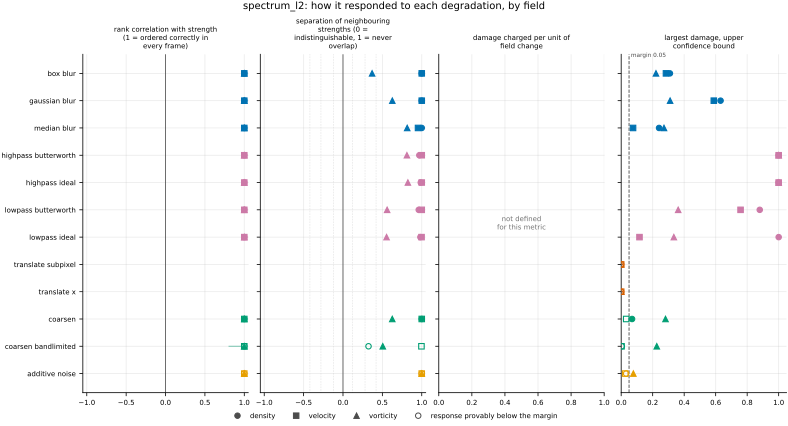
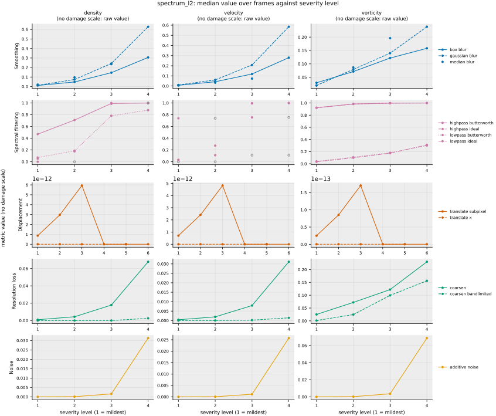

## Definition

Remove the spatial mean of each channel, transform, and sum the squared moduli into
unit-width shells of wavevector magnitude. Writing $\hat{f}^{(c)}_{\mathbf{m}}$ for the
transform of the mean-removed channel $c$ and $|\mathbf{m}|$ for the magnitude of mode
$\mathbf{m}$ in integer wavenumber units (cycles across the domain), the shell energies are

$$
E_f(\kappa) = \sum_{c=1}^{C} \; \sum_{\mathrm{rint}(|\mathbf{m}|) = \kappa}
\bigl| \hat{f}^{(c)}_{\mathbf{m}} \bigr|^2 \tag{1}
$$

where $\kappa = 0, 1, 2, \ldots$ and shell $\kappa$ collects every mode with
$\kappa - \tfrac12 \le |\mathbf{m}| < \kappa + \tfrac12$. Equation (1) is the discrete
counterpart of the shell-averaged energy spectrum of turbulence (Equation 3 of
[@boffetta2012]; see also [@pope2000]). On the 256 by 256 analysis grid there are 182 shells,
running to the corner mode at $|\mathbf{m}| = 181.02$. The metric is the L2
distance between the reference's and the candidate's shell energies, normalised by the
reference's:

$$
S(f, g) = \frac{\bigl( \sum_{\kappa} [ E_f(\kappa) - E_g(\kappa) ]^2 \bigr)^{1/2}}
{\bigl( \sum_{\kappa} E_f(\kappa)^2 \bigr)^{1/2}} \tag{2}
$$

and is NaN when the reference has no fluctuation energy, since Equation (2) then divides by
zero and there is no scale against which a difference could be relative.

Three points about Equation (1) are choices, not consequences.

The spatial mean is removed, so the $\kappa = 0$ shell carries no energy. On this data that
is load-bearing rather than cosmetic: density is $1.0 \pm 1.8 \times 10^{-4}$, so its mean is
four orders of magnitude larger than any fluctuation, and a spectrum retaining it would
compare two means and ignore the flow entirely.

The shells are unit-width bands. The magnitude $|\mathbf{m}|$ is the repository's one
definition, from `fmeval/wavenumbers.py`, and only the grouping is chosen here. That module
exists because the filters and the calibration once disagreed about which side of a cutoff the
diagonal modes fell on, and on density a low-pass asked to remove 30% of the energy removed
99.997%; grouping a shared magnitude into shells cannot recreate that disagreement. The first
version of this metric grouped modes by their exact magnitude instead, which gives 5924 shells
of a median 8 modes on this grid and made Equation (2) nearly a mode-by-mode comparison.
`issues/038` records why it was changed. Every mode is kept, including the corners beyond
$|\mathbf{m}| = 128$, whose shells the square grid only partly fills, so the shell energies sum
to the field's fluctuation energy exactly.

The normalisation in Equation (2) is taken from the reference, which makes the metric
dimensionless and scale-free — multiplying both fields by a constant scales both spectra by
its square, and the ratio is unchanged — but also asymmetric. Swapping the arguments changes
the value, as it does for [nrmse](../../metrics/nrmse/card.md).

Equation (2) is a function of the moduli $|\hat{f}_{\mathbf{m}}|$ alone. Every phase is
discarded, and that is the metric's defining property rather than an approximation.

### Boundary handling

Periodic on every axis, inherited from the discrete Fourier transform in Equation (1). The
shells are in cycles across the domain, so they are circles in physical wavenumber only when
the domain is square; the analysis grid here is 256 by 256 with equal spacing, and on a
rectangular domain Equation (1) would group modes of different physical wavelength. The
shells depend only on the grid's shape and not on its spacing, so unlike
[h_minus_one](../../metrics/h_minus_one/card.md) this metric reads no length from the analysis grid and
its value is unchanged by a rescaling of the cell size.

## Performance

<!-- GENERATED performance: written by `python -m fmeval.cards evidence spectrum_l2 --results results/comparison_1790639359`, do not edit -->



Four measured statistics for spectrum_l2, one row per degradation grouped by family and one marker per field. From left: the rank correlation between the metric and the applied strength within a frame, with the line showing the resampling interval; the separation of neighbouring strengths as Cliff's delta, where 0 means the metric cannot tell one strength from the next and the faint ticks at 0.12, 0.28 and 0.42 are Vargha and Delaney's small, medium and large anchors, for scale and not as grades; the damage charged per unit of field change at the harshest strength; and the upper confidence bound on the largest damage, beside the fixed margin of 0.05. A hollow marker is a field and degradation on which that bound lies below the margin, so the response is provably small. A missing marker is a statistic the analysis withheld, as the rank correlation is on an axis the metric is invariant to.



Median damage over frames against severity level for spectrum_l2, one row per family of degradation and one column per field, on one shared scale. The solid grey line is damage 1, an unrelated field; the dotted black line is the damage assigned to the fake prediction with the right spectrum, where the run included it. The hollow black ring marks the first level at which the metric has moved a tenth of the way to an unrelated field. Hollow grey markers are strengths excluded for repeating a milder one or for doing nothing. Degradations with three or fewer usable levels are drawn as markers only; points above 2 are drawn as triangles at the top. No damage scale on density, velocity, vorticity: the grey panels show the raw value instead.

| test family | field | degradations | rank correlation | weakest gap between neighbouring strengths | first strength detected |
|---|---|---|---|---|---|
| Displacement | density | 2 | — to — | — | level — |
| Displacement | velocity | 2 | — to — | — | level — |
| Displacement | vorticity | 2 | — to — | — | level — |
| Resolution loss | density | 2 | 1 to 1 | 0.662 | level — |
| Resolution loss | velocity | 2 | 1 to 1 | 0.998 | level — |
| Resolution loss | vorticity | 2 | 1 to 1 | 0.753 | level — |
| Smoothing | density | 3 | 1 to 1 | 1 | level — |
| Smoothing | velocity | 3 | 1 to 1 | 0.976 | level — |
| Smoothing | vorticity | 3 | 1 to 1 | 0.685 | level — |
| Spectral filtering | density | 4 | 1 to 1 | 0.981 | level — |
| Spectral filtering | velocity | 4 | 1 to 1 | 0.999 | level — |
| Spectral filtering | vorticity | 4 | 1 to 1 | 0.777 | level — |
| Noise | density | 1 | 1 to 1 | 1 | level — |
| Noise | velocity | 1 | 1 to 1 | 1 | level — |
| Noise | vorticity | 1 | 1 to 1 | 1 | level — |
| trap test: fake prediction, right spectrum | density | 1 | — | — | damage — |
| trap test: fake prediction, right spectrum | velocity | 1 | — | — | damage — |
| trap test: fake prediction, right spectrum | vorticity | 1 | — | — | damage — |

One row per family of degradation and physical field. **Rank correlation** asks whether the metric put the strengths of one degradation in the right order: it is the Spearman correlation between the metric and the applied strength, computed inside a single frame, and the column gives the range over the degradations in that family. A value of 1 means every strength was ordered correctly in every frame. **Weakest gap between neighbouring strengths** asks whether the metric can tell one strength from the next: it is the smallest Mann-Whitney overlap between any two neighbouring strengths, where 1 means the two never overlap and 0.5 means the metric cannot separate them at all. **First strength detected** is the mildest strength at which the metric has moved a tenth of the way from the undegraded reference toward a field with no relation to the truth; a dash means the metric never reached that tenth. **Damage** is that same 0-to-1 scale read as a number: 0 is the undegraded reference and 1 is an unrelated field.

This table reports what was measured and grades none of the measurements. What the numbers mean for this metric is written in the subsections below, beside the test that produced each number.

**Profile.**

| field | selectivity | charges most for | charges least for | response provably below 0.05 at 90% on | elasticity to a sub-pixel shift, against severity (distance) | compute cost (x cheapest in this run) |
|---|---|---|---|---|---|---|
| density | — | — | — | `additive_noise` `coarsen_bandlimited` `translate_subpixel` `translate_x` | — | 36.6 |
| velocity | — | — | — | `additive_noise` `coarsen` `coarsen_bandlimited` `translate_subpixel` `translate_x` | — | 62.2 |
| vorticity | — | — | — | `translate_subpixel` `translate_x` | — | 36.7 |

One row per physical field. **Selectivity** is how concentrated the metric's response is on a few degradations, measured per unit of field change: 0 means it charges every degradation the same, as mean squared error does by construction, and values toward 1 that one degradation carries most of it. **Charges most and least for** name the two ends of that profile. **Response provably below** lists degradations on which the upper confidence bound of the largest damage lies below the margin -- an equivalence test, so an entry says the response is provably small, not merely not significant; a dash means no degradation met the bound. **Elasticity** is the slope of log damage against log shift over the smallest shifts: 1 means damage grows in proportion to the shift, 2 with its square. **Compute cost** is wall-clock per evaluation over the cheapest metric and field in the same run.

<!-- END GENERATED performance -->

## Intuition

Any field can be broken into waves of different wavelengths. The energy spectrum says how
much of the field's total variation sits at each wavelength — how much is large sweeping
structure and how much is fine detail — and says nothing at all about where any of it is or
how it is arranged. This metric compares two such profiles and reports how different they
are, as a fraction of the reference's own size.

What it reveals is a prediction that has the wrong balance of scales: one that is too smooth
has lost energy at short wavelengths, one that is noisy has gained it there, and either shows
up here directly and in proportion. What it cannot reveal is anything about arrangement. Two
fields can have exactly the same profile of energy against wavelength and look completely
unrelated, because the information distinguishing them lives entirely in the alignment of the
waves rather than in their sizes.

That blindness is deliberate and is the reason this metric is in the repository. The
evaluation includes a fake prediction built to have the reference's exact energy profile with
its wave alignments randomised — a field that is obviously wrong to look at and that this
metric scores as perfect, exactly as it scores the reference itself. A suite in which every
metric shrugs that fake off is not a reassuring suite; it means the trap has nothing to
catch, and this metric is something for it to catch. The trap's normalised score cannot show
it yet, for the reason given under Limitations.

A worked example, four cells by four cells. On the left, a reference holding a single wave.
On the right, a prediction that is simply flat. The prediction has none of the reference's
energy, so the two profiles differ by the whole of the reference's, and the relative distance
is exactly one.

```
reference        candidate        spectrum_l2
 1  1  1  1      0 0 0 0
 0  0  0  0      0 0 0 0              1.0
-1 -1 -1 -1      0 0 0 0
 0  0  0  0      0 0 0 0
```

Now replace the flat prediction with the same wave shifted along the vertical axis by one
cell — a field that disagrees with the reference by one unit in every single cell.

```
reference        candidate        spectrum_l2    rms error
 1  1  1  1      0  0  0  0
 0  0  0  0      1  1  1  1           0.0          1.0
-1 -1 -1 -1      0  0  0  0
 0  0  0  0     -1 -1 -1 -1
```

This metric returns zero, because shifting a wave changes only its alignment and not its
size. The cell-by-cell root-mean-square error is 1, larger than the wave's own typical size
of 0.71.

What it ignores: where everything is. Position, arrangement, and the alignment of one scale
against another are all invisible to it.

## Reading the output

Dimensionless, zero and unbounded above. Lower is better. Zero means the two energy profiles
coincide, which is much weaker than the two fields coinciding. One is the value a prediction
with no fluctuation at all receives, so values approaching one mean the candidate has lost
most of its energy, and values above one mean it has more energy than the reference rather
than less.

Because Equation (2) cancels any overall scaling, values are comparable across fields of
completely different magnitude, which is unusual here — density and vorticity can be read on
the same axis. Comparison across analysis-grid resolutions is not valid: the set of shells in
Equation (1) is fixed by the grid, so a finer grid contributes shells a coarser one does not
have.

The comparison that matters most is against a phase-sensitive metric on the same pair of
fields. A large value here means the balance of scales is wrong. A small value here says
almost nothing on its own, and should be read only as "the balance of scales is not the
problem".

## Limitations

The metric assigns zero to fields that are not remotely alike, and this is not an edge case
but the common case for any prediction that has the right statistics and the wrong structure.
A translated copy and a phase-randomised impostor both score perfectly. Used alone it would
certify a useless model. The blindness is to phase specifically, not to arrangement in
general: shuffling the cells at random spreads a smooth field's energy evenly over every
wavenumber, and `test_metric.py` measures that at about 1, as far from the reference as a
flat prediction. `AGENTS.md` states
the general principle this instantiates: matching a spectrum is a weak constraint, and the
two-point correlation is the Fourier transform of this quantity, so running both is
not two independent checks.

A second, quieter failure comes from the linear normalisation in Equation (2). The sum is
dominated by whichever shells hold the most energy, and on this data that is a handful of very
low wavenumbers: the calibration recorded with `comparison_1790633480` puts half of density's
fluctuation energy below $|\mathbf{m}| = 1.29$ and 90% below 3.03, and for velocity half at
$|\mathbf{m}| = 1$. It follows from Equation (2) that a prediction that destroys the entire
inertial range while preserving the largest scales scores close to zero, because the shells
it ruined contributed little to the norm in the first place. A logarithmic or
per-shell-relative comparison would weight the scales more evenly and is not what this
computes.

Third, a shell is blind to where inside it the energy sits. That is the purpose of shell
averaging, and it matters most at the lowest shells, which are the widest relative to their
wavenumber and hold the fewest modes. On this data it is not a corner case: shell 1 holds
both the axis modes at $|\mathbf{m}| = 1$ and the diagonal modes at $\sqrt 2$, and 69% of
density's fluctuation energy sits in the diagonal ones against 3e-5 in the axis ones
(`CLAUDE.md`, finding 5). A prediction that moved that energy from the diagonal modes to the
axis modes would score zero here; `test_metric.py` checks exactly that case.

Finally, the normalised damage scale is not available. It is anchored on an unrelated field
built from large translations, which this metric cannot see: the anchor scores the same
round-off as the reference, so every damage score and every sensitivity level is withheld,
including the Gaussian-impostor damage that is this metric's reason to exist. The raw values
under Results carry the evidence instead. `issues/037` records the problem for the whole
position-blind family and what would settle it.

## Results

<!-- GENERATED run: written by `python -m fmeval.cards evidence spectrum_l2 --results results/comparison_1790639359`, do not edit -->

Measured on `kinet_re5e4`, frames 2000 to 10000 (161 frames of developed flow), on the 256 analysis grid, seed 20260807, at commit `ce78cb2d30d8` (working tree dirty). Run `comparison_1790639359`.

Every number in this section comes from that one run. Regenerate with `python -m fmeval.cards evidence <name> --results results/comparison_1790639359`.

<!-- END GENERATED run -->

### Smoothing

[gaussian_blur](../../degradations/gaussian_blur/card.md) ·
[box_blur](../../degradations/box_blur/card.md)

<!-- GENERATED results_smoothing: written by `python -m fmeval.cards evidence spectrum_l2 --results results/comparison_1790639359`, do not edit -->

| degradation | field | strengths | rank correlation | fraction of frames in the right order | weakest gap between neighbouring strengths |
|---|---|---|---|---|---|
| `box_blur` | density | 4 | 1 | 1 | 1 |
| `box_blur` | velocity | 4 | 1 | 1 | 1 |
| `box_blur` | vorticity | 4 | 1 | 1 | 0.685 |
| `gaussian_blur` | density | 4 | 1 | 1 | 1 |
| `gaussian_blur` | velocity | 4 | 1 | 1 | 1 |
| `gaussian_blur` | vorticity | 4 | 1 | 1 | 0.813 |
| `median_blur` | density | 3 | 1 | 1 | 1 |
| `median_blur` | velocity | 3 | 1 | 1 | 0.976 |
| `median_blur` | vorticity | 3 | 1 | 1 | 0.908 |

<!-- END GENERATED results_smoothing -->

Every smoothing axis is ordered correctly in every frame on all three fields, which is what
Equation (2) implies for any operator that only removes energy. The size of the response is
set by where the removed energy sat. Writing $r(\kappa) = 1 - E_g(\kappa)/E_f(\kappa)$ for
the fraction a candidate removes from shell $\kappa$, Equation (2) is exactly
$S = \bigl(\sum_\kappa r(\kappa)^2 E_f(\kappa)^2 / \sum_\kappa E_f(\kappa)^2\bigr)^{1/2}$,
an average of the per-shell losses weighted by the *square* of each shell's energy. A blur
takes its energy from high shells, which that weight discounts. At the strongest
`gaussian_blur` the metric reads 0.63 on density and 0.58 on velocity, where the blur removes
70% and 64% of the fluctuation energy, and 0.24 on vorticity, where it removes 47%: vorticity's
energy reaches much higher shells (half of it lies above wavenumber 4, a tenth above 23, in
this run's calibration), so more of what the blur removes is discounted. The weakest
separation in the family, 0.685 on `box_blur` applied to vorticity, is on the same field.

### Spectral filtering

[lowpass_ideal](../../degradations/lowpass_ideal/card.md) ·
[highpass_ideal](../../degradations/highpass_ideal/card.md)

<!-- GENERATED results_spectral: written by `python -m fmeval.cards evidence spectrum_l2 --results results/comparison_1790639359`, do not edit -->

| degradation | field | strengths | rank correlation | fraction of frames in the right order | weakest gap between neighbouring strengths |
|---|---|---|---|---|---|
| `highpass_butterworth` | density | 4 | 1 | 1 | 0.985 |
| `highpass_butterworth` | velocity | 3 | 1 | 1 | 1 |
| `highpass_butterworth` | vorticity | 4 | 1 | 1 | 0.906 |
| `highpass_ideal` | density | 3 | 1 | 1 | 0.994 |
| `highpass_ideal` | velocity | 2 | 1 | 1 | 1 |
| `highpass_ideal` | vorticity | 4 | 1 | 1 | 0.912 |
| `lowpass_butterworth` | density | 4 | 1 | 1 | 0.981 |
| `lowpass_butterworth` | velocity | 3 | 1 | 1 | 1 |
| `lowpass_butterworth` | vorticity | 4 | 1 | 1 | 0.78 |
| `lowpass_ideal` | density | 3 | 1 | 1 | 0.991 |
| `lowpass_ideal` | velocity | 2 | 1 | 1 | 0.999 |
| `lowpass_ideal` | vorticity | 4 | 1 | 1 | 0.777 |

<!-- END GENERATED results_spectral -->

Ordered correctly everywhere, and this is the family where the energy-squared weighting is
most visible. `highpass_ideal` at its mildest strength removes 45% of vorticity's energy, all
of it from the lowest, most energetic shells, and the metric already reads 0.92, close to the
value of a flat prediction. `lowpass_ideal`, removing between 6% and 47% from the other end of
the spectrum, reads 0.03 to 0.31 on the same field. Energy lost at large scales costs far more
here than the same energy lost at small scales, which is the Limitations point measured.

### Displacement

[translate_x](../../degradations/translate/card.md) ·
[translate_subpixel](../../degradations/translate_subpixel/card.md)

<!-- GENERATED results_geometric: written by `python -m fmeval.cards evidence spectrum_l2 --results results/comparison_1790639359`, do not edit -->

| degradation | field | strengths | rank correlation | fraction of frames in the right order | weakest gap between neighbouring strengths |
|---|---|---|---|---|---|
| `translate_subpixel` | density | 6 | — | — | — |
| `translate_subpixel` | velocity | 6 | — | — | — |
| `translate_subpixel` | vorticity | 6 | — | — | — |
| `translate_x` | density | 5 | — | — | — |
| `translate_x` | velocity | 5 | — | — | — |
| `translate_x` | vorticity | 5 | — | — | — |

<!-- END GENERATED results_geometric -->

Blind, as the definition requires. A whole-cell translation leaves every Fourier amplitude
unchanged, and the medians on `translate_x` are round-off, 2e-17 to 1.8e-16. The Fourier-shift
interpolation in `translate_subpixel` moves individual values to at most 8e-11. Every ordering
statistic in the table is withheld on both axes, because a ranking of those values is a
ranking of the last bits of floating-point arithmetic.

### Resolution loss

[coarsen](../../degradations/coarsen/card.md) ·
[coarsen_bandlimited](../../degradations/coarsen_bandlimited/card.md)

<!-- GENERATED results_resolution: written by `python -m fmeval.cards evidence spectrum_l2 --results results/comparison_1790639359`, do not edit -->

| degradation | field | strengths | rank correlation | fraction of frames in the right order | weakest gap between neighbouring strengths |
|---|---|---|---|---|---|
| `coarsen` | density | 4 | 1 | 1 | 1 |
| `coarsen` | velocity | 4 | 1 | 1 | 1 |
| `coarsen` | vorticity | 4 | 1 | 1 | 0.813 |
| `coarsen_bandlimited` | density | 4 | 1 | 0.522 | 0.662 |
| `coarsen_bandlimited` | velocity | 4 | 1 | 1 | 0.998 |
| `coarsen_bandlimited` | vorticity | 4 | 1 | 1 | 0.753 |

<!-- END GENERATED results_resolution -->

Ordered correctly on all three fields in every frame. The response is small on the smooth
fields, 0.068 on density and 0.031 on velocity at a factor of 16, where block averaging removes
6% and 3% of their energy. On vorticity it removes 41% and the metric reaches 0.23; the weakest
separation, 0.813, is on the same field.

Under `coarsen_bandlimited` it is ordered correctly too, but much smaller on the smooth
fields: at a factor of 16, 0.0025 on density and 0.0014 on velocity, against 0.068 and 0.031
under `coarsen`. The staircase's block edges put energy into high shells that the band-limited
reconstruction leaves empty. On vorticity the two are closer, 0.16 against 0.23. Density is in
the right order in only 52% of frames under the band-limited operator, where factors 2 and 4
read 1e-6 and 2e-6; `issues/039` records this density pattern, which the pointwise metrics
and `h1_seminorm` show as well.

### Noise

[additive_noise](../../degradations/additive_noise/card.md)

<!-- GENERATED results_stochastic: written by `python -m fmeval.cards evidence spectrum_l2 --results results/comparison_1790639359`, do not edit -->

| degradation | field | strengths | rank correlation | fraction of frames in the right order | weakest gap between neighbouring strengths |
|---|---|---|---|---|---|
| `additive_noise` | density | 4 | 1 | 1 | 1 |
| `additive_noise` | velocity | 4 | 1 | 1 | 1 |
| `additive_noise` | vorticity | 4 | 1 | 1 | 1 |

<!-- END GENERATED results_stochastic -->

Ordered correctly with complete separation between neighbouring strengths, but the values
are small beside the energy involved. The strongest noise *adds* 25% to the fluctuation energy
of every field, and the metric reads 0.031 on density, 0.026 on velocity and 0.069 on
vorticity. White noise adds energy to each shell in proportion to the number of modes in it,
so most of it lands in the high shells, where the energy-squared weight described under
Smoothing is smallest.

### Trap tests

[gaussian_impostor](../../degradations/gaussian_impostor/card.md) ·
[uncorrelated](../../degradations/random_large_translation/card.md)

<!-- GENERATED results_canaries: written by `python -m fmeval.cards evidence spectrum_l2 --results results/comparison_1790639359`, do not edit -->

| field | damage assigned to the fake prediction | closest real degradation | value on an unrelated field |
|---|---|---|---|
| density | — | `` | 1.81e-16 |
| velocity | — | `` | 1.61e-16 |
| vorticity | — | `` | 1.59e-16 |

The fake prediction here has exactly the reference field's amplitude spectrum and completely scrambled structure. Damage of 1 is what a field with no relation to the truth scores, so the damage column says how close to useless this metric considers that fake prediction: a low number means the metric was fooled. The third column translates the same number into an ordinary degradation whose damage the fake prediction matches, which is easier to picture.

<!-- END GENERATED results_canaries -->

The fake prediction was caught in the sense that matters: it has the reference's exact
Fourier amplitudes, and the metric scored it at medians of 2.8e-15, 1.6e-16 and 2.0e-16 on
density, velocity and vorticity, indistinguishable from the undegraded reference. The damage
column cannot say so, because the unrelated-field anchor is built from translations, which
this metric also cannot see, and the table shows that anchor at 1.6e-16 to 1.8e-16. Every
damage score and every "first strength detected" level is therefore withheld.
`issues/037` records this for the whole position-blind family and what would settle it.

### Compared with the other metrics

<!-- GENERATED results_summary: written by `python -m fmeval.cards evidence spectrum_l2 --results results/comparison_1790639359`, do not edit -->

| compared with | rank correlation over every degradation |
|---|---|
| `increment_w1` | 0.749 |
| `nrmse` | 0.217 |
| `h_minus_one` | 0.147 |
| `rmse` | 0.147 |
| `mse` | 0.147 |
| `mae` | 0.136 |
| `h1_seminorm` | -0.132 |
| `increment_flatness` | -0.234 |
| `palinstrophy` | -0.702 |
| `enstrophy` | -0.828 |
| `kinetic_energy` | -0.883 |

Computed on the median value at each combination of degradation and strength, over every degradation and physical field in the run, with the undegraded reference excluded. Two metrics correlating near 1 put the degradations in the same order, but the two may still weight those degradations very differently. A correlation near 1 therefore means the two metrics are redundant for ranking models, not that the two are interchangeable as training losses.

<!-- END GENERATED results_summary -->

The ranking this metric produces is close to independent of the pointwise family, correlating
0.136 to 0.217 with `mae`, `mse`, `rmse` and `nrmse`, and closest to `increment_w1` at 0.75,
the other metric here that reads only a distribution rather than an arrangement. The strong
negative correlations with `enstrophy`, `palinstrophy` and `kinetic_energy` are orientation
rather than disagreement: those are single-field quantities that fall as the damage rises.

### Damage beside the other metrics

<!-- GENERATED results_damage_by_level: written by `python -m fmeval.cards evidence spectrum_l2 --results results/comparison_1790639359`, do not edit -->

**Displacement, density, `translate_subpixel`** (strength: distance).

| metric | 0.125 | 0.25 | 0.5 | 1 | 2 | 4 |
|---|---|---|---|---|---|---|
| `spectrum_l2` | — | — | — | — | — | — |
| `mae` | 0.00328 | 0.00655 | 0.0131 | 0.0262 | 0.0521 | 0.103 |
| `mse` | 1.49e-05 | 5.97e-05 | 0.000238 | 0.000952 | 0.00379 | 0.015 |
| `rmse` | 0.00386 | 0.00772 | 0.0154 | 0.0309 | 0.0616 | 0.123 |
| `nrmse` | 0.00362 | 0.00723 | 0.0145 | 0.0289 | 0.0576 | 0.115 |

**Displacement, density, `translate_x`** (strength: distance).

| metric | 1 | 2 | 4 | 8 | 16 |
|---|---|---|---|---|---|
| `spectrum_l2` | — | — | — | — | — |
| `mae` | 0.0262 | 0.0521 | 0.103 | 0.205 | 0.401 |
| `mse` | 0.000952 | 0.00379 | 0.015 | 0.0584 | 0.211 |
| `rmse` | 0.0309 | 0.0616 | 0.123 | 0.242 | 0.46 |
| `nrmse` | 0.0289 | 0.0576 | 0.115 | 0.226 | 0.43 |

**Displacement, velocity, `translate_subpixel`** (strength: distance).

| metric | 0.125 | 0.25 | 0.5 | 1 | 2 | 4 |
|---|---|---|---|---|---|---|
| `spectrum_l2` | — | — | — | — | — | — |
| `mae` | 0.00163 | 0.00325 | 0.0065 | 0.013 | 0.0257 | 0.05 |
| `mse` | 4.76e-06 | 1.91e-05 | 7.61e-05 | 0.000303 | 0.00118 | 0.00445 |
| `rmse` | 0.00218 | 0.00437 | 0.00873 | 0.0174 | 0.0344 | 0.0667 |
| `nrmse` | 0.00219 | 0.00437 | 0.00873 | 0.0174 | 0.0343 | 0.0667 |

**Displacement, velocity, `translate_x`** (strength: distance).

| metric | 1 | 2 | 4 | 8 | 16 |
|---|---|---|---|---|---|
| `spectrum_l2` | — | — | — | — | — |
| `mae` | 0.013 | 0.0257 | 0.05 | 0.0951 | 0.18 |
| `mse` | 0.000303 | 0.00118 | 0.00445 | 0.016 | 0.0541 |
| `rmse` | 0.0174 | 0.0344 | 0.0667 | 0.127 | 0.233 |
| `nrmse` | 0.0174 | 0.0343 | 0.0667 | 0.127 | 0.232 |

**Displacement, vorticity, `translate_subpixel`** (strength: distance).

| metric | 0.125 | 0.25 | 0.5 | 1 | 2 | 4 |
|---|---|---|---|---|---|---|
| `spectrum_l2` | — | — | — | — | — | — |
| `mae` | 0.0225 | 0.045 | 0.0892 | 0.172 | 0.306 | 0.453 |
| `mse` | 0.000476 | 0.0019 | 0.00747 | 0.028 | 0.0889 | 0.187 |
| `rmse` | 0.0218 | 0.0436 | 0.0865 | 0.167 | 0.298 | 0.432 |
| `nrmse` | 0.0219 | 0.0437 | 0.0868 | 0.169 | 0.304 | 0.447 |

**Displacement, vorticity, `translate_x`** (strength: distance).

| metric | 1 | 2 | 4 | 8 | 16 |
|---|---|---|---|---|---|
| `spectrum_l2` | — | — | — | — | — |
| `mae` | 0.172 | 0.306 | 0.453 | 0.581 | 0.69 |
| `mse` | 0.028 | 0.0889 | 0.187 | 0.288 | 0.468 |
| `rmse` | 0.167 | 0.298 | 0.432 | 0.537 | 0.684 |
| `nrmse` | 0.169 | 0.304 | 0.447 | 0.555 | 0.702 |

Median damage over frames at every strength, this metric in the first row and the pointwise controls beneath it, all on the same 0-to-1 scale where 0 is the undegraded reference and 1 an unrelated field; a dash means no damage scale on that field. The rank correlations under *Compared with the other metrics* say whether two metrics put the strengths in the same order; this table says how much each one charges for the same strength, which decides whether two metrics are interchangeable as training losses.

<!-- END GENERATED results_damage_by_level -->

## References

\bibliography
